---

## Abstract

**Background.** Chronic kidney disease (CKD) affects approximately 37 million U.S. adults and is a leading cause of cardiovascular morbidity and premature mortality. Identifying independent risk factors for mortality across the full spectrum of CKD severity informs both clinical management and public health intervention.

**Methods.** We analysed data from 5,038 adults in the NHANES 2017–2023 cohort linked to the NCHS Public Use Mortality File (median follow-up: 2.1 years). eGFR was estimated using the CKD-EPI 2021 race-free creatinine equation. Multivariable Cox proportional hazards regression examined associations between CKD stage, albuminuria, and all-cause mortality, adjusting for demographics, metabolic comorbidities, and lifestyle factors. Model discrimination was assessed by Harrell's C-statistic with 10-fold cross-validation. Sensitivity analyses included multiple imputation, restricted cubic splines, cause-specific mortality, and subgroup analyses.

**Results.** CKD (eGFR <60 mL/min/1.73m²) was present in 8.5% of participants; all-cause mortality was 2.0% over a median 2.1-year follow-up. After full adjustment, age (HR 1.73 per decade), diabetes (HR 1.73), and below-poverty income (HR 2.75) were the dominant independent predictors. Advanced CKD stages (G3b–G5) showed higher unadjusted mortality, attenuated but directionally consistent after covariate adjustment. The fully adjusted model achieved a cross-validated C-statistic of 0.810 (full-data: 0.847).

**Conclusions.** Age, diabetes, socioeconomic deprivation, and BMI are the dominant independent predictors of all-cause mortality in this nationally representative U.S. adult cohort, with CKD stage contributing a graded unadjusted risk gradient. Modifiable metabolic factors represent actionable targets for risk reduction across CKD severity strata.

---

## Introduction

Chronic kidney disease represents one of the most consequential chronic conditions in the United States, affecting an estimated 37 million adults and consuming over \$81 billion annually in Medicare expenditures, predominantly through end-stage renal disease (ESRD) treatment [@usrds2023]. Despite its prevalence, CKD remains underdiagnosed: over 90% of adults with early-stage CKD and approximately 40% with late-stage disease are unaware of their diagnosis [@ckd_awareness].

The relationship between kidney function and mortality operates through multiple mechanisms. Reduced glomerular filtration rate (eGFR) promotes the accumulation of uremic toxins, drives chronic inflammation, and accelerates cardiovascular disease — the leading cause of death in CKD patients at all stages [@kdigo2024]. Albuminuria, quantified by the urine albumin-to-creatinine ratio (UACR), contributes independently to mortality risk beyond eGFR alone, as reflected in the KDIGO 2024 two-dimensional risk stratification framework [@kdigo2024].

Epidemiological research has consistently demonstrated a graded inverse association between eGFR and mortality [@ckd_pc2010], but most large-scale analyses rely on administrative claims data that cannot characterise lifestyle determinants of risk. NHANES, by contrast, provides objectively measured biomarkers alongside self-reported behavioural data in a nationally representative probability sample, enabling rigorous examination of both clinical and modifiable risk factors within a single analytical framework.

This study uses NHANES 2017–2023 linked to the NCHS National Death Index to: (1) estimate stage-specific mortality rates across the CKD severity spectrum; (2) identify independent predictors of all-cause mortality after comprehensive confounder adjustment; and (3) assess the incremental contribution of modifiable lifestyle factors beyond established clinical risk factors.

---

## Methods

### Data Source

We used data from NHANES cycles 2017–2018 and August 2021–2023. NHANES is a continuous, cross-sectional survey of the non-institutionalised U.S. civilian population conducted by the National Center for Health Statistics (NCHS), using a complex stratified multistage probability sampling design. Mortality follow-up was obtained by linking NHANES participants to the National Death Index (NDI) via the NCHS Public Use Linked Mortality Files (2017–2018 cohort linked through December 2019), providing vital status and cause-of-death information. The 2019–2020 cycle was excluded as CDC did not release standalone public-use files for that partial year due to COVID-19 data collection disruption.

### Cohort Definition

Eligible participants were adults aged ≥18 years with complete data on serum creatinine (required for eGFR computation) and valid mortality linkage records. Additional exclusions are detailed in the cohort flow table below (@tbl-flow). The final analytic cohort comprised 5,038 participants contributing 10,219 person-years of follow-up, with 102 all-cause deaths.


::: {#tbl-flow .cell tbl-cap='Cohort exclusion flow (STROBE-compliant). Numbers reflect sequential application of exclusion criteria to the NHANES adult sample.'}

```{.r .cell-code}
flow_df <- readr::read_csv(here("output", "tables", "02_cohort_flow.csv"),
                            show_col_types = FALSE)

flow_df |>
  mutate(
    step     = str_replace_all(step, c("^\\d+_" = "", "_" = " ")) |>
               str_to_sentence(),
    excluded = abs(excluded)
  ) |>
  gt() |>
  cols_label(step = "Criterion", n = "N remaining", excluded = "N excluded") |>
  fmt_integer(columns = c(n, excluded)) |>
  tab_style(
    style = cell_text(weight = "bold"),
    locations = cells_column_labels()
  ) |>
  tab_style(
    style = list(cell_fill(color = "#EBF5FB"), cell_text(weight = "bold")),
    locations = cells_body(rows = n == min(n))
  )
```

::: {.cell-output-display}

```{=html}
<div id="lakcxwntbg" style="padding-left:0px;padding-right:0px;padding-top:10px;padding-bottom:10px;overflow-x:auto;overflow-y:auto;width:auto;height:auto;">
<style>#lakcxwntbg table {
  font-family: system-ui, 'Segoe UI', Roboto, Helvetica, Arial, sans-serif, 'Apple Color Emoji', 'Segoe UI Emoji', 'Segoe UI Symbol', 'Noto Color Emoji';
  -webkit-font-smoothing: antialiased;
  -moz-osx-font-smoothing: grayscale;
}

#lakcxwntbg thead, #lakcxwntbg tbody, #lakcxwntbg tfoot, #lakcxwntbg tr, #lakcxwntbg td, #lakcxwntbg th {
  border-style: none;
}

#lakcxwntbg p {
  margin: 0;
  padding: 0;
}

#lakcxwntbg .gt_table {
  display: table;
  border-collapse: collapse;
  line-height: normal;
  margin-left: auto;
  margin-right: auto;
  color: #333333;
  font-size: 16px;
  font-weight: normal;
  font-style: normal;
  background-color: #FFFFFF;
  width: auto;
  border-top-style: solid;
  border-top-width: 2px;
  border-top-color: #A8A8A8;
  border-right-style: none;
  border-right-width: 2px;
  border-right-color: #D3D3D3;
  border-bottom-style: solid;
  border-bottom-width: 2px;
  border-bottom-color: #A8A8A8;
  border-left-style: none;
  border-left-width: 2px;
  border-left-color: #D3D3D3;
}

#lakcxwntbg .gt_caption {
  padding-top: 4px;
  padding-bottom: 4px;
}

#lakcxwntbg .gt_title {
  color: #333333;
  font-size: 125%;
  font-weight: initial;
  padding-top: 4px;
  padding-bottom: 4px;
  padding-left: 5px;
  padding-right: 5px;
  border-bottom-color: #FFFFFF;
  border-bottom-width: 0;
}

#lakcxwntbg .gt_subtitle {
  color: #333333;
  font-size: 85%;
  font-weight: initial;
  padding-top: 3px;
  padding-bottom: 5px;
  padding-left: 5px;
  padding-right: 5px;
  border-top-color: #FFFFFF;
  border-top-width: 0;
}

#lakcxwntbg .gt_heading {
  background-color: #FFFFFF;
  text-align: center;
  border-bottom-color: #FFFFFF;
  border-left-style: none;
  border-left-width: 1px;
  border-left-color: #D3D3D3;
  border-right-style: none;
  border-right-width: 1px;
  border-right-color: #D3D3D3;
}

#lakcxwntbg .gt_bottom_border {
  border-bottom-style: solid;
  border-bottom-width: 2px;
  border-bottom-color: #D3D3D3;
}

#lakcxwntbg .gt_col_headings {
  border-top-style: solid;
  border-top-width: 2px;
  border-top-color: #D3D3D3;
  border-bottom-style: solid;
  border-bottom-width: 2px;
  border-bottom-color: #D3D3D3;
  border-left-style: none;
  border-left-width: 1px;
  border-left-color: #D3D3D3;
  border-right-style: none;
  border-right-width: 1px;
  border-right-color: #D3D3D3;
}

#lakcxwntbg .gt_col_heading {
  color: #333333;
  background-color: #FFFFFF;
  font-size: 100%;
  font-weight: normal;
  text-transform: inherit;
  border-left-style: none;
  border-left-width: 1px;
  border-left-color: #D3D3D3;
  border-right-style: none;
  border-right-width: 1px;
  border-right-color: #D3D3D3;
  vertical-align: bottom;
  padding-top: 5px;
  padding-bottom: 6px;
  padding-left: 5px;
  padding-right: 5px;
  overflow-x: hidden;
}

#lakcxwntbg .gt_column_spanner_outer {
  color: #333333;
  background-color: #FFFFFF;
  font-size: 100%;
  font-weight: normal;
  text-transform: inherit;
  padding-top: 0;
  padding-bottom: 0;
  padding-left: 4px;
  padding-right: 4px;
}

#lakcxwntbg .gt_column_spanner_outer:first-child {
  padding-left: 0;
}

#lakcxwntbg .gt_column_spanner_outer:last-child {
  padding-right: 0;
}

#lakcxwntbg .gt_column_spanner {
  border-bottom-style: solid;
  border-bottom-width: 2px;
  border-bottom-color: #D3D3D3;
  vertical-align: bottom;
  padding-top: 5px;
  padding-bottom: 5px;
  overflow-x: hidden;
  display: inline-block;
  width: 100%;
}

#lakcxwntbg .gt_spanner_row {
  border-bottom-style: hidden;
}

#lakcxwntbg .gt_group_heading {
  padding-top: 8px;
  padding-bottom: 8px;
  padding-left: 5px;
  padding-right: 5px;
  color: #333333;
  background-color: #FFFFFF;
  font-size: 100%;
  font-weight: initial;
  text-transform: inherit;
  border-top-style: solid;
  border-top-width: 2px;
  border-top-color: #D3D3D3;
  border-bottom-style: solid;
  border-bottom-width: 2px;
  border-bottom-color: #D3D3D3;
  border-left-style: none;
  border-left-width: 1px;
  border-left-color: #D3D3D3;
  border-right-style: none;
  border-right-width: 1px;
  border-right-color: #D3D3D3;
  vertical-align: middle;
  text-align: left;
}

#lakcxwntbg .gt_empty_group_heading {
  padding: 0.5px;
  color: #333333;
  background-color: #FFFFFF;
  font-size: 100%;
  font-weight: initial;
  border-top-style: solid;
  border-top-width: 2px;
  border-top-color: #D3D3D3;
  border-bottom-style: solid;
  border-bottom-width: 2px;
  border-bottom-color: #D3D3D3;
  vertical-align: middle;
}

#lakcxwntbg .gt_from_md > :first-child {
  margin-top: 0;
}

#lakcxwntbg .gt_from_md > :last-child {
  margin-bottom: 0;
}

#lakcxwntbg .gt_row {
  padding-top: 8px;
  padding-bottom: 8px;
  padding-left: 5px;
  padding-right: 5px;
  margin: 10px;
  border-top-style: solid;
  border-top-width: 1px;
  border-top-color: #D3D3D3;
  border-left-style: none;
  border-left-width: 1px;
  border-left-color: #D3D3D3;
  border-right-style: none;
  border-right-width: 1px;
  border-right-color: #D3D3D3;
  vertical-align: middle;
  overflow-x: hidden;
}

#lakcxwntbg .gt_stub {
  color: #333333;
  background-color: #FFFFFF;
  font-size: 100%;
  font-weight: initial;
  text-transform: inherit;
  border-right-style: solid;
  border-right-width: 2px;
  border-right-color: #D3D3D3;
  padding-left: 5px;
  padding-right: 5px;
}

#lakcxwntbg .gt_stub_row_group {
  color: #333333;
  background-color: #FFFFFF;
  font-size: 100%;
  font-weight: initial;
  text-transform: inherit;
  border-right-style: solid;
  border-right-width: 2px;
  border-right-color: #D3D3D3;
  padding-left: 5px;
  padding-right: 5px;
  vertical-align: top;
}

#lakcxwntbg .gt_row_group_first td {
  border-top-width: 2px;
}

#lakcxwntbg .gt_row_group_first th {
  border-top-width: 2px;
}

#lakcxwntbg .gt_summary_row {
  color: #333333;
  background-color: #FFFFFF;
  text-transform: inherit;
  padding-top: 8px;
  padding-bottom: 8px;
  padding-left: 5px;
  padding-right: 5px;
}

#lakcxwntbg .gt_first_summary_row {
  border-top-style: solid;
  border-top-color: #D3D3D3;
}

#lakcxwntbg .gt_first_summary_row.thick {
  border-top-width: 2px;
}

#lakcxwntbg .gt_last_summary_row {
  padding-top: 8px;
  padding-bottom: 8px;
  padding-left: 5px;
  padding-right: 5px;
  border-bottom-style: solid;
  border-bottom-width: 2px;
  border-bottom-color: #D3D3D3;
}

#lakcxwntbg .gt_grand_summary_row {
  color: #333333;
  background-color: #FFFFFF;
  text-transform: inherit;
  padding-top: 8px;
  padding-bottom: 8px;
  padding-left: 5px;
  padding-right: 5px;
}

#lakcxwntbg .gt_first_grand_summary_row {
  padding-top: 8px;
  padding-bottom: 8px;
  padding-left: 5px;
  padding-right: 5px;
  border-top-style: double;
  border-top-width: 6px;
  border-top-color: #D3D3D3;
}

#lakcxwntbg .gt_last_grand_summary_row_top {
  padding-top: 8px;
  padding-bottom: 8px;
  padding-left: 5px;
  padding-right: 5px;
  border-bottom-style: double;
  border-bottom-width: 6px;
  border-bottom-color: #D3D3D3;
}

#lakcxwntbg .gt_striped {
  background-color: rgba(128, 128, 128, 0.05);
}

#lakcxwntbg .gt_table_body {
  border-top-style: solid;
  border-top-width: 2px;
  border-top-color: #D3D3D3;
  border-bottom-style: solid;
  border-bottom-width: 2px;
  border-bottom-color: #D3D3D3;
}

#lakcxwntbg .gt_footnotes {
  color: #333333;
  background-color: #FFFFFF;
  border-bottom-style: none;
  border-bottom-width: 2px;
  border-bottom-color: #D3D3D3;
  border-left-style: none;
  border-left-width: 2px;
  border-left-color: #D3D3D3;
  border-right-style: none;
  border-right-width: 2px;
  border-right-color: #D3D3D3;
}

#lakcxwntbg .gt_footnote {
  margin: 0px;
  font-size: 90%;
  padding-top: 4px;
  padding-bottom: 4px;
  padding-left: 5px;
  padding-right: 5px;
}

#lakcxwntbg .gt_sourcenotes {
  color: #333333;
  background-color: #FFFFFF;
  border-bottom-style: none;
  border-bottom-width: 2px;
  border-bottom-color: #D3D3D3;
  border-left-style: none;
  border-left-width: 2px;
  border-left-color: #D3D3D3;
  border-right-style: none;
  border-right-width: 2px;
  border-right-color: #D3D3D3;
}

#lakcxwntbg .gt_sourcenote {
  font-size: 90%;
  padding-top: 4px;
  padding-bottom: 4px;
  padding-left: 5px;
  padding-right: 5px;
}

#lakcxwntbg .gt_left {
  text-align: left;
}

#lakcxwntbg .gt_center {
  text-align: center;
}

#lakcxwntbg .gt_right {
  text-align: right;
  font-variant-numeric: tabular-nums;
}

#lakcxwntbg .gt_font_normal {
  font-weight: normal;
}

#lakcxwntbg .gt_font_bold {
  font-weight: bold;
}

#lakcxwntbg .gt_font_italic {
  font-style: italic;
}

#lakcxwntbg .gt_super {
  font-size: 65%;
}

#lakcxwntbg .gt_footnote_marks {
  font-size: 75%;
  vertical-align: 0.4em;
  position: initial;
}

#lakcxwntbg .gt_asterisk {
  font-size: 100%;
  vertical-align: 0;
}

#lakcxwntbg .gt_indent_1 {
  text-indent: 5px;
}

#lakcxwntbg .gt_indent_2 {
  text-indent: 10px;
}

#lakcxwntbg .gt_indent_3 {
  text-indent: 15px;
}

#lakcxwntbg .gt_indent_4 {
  text-indent: 20px;
}

#lakcxwntbg .gt_indent_5 {
  text-indent: 25px;
}

#lakcxwntbg .katex-display {
  display: inline-flex !important;
  margin-bottom: 0.75em !important;
}

#lakcxwntbg div.Reactable > div.rt-table > div.rt-thead > div.rt-tr.rt-tr-group-header > div.rt-th-group:after {
  height: 0px !important;
}
</style>
<table class="gt_table" data-quarto-disable-processing="false" data-quarto-bootstrap="false">
  <thead>
    <tr class="gt_col_headings">
      <th class="gt_col_heading gt_columns_bottom_border gt_left" rowspan="1" colspan="1" style="font-weight: bold;" scope="col" id="step">Criterion</th>
      <th class="gt_col_heading gt_columns_bottom_border gt_right" rowspan="1" colspan="1" style="font-weight: bold;" scope="col" id="n">N remaining</th>
      <th class="gt_col_heading gt_columns_bottom_border gt_right" rowspan="1" colspan="1" style="font-weight: bold;" scope="col" id="excluded">N excluded</th>
    </tr>
  </thead>
  <tbody class="gt_table_body">
    <tr><td headers="step" class="gt_row gt_left">Nhanes adults</td>
<td headers="n" class="gt_row gt_right">14,009</td>
<td headers="excluded" class="gt_row gt_right">0</td></tr>
    <tr><td headers="step" class="gt_row gt_left">Has egfr</td>
<td headers="n" class="gt_row gt_right">10,812</td>
<td headers="excluded" class="gt_row gt_right">3,197</td></tr>
    <tr><td headers="step" class="gt_row gt_left">Has mortality</td>
<td headers="n" class="gt_row gt_right">5,124</td>
<td headers="excluded" class="gt_row gt_right">5,688</td></tr>
    <tr><td headers="step" class="gt_row gt_left">Has bmi</td>
<td headers="n" class="gt_row gt_right">5,042</td>
<td headers="excluded" class="gt_row gt_right">82</td></tr>
    <tr><td headers="step" class="gt_row gt_left" style="background-color: #EBF5FB; font-weight: bold;">Has hba1c</td>
<td headers="n" class="gt_row gt_right" style="background-color: #EBF5FB; font-weight: bold;">5,038</td>
<td headers="excluded" class="gt_row gt_right" style="background-color: #EBF5FB; font-weight: bold;">4</td></tr>
    <tr><td headers="step" class="gt_row gt_left" style="background-color: #EBF5FB; font-weight: bold;">Followup gt0</td>
<td headers="n" class="gt_row gt_right" style="background-color: #EBF5FB; font-weight: bold;">5,038</td>
<td headers="excluded" class="gt_row gt_right" style="background-color: #EBF5FB; font-weight: bold;">0</td></tr>
    <tr><td headers="step" class="gt_row gt_left" style="background-color: #EBF5FB; font-weight: bold;">Egfr plausible</td>
<td headers="n" class="gt_row gt_right" style="background-color: #EBF5FB; font-weight: bold;">5,038</td>
<td headers="excluded" class="gt_row gt_right" style="background-color: #EBF5FB; font-weight: bold;">0</td></tr>
  </tbody>
  
</table>
</div>
```

:::
:::


### eGFR Estimation

eGFR was computed from serum creatinine using the CKD-EPI 2021 race-free creatinine equation [@ckdepi2021]:

$$
\text{eGFR} = 142 \times \min\!\left(\frac{S_{cr}}{\kappa}, 1\right)^{\!\alpha} \times \max\!\left(\frac{S_{cr}}{\kappa}, 1\right)^{-1.200} \times 0.9938^{\text{Age}} \times [1.012 \text{ if Female}]
$$

where $\kappa = 0.7$ (female) or $0.9$ (male), and $\alpha = -0.241$ (female) or $-0.302$ (male). CKD stage was assigned using KDIGO 2024 G-categories (G1: ≥90; G2: 60–89; G3a: 45–59; G3b: 30–44; G4: 15–29; G5: <15 mL/min/1.73m²). The binary CKD indicator was defined as eGFR <60 mL/min/1.73m² (stages G3–G5).

### Covariate Definitions

Diabetes was defined by self-reported physician diagnosis or HbA1c ≥6.5% (ADA threshold). Hypertension was defined by self-reported physician diagnosis or current antihypertensive medication use (questionnaire-based; BPQ020/BPQ050A). Physical activity was quantified as MET-minutes per week [(moderate days × moderate minutes/day × 4.0) + (vigorous days × vigorous minutes/day × 8.0)] and categorised as active (≥600 MET-min/week), low active (1–599), or sedentary (0). Income was operationalised as the poverty-to-income ratio (PIR), categorised into four levels.

### Statistical Analysis

Baseline characteristics were summarised stratified by CKD status. Continuous variables are presented as median (interquartile range); categorical variables as count (percentage). Group differences were assessed by Wilcoxon rank-sum test and chi-square test respectively.

Survival time was measured in years from the NHANES MEC examination date. The event was all-cause death (MORTSTAT = 1). Participants without a mortality record or alive at the NDI follow-up window were right-censored (non-informative censoring assumed).

Three Cox proportional hazards models were fitted sequentially:

- **Model 1** (unadjusted): CKD stage only
- **Model 2** (demographically adjusted): + age per decade, sex, race/ethnicity, income category
- **Model 3** (fully adjusted, primary): + diabetes, hypertension, BMI category, physical activity, smoking, log(UACR + 1)

The proportional hazards (PH) assumption was verified using scaled Schoenfeld residual tests (cox.zph, KM transform) and graphical inspection. Functional form of continuous predictors was assessed via martingale residuals from a null model. Model discrimination was quantified by Harrell's C-statistic; unbiased estimates were obtained via 10-fold stratified cross-validation within the tidymodels/censored framework [@tidymodels].

Pre-specified sensitivity analyses included: (SA-1) multiple imputation via predictive mean matching (M = 20, MICE) [@mice]; (SA-2) restricted cubic splines for the eGFR–mortality dose-response; (SA-3) time-varying covariate interactions for detected PH violations; (SA-4) subgroup analyses by diabetes status and age group; (SA-5) cause-specific (cardiovascular and renal) mortality; and (SA-6) alternative CKD thresholds (eGFR <45, <75).

All analyses were conducted in R 4.5.0. Statistical significance was defined at α = 0.05 (two-sided). This study used publicly available de-identified data and was exempt from IRB review.

---

## Results

### Cohort Characteristics

The analytic cohort comprised 5,038 adults (median age 52 years; 51.8% female). CKD prevalence (eGFR <60) was 8.5%, and 102 participants (2.0%) died over a median 2.1 years of follow-up.


::: {#tbl-1 .cell tbl-cap='Table 1. Baseline characteristics stratified by CKD status (eGFR <60 vs ≥60 mL/min/1.73m²). Continuous variables: median (IQR); categorical: n (%). p-values from Wilcoxon rank-sum (continuous) and chi-square (categorical) tests.'}

```{.r .cell-code}
tbl1_html <- here("output", "tables", "03_table1.html")
if (file.exists(tbl1_html)) {
  htmltools::includeHTML(tbl1_html)
} else {
  df |>
    mutate(ckd = factor(ckd, 0:1,
                        c("eGFR ≥60 (No CKD)", "eGFR <60 (CKD G3–G5)"))) |>
    select(ckd, age_yr, sex, race_eth, poverty_cat,
           egfr, uacr, hba1c, diabetes, hypertension,
           bmi, pa_cat, smoking, died, follow_yrs) |>
    tbl_summary(by = ckd, missing = "ifany",
                statistic = list(all_continuous()  ~ "{median} ({p25}, {p75})",
                                 all_categorical() ~ "{n} ({p}%)")) |>
    add_overall() |> add_p() |> bold_labels()
}
```

::: {.cell-output-display}

```{=html}
<!DOCTYPE html>
<html lang="en">
<head>
<meta charset="utf-8"/>
<style>body{background-color:white;}</style>


</head>
<body>
<div id="mzmurosarn" style="padding-left:0px;padding-right:0px;padding-top:10px;padding-bottom:10px;overflow-x:auto;overflow-y:auto;width:auto;height:auto;">
  <style>#mzmurosarn table {
  font-family: system-ui, 'Segoe UI', Roboto, Helvetica, Arial, sans-serif, 'Apple Color Emoji', 'Segoe UI Emoji', 'Segoe UI Symbol', 'Noto Color Emoji';
  -webkit-font-smoothing: antialiased;
  -moz-osx-font-smoothing: grayscale;
}

#mzmurosarn thead, #mzmurosarn tbody, #mzmurosarn tfoot, #mzmurosarn tr, #mzmurosarn td, #mzmurosarn th {
  border-style: none;
}

#mzmurosarn p {
  margin: 0;
  padding: 0;
}

#mzmurosarn .gt_table {
  display: table;
  border-collapse: collapse;
  line-height: normal;
  margin-left: auto;
  margin-right: auto;
  color: #333333;
  font-size: 16px;
  font-weight: normal;
  font-style: normal;
  background-color: #FFFFFF;
  width: auto;
  border-top-style: solid;
  border-top-width: 2px;
  border-top-color: #A8A8A8;
  border-right-style: none;
  border-right-width: 2px;
  border-right-color: #D3D3D3;
  border-bottom-style: solid;
  border-bottom-width: 2px;
  border-bottom-color: #A8A8A8;
  border-left-style: none;
  border-left-width: 2px;
  border-left-color: #D3D3D3;
}

#mzmurosarn .gt_caption {
  padding-top: 4px;
  padding-bottom: 4px;
}

#mzmurosarn .gt_title {
  color: #333333;
  font-size: 125%;
  font-weight: initial;
  padding-top: 4px;
  padding-bottom: 4px;
  padding-left: 5px;
  padding-right: 5px;
  border-bottom-color: #FFFFFF;
  border-bottom-width: 0;
}

#mzmurosarn .gt_subtitle {
  color: #333333;
  font-size: 85%;
  font-weight: initial;
  padding-top: 3px;
  padding-bottom: 5px;
  padding-left: 5px;
  padding-right: 5px;
  border-top-color: #FFFFFF;
  border-top-width: 0;
}

#mzmurosarn .gt_heading {
  background-color: #FFFFFF;
  text-align: center;
  border-bottom-color: #FFFFFF;
  border-left-style: none;
  border-left-width: 1px;
  border-left-color: #D3D3D3;
  border-right-style: none;
  border-right-width: 1px;
  border-right-color: #D3D3D3;
}

#mzmurosarn .gt_bottom_border {
  border-bottom-style: solid;
  border-bottom-width: 2px;
  border-bottom-color: #D3D3D3;
}

#mzmurosarn .gt_col_headings {
  border-top-style: solid;
  border-top-width: 2px;
  border-top-color: #D3D3D3;
  border-bottom-style: solid;
  border-bottom-width: 2px;
  border-bottom-color: #D3D3D3;
  border-left-style: none;
  border-left-width: 1px;
  border-left-color: #D3D3D3;
  border-right-style: none;
  border-right-width: 1px;
  border-right-color: #D3D3D3;
}

#mzmurosarn .gt_col_heading {
  color: #333333;
  background-color: #FFFFFF;
  font-size: 100%;
  font-weight: normal;
  text-transform: inherit;
  border-left-style: none;
  border-left-width: 1px;
  border-left-color: #D3D3D3;
  border-right-style: none;
  border-right-width: 1px;
  border-right-color: #D3D3D3;
  vertical-align: bottom;
  padding-top: 5px;
  padding-bottom: 6px;
  padding-left: 5px;
  padding-right: 5px;
  overflow-x: hidden;
}

#mzmurosarn .gt_column_spanner_outer {
  color: #333333;
  background-color: #FFFFFF;
  font-size: 100%;
  font-weight: normal;
  text-transform: inherit;
  padding-top: 0;
  padding-bottom: 0;
  padding-left: 4px;
  padding-right: 4px;
}

#mzmurosarn .gt_column_spanner_outer:first-child {
  padding-left: 0;
}

#mzmurosarn .gt_column_spanner_outer:last-child {
  padding-right: 0;
}

#mzmurosarn .gt_column_spanner {
  border-bottom-style: solid;
  border-bottom-width: 2px;
  border-bottom-color: #D3D3D3;
  vertical-align: bottom;
  padding-top: 5px;
  padding-bottom: 5px;
  overflow-x: hidden;
  display: inline-block;
  width: 100%;
}

#mzmurosarn .gt_spanner_row {
  border-bottom-style: hidden;
}

#mzmurosarn .gt_group_heading {
  padding-top: 8px;
  padding-bottom: 8px;
  padding-left: 5px;
  padding-right: 5px;
  color: #333333;
  background-color: #FFFFFF;
  font-size: 100%;
  font-weight: initial;
  text-transform: inherit;
  border-top-style: solid;
  border-top-width: 2px;
  border-top-color: #D3D3D3;
  border-bottom-style: solid;
  border-bottom-width: 2px;
  border-bottom-color: #D3D3D3;
  border-left-style: none;
  border-left-width: 1px;
  border-left-color: #D3D3D3;
  border-right-style: none;
  border-right-width: 1px;
  border-right-color: #D3D3D3;
  vertical-align: middle;
  text-align: left;
}

#mzmurosarn .gt_empty_group_heading {
  padding: 0.5px;
  color: #333333;
  background-color: #FFFFFF;
  font-size: 100%;
  font-weight: initial;
  border-top-style: solid;
  border-top-width: 2px;
  border-top-color: #D3D3D3;
  border-bottom-style: solid;
  border-bottom-width: 2px;
  border-bottom-color: #D3D3D3;
  vertical-align: middle;
}

#mzmurosarn .gt_from_md > :first-child {
  margin-top: 0;
}

#mzmurosarn .gt_from_md > :last-child {
  margin-bottom: 0;
}

#mzmurosarn .gt_row {
  padding-top: 8px;
  padding-bottom: 8px;
  padding-left: 5px;
  padding-right: 5px;
  margin: 10px;
  border-top-style: solid;
  border-top-width: 1px;
  border-top-color: #D3D3D3;
  border-left-style: none;
  border-left-width: 1px;
  border-left-color: #D3D3D3;
  border-right-style: none;
  border-right-width: 1px;
  border-right-color: #D3D3D3;
  vertical-align: middle;
  overflow-x: hidden;
}

#mzmurosarn .gt_stub {
  color: #333333;
  background-color: #FFFFFF;
  font-size: 100%;
  font-weight: initial;
  text-transform: inherit;
  border-right-style: solid;
  border-right-width: 2px;
  border-right-color: #D3D3D3;
  padding-left: 5px;
  padding-right: 5px;
}

#mzmurosarn .gt_stub_row_group {
  color: #333333;
  background-color: #FFFFFF;
  font-size: 100%;
  font-weight: initial;
  text-transform: inherit;
  border-right-style: solid;
  border-right-width: 2px;
  border-right-color: #D3D3D3;
  padding-left: 5px;
  padding-right: 5px;
  vertical-align: top;
}

#mzmurosarn .gt_row_group_first td {
  border-top-width: 2px;
}

#mzmurosarn .gt_row_group_first th {
  border-top-width: 2px;
}

#mzmurosarn .gt_summary_row {
  color: #333333;
  background-color: #FFFFFF;
  text-transform: inherit;
  padding-top: 8px;
  padding-bottom: 8px;
  padding-left: 5px;
  padding-right: 5px;
}

#mzmurosarn .gt_first_summary_row {
  border-top-style: solid;
  border-top-color: #D3D3D3;
}

#mzmurosarn .gt_first_summary_row.thick {
  border-top-width: 2px;
}

#mzmurosarn .gt_last_summary_row {
  padding-top: 8px;
  padding-bottom: 8px;
  padding-left: 5px;
  padding-right: 5px;
  border-bottom-style: solid;
  border-bottom-width: 2px;
  border-bottom-color: #D3D3D3;
}

#mzmurosarn .gt_grand_summary_row {
  color: #333333;
  background-color: #FFFFFF;
  text-transform: inherit;
  padding-top: 8px;
  padding-bottom: 8px;
  padding-left: 5px;
  padding-right: 5px;
}

#mzmurosarn .gt_first_grand_summary_row {
  padding-top: 8px;
  padding-bottom: 8px;
  padding-left: 5px;
  padding-right: 5px;
  border-top-style: double;
  border-top-width: 6px;
  border-top-color: #D3D3D3;
}

#mzmurosarn .gt_last_grand_summary_row_top {
  padding-top: 8px;
  padding-bottom: 8px;
  padding-left: 5px;
  padding-right: 5px;
  border-bottom-style: double;
  border-bottom-width: 6px;
  border-bottom-color: #D3D3D3;
}

#mzmurosarn .gt_striped {
  background-color: rgba(128, 128, 128, 0.05);
}

#mzmurosarn .gt_table_body {
  border-top-style: solid;
  border-top-width: 2px;
  border-top-color: #D3D3D3;
  border-bottom-style: solid;
  border-bottom-width: 2px;
  border-bottom-color: #D3D3D3;
}

#mzmurosarn .gt_footnotes {
  color: #333333;
  background-color: #FFFFFF;
  border-bottom-style: none;
  border-bottom-width: 2px;
  border-bottom-color: #D3D3D3;
  border-left-style: none;
  border-left-width: 2px;
  border-left-color: #D3D3D3;
  border-right-style: none;
  border-right-width: 2px;
  border-right-color: #D3D3D3;
}

#mzmurosarn .gt_footnote {
  margin: 0px;
  font-size: 90%;
  padding-top: 4px;
  padding-bottom: 4px;
  padding-left: 5px;
  padding-right: 5px;
}

#mzmurosarn .gt_sourcenotes {
  color: #333333;
  background-color: #FFFFFF;
  border-bottom-style: none;
  border-bottom-width: 2px;
  border-bottom-color: #D3D3D3;
  border-left-style: none;
  border-left-width: 2px;
  border-left-color: #D3D3D3;
  border-right-style: none;
  border-right-width: 2px;
  border-right-color: #D3D3D3;
}

#mzmurosarn .gt_sourcenote {
  font-size: 90%;
  padding-top: 4px;
  padding-bottom: 4px;
  padding-left: 5px;
  padding-right: 5px;
}

#mzmurosarn .gt_left {
  text-align: left;
}

#mzmurosarn .gt_center {
  text-align: center;
}

#mzmurosarn .gt_right {
  text-align: right;
  font-variant-numeric: tabular-nums;
}

#mzmurosarn .gt_font_normal {
  font-weight: normal;
}

#mzmurosarn .gt_font_bold {
  font-weight: bold;
}

#mzmurosarn .gt_font_italic {
  font-style: italic;
}

#mzmurosarn .gt_super {
  font-size: 65%;
}

#mzmurosarn .gt_footnote_marks {
  font-size: 75%;
  vertical-align: 0.4em;
  position: initial;
}

#mzmurosarn .gt_asterisk {
  font-size: 100%;
  vertical-align: 0;
}

#mzmurosarn .gt_indent_1 {
  text-indent: 5px;
}

#mzmurosarn .gt_indent_2 {
  text-indent: 10px;
}

#mzmurosarn .gt_indent_3 {
  text-indent: 15px;
}

#mzmurosarn .gt_indent_4 {
  text-indent: 20px;
}

#mzmurosarn .gt_indent_5 {
  text-indent: 25px;
}

#mzmurosarn .katex-display {
  display: inline-flex !important;
  margin-bottom: 0.75em !important;
}

#mzmurosarn div.Reactable > div.rt-table > div.rt-thead > div.rt-tr.rt-tr-group-header > div.rt-th-group:after {
  height: 0px !important;
}
</style>
  <table class="gt_table" data-quarto-disable-processing="false" data-quarto-bootstrap="false">
  <!--/html_preserve--><caption class='gt_caption'><span class='gt_from_md'><strong>Table 1.</strong> Baseline characteristics of NHANES 2017–2023 participants
stratified by chronic kidney disease status. Continuous variables are
presented as median (IQR); categorical variables as n (%).
p-values from Wilcoxon rank-sum test (continuous) and
chi-square test (categorical).</span></caption><!--html_preserve-->
  <thead>
    <tr class="gt_col_headings">
      <th class="gt_col_heading gt_columns_bottom_border gt_left" rowspan="1" colspan="1" scope="col" id="label"><span class='gt_from_md'><strong>Characteristic</strong></span></th>
      <th class="gt_col_heading gt_columns_bottom_border gt_center" rowspan="1" colspan="1" scope="col" id="n"><span class='gt_from_md'><strong>N</strong></span></th>
      <th class="gt_col_heading gt_columns_bottom_border gt_center" rowspan="1" colspan="1" scope="col" id="stat_0"><span class='gt_from_md'><strong>Overall</strong><br />
N = 5038</span><span class="gt_footnote_marks" style="white-space:nowrap;font-style:italic;font-weight:normal;line-height:0;"><sup>1</sup></span></th>
      <th class="gt_col_heading gt_columns_bottom_border gt_center" rowspan="1" colspan="1" scope="col" id="stat_1"><span class='gt_from_md'><strong>eGFR ≥60</strong><br />
N = 4611</span><span class="gt_footnote_marks" style="white-space:nowrap;font-style:italic;font-weight:normal;line-height:0;"><sup>1</sup></span></th>
      <th class="gt_col_heading gt_columns_bottom_border gt_center" rowspan="1" colspan="1" scope="col" id="stat_2"><span class='gt_from_md'><strong>CKD G3–G5</strong><br />
N = 427</span><span class="gt_footnote_marks" style="white-space:nowrap;font-style:italic;font-weight:normal;line-height:0;"><sup>1</sup></span></th>
      <th class="gt_col_heading gt_columns_bottom_border gt_center" rowspan="1" colspan="1" scope="col" id="p.value"><span class='gt_from_md'><strong>p-value</strong></span></th>
    </tr>
  </thead>
  <tbody class="gt_table_body">
    <tr><td headers="label" class="gt_row gt_left" style="font-weight: bold;">All-cause mortality, n (%)</td>
<td headers="n" class="gt_row gt_center">5,038</td>
<td headers="stat_0" class="gt_row gt_center">102 (2.0%)</td>
<td headers="stat_1" class="gt_row gt_center">65 (1.4%)</td>
<td headers="stat_2" class="gt_row gt_center">37 (8.7%)</td>
<td headers="p.value" class="gt_row gt_center"><br /></td></tr>
    <tr><td headers="label" class="gt_row gt_left" style="font-weight: bold;">Follow-up, years</td>
<td headers="n" class="gt_row gt_center">5,038</td>
<td headers="stat_0" class="gt_row gt_center">2.1 (1.5, 2.6)</td>
<td headers="stat_1" class="gt_row gt_center">2.1 (1.5, 2.6)</td>
<td headers="stat_2" class="gt_row gt_center">1.9 (1.4, 2.6)</td>
<td headers="p.value" class="gt_row gt_center"><br /></td></tr>
    <tr><td headers="label" class="gt_row gt_left" style="font-weight: bold;">eGFR, mL/min/1.73m²</td>
<td headers="n" class="gt_row gt_center">5,038</td>
<td headers="stat_0" class="gt_row gt_center">97.3 (80.1, 111.7)</td>
<td headers="stat_1" class="gt_row gt_center">99.5 (85.5, 113.0)</td>
<td headers="stat_2" class="gt_row gt_center">49.6 (40.0, 56.2)</td>
<td headers="p.value" class="gt_row gt_center"><br /></td></tr>
    <tr><td headers="label" class="gt_row gt_left" style="font-weight: bold;">CKD stage (KDIGO G-category)</td>
<td headers="n" class="gt_row gt_center">5,038</td>
<td headers="stat_0" class="gt_row gt_center"><br /></td>
<td headers="stat_1" class="gt_row gt_center"><br /></td>
<td headers="stat_2" class="gt_row gt_center"><br /></td>
<td headers="p.value" class="gt_row gt_center"><br /></td></tr>
    <tr><td headers="label" class="gt_row gt_left">    G1 (≥90)</td>
<td headers="n" class="gt_row gt_center"><br /></td>
<td headers="stat_0" class="gt_row gt_center">3,152 (62.6%)</td>
<td headers="stat_1" class="gt_row gt_center">3,152 (68.4%)</td>
<td headers="stat_2" class="gt_row gt_center">0 (0.0%)</td>
<td headers="p.value" class="gt_row gt_center"><br /></td></tr>
    <tr><td headers="label" class="gt_row gt_left">    G2 (60–89)</td>
<td headers="n" class="gt_row gt_center"><br /></td>
<td headers="stat_0" class="gt_row gt_center">1,459 (29.0%)</td>
<td headers="stat_1" class="gt_row gt_center">1,459 (31.6%)</td>
<td headers="stat_2" class="gt_row gt_center">0 (0.0%)</td>
<td headers="p.value" class="gt_row gt_center"><br /></td></tr>
    <tr><td headers="label" class="gt_row gt_left">    G3a (45–59)</td>
<td headers="n" class="gt_row gt_center"><br /></td>
<td headers="stat_0" class="gt_row gt_center">275 (5.5%)</td>
<td headers="stat_1" class="gt_row gt_center">0 (0.0%)</td>
<td headers="stat_2" class="gt_row gt_center">275 (64.4%)</td>
<td headers="p.value" class="gt_row gt_center"><br /></td></tr>
    <tr><td headers="label" class="gt_row gt_left">    G3b (30–44)</td>
<td headers="n" class="gt_row gt_center"><br /></td>
<td headers="stat_0" class="gt_row gt_center">107 (2.1%)</td>
<td headers="stat_1" class="gt_row gt_center">0 (0.0%)</td>
<td headers="stat_2" class="gt_row gt_center">107 (25.1%)</td>
<td headers="p.value" class="gt_row gt_center"><br /></td></tr>
    <tr><td headers="label" class="gt_row gt_left">    G4 (15–29)</td>
<td headers="n" class="gt_row gt_center"><br /></td>
<td headers="stat_0" class="gt_row gt_center">30 (0.6%)</td>
<td headers="stat_1" class="gt_row gt_center">0 (0.0%)</td>
<td headers="stat_2" class="gt_row gt_center">30 (7.0%)</td>
<td headers="p.value" class="gt_row gt_center"><br /></td></tr>
    <tr><td headers="label" class="gt_row gt_left">    G5 (&lt;15)</td>
<td headers="n" class="gt_row gt_center"><br /></td>
<td headers="stat_0" class="gt_row gt_center">15 (0.3%)</td>
<td headers="stat_1" class="gt_row gt_center">0 (0.0%)</td>
<td headers="stat_2" class="gt_row gt_center">15 (3.5%)</td>
<td headers="p.value" class="gt_row gt_center"><br /></td></tr>
    <tr><td headers="label" class="gt_row gt_left" style="font-weight: bold;">UACR, mg/g</td>
<td headers="n" class="gt_row gt_center">4,971</td>
<td headers="stat_0" class="gt_row gt_center">9.2 (4.6, 18.9)</td>
<td headers="stat_1" class="gt_row gt_center">8.8 (4.5, 17.2)</td>
<td headers="stat_2" class="gt_row gt_center">20.9 (8.6, 79.2)</td>
<td headers="p.value" class="gt_row gt_center"><br /></td></tr>
    <tr><td headers="label" class="gt_row gt_left">    Unknown</td>
<td headers="n" class="gt_row gt_center"><br /></td>
<td headers="stat_0" class="gt_row gt_center">67</td>
<td headers="stat_1" class="gt_row gt_center">42</td>
<td headers="stat_2" class="gt_row gt_center">25</td>
<td headers="p.value" class="gt_row gt_center"><br /></td></tr>
    <tr><td headers="label" class="gt_row gt_left" style="font-weight: bold;">Albuminuria category</td>
<td headers="n" class="gt_row gt_center">4,971</td>
<td headers="stat_0" class="gt_row gt_center"><br /></td>
<td headers="stat_1" class="gt_row gt_center"><br /></td>
<td headers="stat_2" class="gt_row gt_center"><br /></td>
<td headers="p.value" class="gt_row gt_center"><br /></td></tr>
    <tr><td headers="label" class="gt_row gt_left">    A1 (normal)</td>
<td headers="n" class="gt_row gt_center"><br /></td>
<td headers="stat_0" class="gt_row gt_center">4,188 (84.2%)</td>
<td headers="stat_1" class="gt_row gt_center">3,959 (86.6%)</td>
<td headers="stat_2" class="gt_row gt_center">229 (57.0%)</td>
<td headers="p.value" class="gt_row gt_center"><br /></td></tr>
    <tr><td headers="label" class="gt_row gt_left">    A2 (moderately increased)</td>
<td headers="n" class="gt_row gt_center"><br /></td>
<td headers="stat_0" class="gt_row gt_center">665 (13.4%)</td>
<td headers="stat_1" class="gt_row gt_center">542 (11.9%)</td>
<td headers="stat_2" class="gt_row gt_center">123 (30.6%)</td>
<td headers="p.value" class="gt_row gt_center"><br /></td></tr>
    <tr><td headers="label" class="gt_row gt_left">    A3 (severely increased)</td>
<td headers="n" class="gt_row gt_center"><br /></td>
<td headers="stat_0" class="gt_row gt_center">118 (2.4%)</td>
<td headers="stat_1" class="gt_row gt_center">68 (1.5%)</td>
<td headers="stat_2" class="gt_row gt_center">50 (12.4%)</td>
<td headers="p.value" class="gt_row gt_center"><br /></td></tr>
    <tr><td headers="label" class="gt_row gt_left">    Unknown</td>
<td headers="n" class="gt_row gt_center"><br /></td>
<td headers="stat_0" class="gt_row gt_center">67</td>
<td headers="stat_1" class="gt_row gt_center">42</td>
<td headers="stat_2" class="gt_row gt_center">25</td>
<td headers="p.value" class="gt_row gt_center"><br /></td></tr>
    <tr><td headers="label" class="gt_row gt_left" style="font-weight: bold;">Age, years</td>
<td headers="n" class="gt_row gt_center">5,038</td>
<td headers="stat_0" class="gt_row gt_center">52.0 (34.0, 64.0)</td>
<td headers="stat_1" class="gt_row gt_center">49.0 (32.0, 62.0)</td>
<td headers="stat_2" class="gt_row gt_center">73.0 (65.0, 80.0)</td>
<td headers="p.value" class="gt_row gt_center"><br /></td></tr>
    <tr><td headers="label" class="gt_row gt_left" style="font-weight: bold;">Sex</td>
<td headers="n" class="gt_row gt_center">5,038</td>
<td headers="stat_0" class="gt_row gt_center"><br /></td>
<td headers="stat_1" class="gt_row gt_center"><br /></td>
<td headers="stat_2" class="gt_row gt_center"><br /></td>
<td headers="p.value" class="gt_row gt_center"><br /></td></tr>
    <tr><td headers="label" class="gt_row gt_left">    Male</td>
<td headers="n" class="gt_row gt_center"><br /></td>
<td headers="stat_0" class="gt_row gt_center">2,427 (48.2%)</td>
<td headers="stat_1" class="gt_row gt_center">2,213 (48.0%)</td>
<td headers="stat_2" class="gt_row gt_center">214 (50.1%)</td>
<td headers="p.value" class="gt_row gt_center"><br /></td></tr>
    <tr><td headers="label" class="gt_row gt_left">    Female</td>
<td headers="n" class="gt_row gt_center"><br /></td>
<td headers="stat_0" class="gt_row gt_center">2,611 (51.8%)</td>
<td headers="stat_1" class="gt_row gt_center">2,398 (52.0%)</td>
<td headers="stat_2" class="gt_row gt_center">213 (49.9%)</td>
<td headers="p.value" class="gt_row gt_center"><br /></td></tr>
    <tr><td headers="label" class="gt_row gt_left" style="font-weight: bold;">Race/ethnicity</td>
<td headers="n" class="gt_row gt_center">4,338</td>
<td headers="stat_0" class="gt_row gt_center"><br /></td>
<td headers="stat_1" class="gt_row gt_center"><br /></td>
<td headers="stat_2" class="gt_row gt_center"><br /></td>
<td headers="p.value" class="gt_row gt_center"><br /></td></tr>
    <tr><td headers="label" class="gt_row gt_left">    Mexican American</td>
<td headers="n" class="gt_row gt_center"><br /></td>
<td headers="stat_0" class="gt_row gt_center">709 (16.3%)</td>
<td headers="stat_1" class="gt_row gt_center">684 (17.4%)</td>
<td headers="stat_2" class="gt_row gt_center">25 (6.1%)</td>
<td headers="p.value" class="gt_row gt_center"><br /></td></tr>
    <tr><td headers="label" class="gt_row gt_left">    Other Hispanic</td>
<td headers="n" class="gt_row gt_center"><br /></td>
<td headers="stat_0" class="gt_row gt_center">477 (11.0%)</td>
<td headers="stat_1" class="gt_row gt_center">456 (11.6%)</td>
<td headers="stat_2" class="gt_row gt_center">21 (5.2%)</td>
<td headers="p.value" class="gt_row gt_center"><br /></td></tr>
    <tr><td headers="label" class="gt_row gt_left">    Non-Hispanic White</td>
<td headers="n" class="gt_row gt_center"><br /></td>
<td headers="stat_0" class="gt_row gt_center">1,769 (40.8%)</td>
<td headers="stat_1" class="gt_row gt_center">1,580 (40.2%)</td>
<td headers="stat_2" class="gt_row gt_center">189 (46.4%)</td>
<td headers="p.value" class="gt_row gt_center"><br /></td></tr>
    <tr><td headers="label" class="gt_row gt_left">    Non-Hispanic Black</td>
<td headers="n" class="gt_row gt_center"><br /></td>
<td headers="stat_0" class="gt_row gt_center">1,117 (25.7%)</td>
<td headers="stat_1" class="gt_row gt_center">959 (24.4%)</td>
<td headers="stat_2" class="gt_row gt_center">158 (38.8%)</td>
<td headers="p.value" class="gt_row gt_center"><br /></td></tr>
    <tr><td headers="label" class="gt_row gt_left">    Non-Hispanic Asian</td>
<td headers="n" class="gt_row gt_center"><br /></td>
<td headers="stat_0" class="gt_row gt_center">266 (6.1%)</td>
<td headers="stat_1" class="gt_row gt_center">252 (6.4%)</td>
<td headers="stat_2" class="gt_row gt_center">14 (3.4%)</td>
<td headers="p.value" class="gt_row gt_center"><br /></td></tr>
    <tr><td headers="label" class="gt_row gt_left">    Other/Multiracial</td>
<td headers="n" class="gt_row gt_center"><br /></td>
<td headers="stat_0" class="gt_row gt_center">0 (0.0%)</td>
<td headers="stat_1" class="gt_row gt_center">0 (0.0%)</td>
<td headers="stat_2" class="gt_row gt_center">0 (0.0%)</td>
<td headers="p.value" class="gt_row gt_center"><br /></td></tr>
    <tr><td headers="label" class="gt_row gt_left">    Unknown</td>
<td headers="n" class="gt_row gt_center"><br /></td>
<td headers="stat_0" class="gt_row gt_center">700</td>
<td headers="stat_1" class="gt_row gt_center">680</td>
<td headers="stat_2" class="gt_row gt_center">20</td>
<td headers="p.value" class="gt_row gt_center"><br /></td></tr>
    <tr><td headers="label" class="gt_row gt_left" style="font-weight: bold;">Income category</td>
<td headers="n" class="gt_row gt_center">4,403</td>
<td headers="stat_0" class="gt_row gt_center"><br /></td>
<td headers="stat_1" class="gt_row gt_center"><br /></td>
<td headers="stat_2" class="gt_row gt_center"><br /></td>
<td headers="p.value" class="gt_row gt_center"><br /></td></tr>
    <tr><td headers="label" class="gt_row gt_left">    Below poverty</td>
<td headers="n" class="gt_row gt_center"><br /></td>
<td headers="stat_0" class="gt_row gt_center">853 (19.4%)</td>
<td headers="stat_1" class="gt_row gt_center">785 (19.5%)</td>
<td headers="stat_2" class="gt_row gt_center">68 (17.9%)</td>
<td headers="p.value" class="gt_row gt_center"><br /></td></tr>
    <tr><td headers="label" class="gt_row gt_left">    Low income</td>
<td headers="n" class="gt_row gt_center"><br /></td>
<td headers="stat_0" class="gt_row gt_center">1,245 (28.3%)</td>
<td headers="stat_1" class="gt_row gt_center">1,121 (27.9%)</td>
<td headers="stat_2" class="gt_row gt_center">124 (32.7%)</td>
<td headers="p.value" class="gt_row gt_center"><br /></td></tr>
    <tr><td headers="label" class="gt_row gt_left">    Middle income</td>
<td headers="n" class="gt_row gt_center"><br /></td>
<td headers="stat_0" class="gt_row gt_center">1,182 (26.8%)</td>
<td headers="stat_1" class="gt_row gt_center">1,079 (26.8%)</td>
<td headers="stat_2" class="gt_row gt_center">103 (27.2%)</td>
<td headers="p.value" class="gt_row gt_center"><br /></td></tr>
    <tr><td headers="label" class="gt_row gt_left">    High income</td>
<td headers="n" class="gt_row gt_center"><br /></td>
<td headers="stat_0" class="gt_row gt_center">1,123 (25.5%)</td>
<td headers="stat_1" class="gt_row gt_center">1,039 (25.8%)</td>
<td headers="stat_2" class="gt_row gt_center">84 (22.2%)</td>
<td headers="p.value" class="gt_row gt_center"><br /></td></tr>
    <tr><td headers="label" class="gt_row gt_left">    Unknown</td>
<td headers="n" class="gt_row gt_center"><br /></td>
<td headers="stat_0" class="gt_row gt_center">635</td>
<td headers="stat_1" class="gt_row gt_center">587</td>
<td headers="stat_2" class="gt_row gt_center">48</td>
<td headers="p.value" class="gt_row gt_center"><br /></td></tr>
    <tr><td headers="label" class="gt_row gt_left" style="font-weight: bold;">BMI, kg/m²</td>
<td headers="n" class="gt_row gt_center">5,038</td>
<td headers="stat_0" class="gt_row gt_center">28.5 (24.7, 33.6)</td>
<td headers="stat_1" class="gt_row gt_center">28.4 (24.5, 33.5)</td>
<td headers="stat_2" class="gt_row gt_center">30.0 (25.9, 34.1)</td>
<td headers="p.value" class="gt_row gt_center"><br /></td></tr>
    <tr><td headers="label" class="gt_row gt_left" style="font-weight: bold;">BMI category</td>
<td headers="n" class="gt_row gt_center">5,038</td>
<td headers="stat_0" class="gt_row gt_center"><br /></td>
<td headers="stat_1" class="gt_row gt_center"><br /></td>
<td headers="stat_2" class="gt_row gt_center"><br /></td>
<td headers="p.value" class="gt_row gt_center"><br /></td></tr>
    <tr><td headers="label" class="gt_row gt_left">    Underweight</td>
<td headers="n" class="gt_row gt_center"><br /></td>
<td headers="stat_0" class="gt_row gt_center">82 (1.6%)</td>
<td headers="stat_1" class="gt_row gt_center">81 (1.8%)</td>
<td headers="stat_2" class="gt_row gt_center">1 (0.2%)</td>
<td headers="p.value" class="gt_row gt_center"><br /></td></tr>
    <tr><td headers="label" class="gt_row gt_left">    Normal</td>
<td headers="n" class="gt_row gt_center"><br /></td>
<td headers="stat_0" class="gt_row gt_center">1,258 (25.0%)</td>
<td headers="stat_1" class="gt_row gt_center">1,181 (25.6%)</td>
<td headers="stat_2" class="gt_row gt_center">77 (18.0%)</td>
<td headers="p.value" class="gt_row gt_center"><br /></td></tr>
    <tr><td headers="label" class="gt_row gt_left">    Overweight</td>
<td headers="n" class="gt_row gt_center"><br /></td>
<td headers="stat_0" class="gt_row gt_center">1,597 (31.7%)</td>
<td headers="stat_1" class="gt_row gt_center">1,463 (31.7%)</td>
<td headers="stat_2" class="gt_row gt_center">134 (31.4%)</td>
<td headers="p.value" class="gt_row gt_center"><br /></td></tr>
    <tr><td headers="label" class="gt_row gt_left">    Obese</td>
<td headers="n" class="gt_row gt_center"><br /></td>
<td headers="stat_0" class="gt_row gt_center">2,101 (41.7%)</td>
<td headers="stat_1" class="gt_row gt_center">1,886 (40.9%)</td>
<td headers="stat_2" class="gt_row gt_center">215 (50.4%)</td>
<td headers="p.value" class="gt_row gt_center"><br /></td></tr>
    <tr><td headers="label" class="gt_row gt_left" style="font-weight: bold;">HbA1c, %</td>
<td headers="n" class="gt_row gt_center">5,038</td>
<td headers="stat_0" class="gt_row gt_center">5.6 (5.3, 6.0)</td>
<td headers="stat_1" class="gt_row gt_center">5.5 (5.3, 5.9)</td>
<td headers="stat_2" class="gt_row gt_center">5.9 (5.6, 6.6)</td>
<td headers="p.value" class="gt_row gt_center"><br /></td></tr>
    <tr><td headers="label" class="gt_row gt_left" style="font-weight: bold;">Diabetes, n (%)</td>
<td headers="n" class="gt_row gt_center">5,038</td>
<td headers="stat_0" class="gt_row gt_center">948 (18.8%)</td>
<td headers="stat_1" class="gt_row gt_center">776 (16.8%)</td>
<td headers="stat_2" class="gt_row gt_center">172 (40.3%)</td>
<td headers="p.value" class="gt_row gt_center"><br /></td></tr>
    <tr><td headers="label" class="gt_row gt_left" style="font-weight: bold;">Systolic BP, mmHg</td>
<td headers="n" class="gt_row gt_center">4,482</td>
<td headers="stat_0" class="gt_row gt_center">121.0 (110.0, 136.0)</td>
<td headers="stat_1" class="gt_row gt_center">121.0 (110.0, 134.0)</td>
<td headers="stat_2" class="gt_row gt_center">134.0 (119.0, 152.0)</td>
<td headers="p.value" class="gt_row gt_center"><br /></td></tr>
    <tr><td headers="label" class="gt_row gt_left">    Unknown</td>
<td headers="n" class="gt_row gt_center"><br /></td>
<td headers="stat_0" class="gt_row gt_center">556</td>
<td headers="stat_1" class="gt_row gt_center">496</td>
<td headers="stat_2" class="gt_row gt_center">60</td>
<td headers="p.value" class="gt_row gt_center"><br /></td></tr>
    <tr><td headers="label" class="gt_row gt_left" style="font-weight: bold;">Diastolic BP, mmHg</td>
<td headers="n" class="gt_row gt_center">4,482</td>
<td headers="stat_0" class="gt_row gt_center">74.0 (67.0, 82.0)</td>
<td headers="stat_1" class="gt_row gt_center">74.0 (67.0, 82.0)</td>
<td headers="stat_2" class="gt_row gt_center">72.0 (64.0, 82.0)</td>
<td headers="p.value" class="gt_row gt_center"><br /></td></tr>
    <tr><td headers="label" class="gt_row gt_left">    Unknown</td>
<td headers="n" class="gt_row gt_center"><br /></td>
<td headers="stat_0" class="gt_row gt_center">556</td>
<td headers="stat_1" class="gt_row gt_center">496</td>
<td headers="stat_2" class="gt_row gt_center">60</td>
<td headers="p.value" class="gt_row gt_center"><br /></td></tr>
    <tr><td headers="label" class="gt_row gt_left" style="font-weight: bold;">Hypertension, n (%)</td>
<td headers="n" class="gt_row gt_center">2,793</td>
<td headers="stat_0" class="gt_row gt_center"><br /></td>
<td headers="stat_1" class="gt_row gt_center"><br /></td>
<td headers="stat_2" class="gt_row gt_center"><br /></td>
<td headers="p.value" class="gt_row gt_center"><br /></td></tr>
    <tr><td headers="label" class="gt_row gt_left">    1</td>
<td headers="n" class="gt_row gt_center"><br /></td>
<td headers="stat_0" class="gt_row gt_center">2,793 (100.0%)</td>
<td headers="stat_1" class="gt_row gt_center">2,417 (100.0%)</td>
<td headers="stat_2" class="gt_row gt_center">376 (100.0%)</td>
<td headers="p.value" class="gt_row gt_center"><br /></td></tr>
    <tr><td headers="label" class="gt_row gt_left">    Unknown</td>
<td headers="n" class="gt_row gt_center"><br /></td>
<td headers="stat_0" class="gt_row gt_center">2,245</td>
<td headers="stat_1" class="gt_row gt_center">2,194</td>
<td headers="stat_2" class="gt_row gt_center">51</td>
<td headers="p.value" class="gt_row gt_center"><br /></td></tr>
    <tr><td headers="label" class="gt_row gt_left" style="font-weight: bold;">Physical activity category</td>
<td headers="n" class="gt_row gt_center">1,011</td>
<td headers="stat_0" class="gt_row gt_center"><br /></td>
<td headers="stat_1" class="gt_row gt_center"><br /></td>
<td headers="stat_2" class="gt_row gt_center"><br /></td>
<td headers="p.value" class="gt_row gt_center"><br /></td></tr>
    <tr><td headers="label" class="gt_row gt_left">    Sedentary</td>
<td headers="n" class="gt_row gt_center"><br /></td>
<td headers="stat_0" class="gt_row gt_center">0 (0.0%)</td>
<td headers="stat_1" class="gt_row gt_center">0 (0.0%)</td>
<td headers="stat_2" class="gt_row gt_center">0 (0.0%)</td>
<td headers="p.value" class="gt_row gt_center"><br /></td></tr>
    <tr><td headers="label" class="gt_row gt_left">    Low active</td>
<td headers="n" class="gt_row gt_center"><br /></td>
<td headers="stat_0" class="gt_row gt_center">110 (10.9%)</td>
<td headers="stat_1" class="gt_row gt_center">100 (10.4%)</td>
<td headers="stat_2" class="gt_row gt_center">10 (22.2%)</td>
<td headers="p.value" class="gt_row gt_center"><br /></td></tr>
    <tr><td headers="label" class="gt_row gt_left">    Active</td>
<td headers="n" class="gt_row gt_center"><br /></td>
<td headers="stat_0" class="gt_row gt_center">901 (89.1%)</td>
<td headers="stat_1" class="gt_row gt_center">866 (89.6%)</td>
<td headers="stat_2" class="gt_row gt_center">35 (77.8%)</td>
<td headers="p.value" class="gt_row gt_center"><br /></td></tr>
    <tr><td headers="label" class="gt_row gt_left">    Unknown</td>
<td headers="n" class="gt_row gt_center"><br /></td>
<td headers="stat_0" class="gt_row gt_center">4,027</td>
<td headers="stat_1" class="gt_row gt_center">3,645</td>
<td headers="stat_2" class="gt_row gt_center">382</td>
<td headers="p.value" class="gt_row gt_center"><br /></td></tr>
    <tr><td headers="label" class="gt_row gt_left" style="font-weight: bold;">Smoking status</td>
<td headers="n" class="gt_row gt_center">5,038</td>
<td headers="stat_0" class="gt_row gt_center"><br /></td>
<td headers="stat_1" class="gt_row gt_center"><br /></td>
<td headers="stat_2" class="gt_row gt_center"><br /></td>
<td headers="p.value" class="gt_row gt_center"><br /></td></tr>
    <tr><td headers="label" class="gt_row gt_left">    Never</td>
<td headers="n" class="gt_row gt_center"><br /></td>
<td headers="stat_0" class="gt_row gt_center">2,988 (59.3%)</td>
<td headers="stat_1" class="gt_row gt_center">2,793 (60.6%)</td>
<td headers="stat_2" class="gt_row gt_center">195 (45.7%)</td>
<td headers="p.value" class="gt_row gt_center"><br /></td></tr>
    <tr><td headers="label" class="gt_row gt_left">    Current/Former</td>
<td headers="n" class="gt_row gt_center"><br /></td>
<td headers="stat_0" class="gt_row gt_center">2,050 (40.7%)</td>
<td headers="stat_1" class="gt_row gt_center">1,818 (39.4%)</td>
<td headers="stat_2" class="gt_row gt_center">232 (54.3%)</td>
<td headers="p.value" class="gt_row gt_center"><br /></td></tr>
  </tbody>
  <tfoot>
    <tr class="gt_footnotes">
      <td class="gt_footnote" colspan="6"><span class="gt_footnote_marks" style="white-space:nowrap;font-style:italic;font-weight:normal;line-height:0;"><sup>1</sup></span> <span class='gt_from_md'>n (%); Median (Q1, Q3)</span></td>
    </tr>
  </tfoot>
</table>
</div>
</body>
</html>
```

:::
:::


### eGFR Distribution and KDIGO Risk Classification


::: {.cell}

```{.r .cell-code}
knitr::include_graphics(here("output", "figures", "03_egfr_distribution.png"))
```

::: {.cell-output-display}
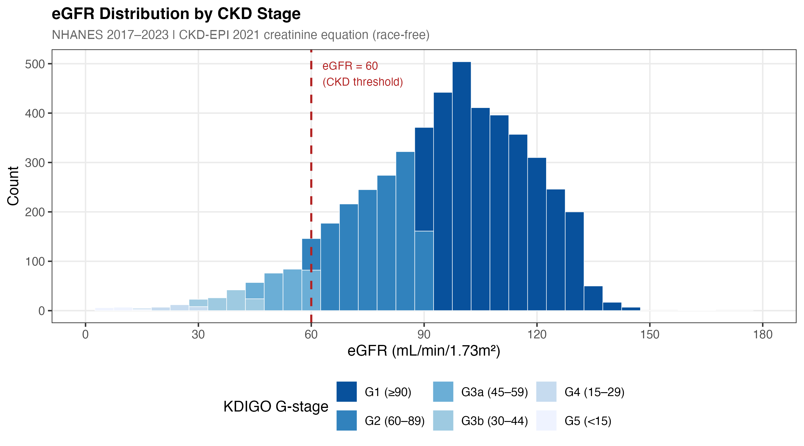{#fig-egfr width=1350}
:::
:::


::: {.cell}

```{.r .cell-code}
knitr::include_graphics(here("output", "figures", "03_uacr_boxplot.png"))
```

::: {.cell-output-display}
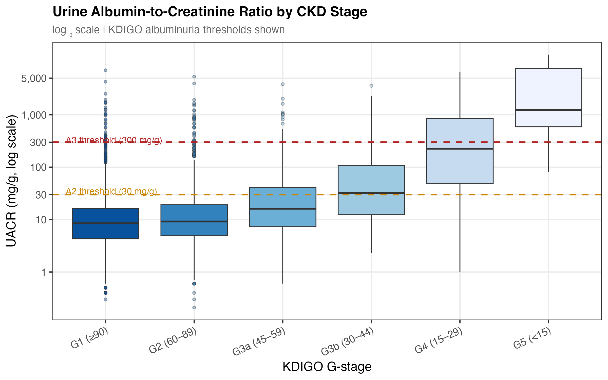{#fig-uacr width=1200}
:::
:::


::: {.cell}

```{.r .cell-code}
knitr::include_graphics(here("output", "figures", "03_risk_heatmap.png"))
```

::: {.cell-output-display}
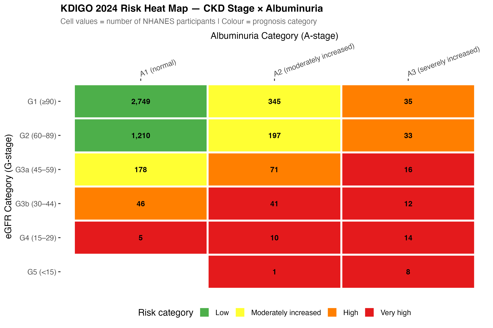{#fig-heatmap width=1350}
:::
:::


The KDIGO heat map (@fig-heatmap) demonstrates that participants with combined reduced eGFR and elevated albuminuria — the highest-risk KDIGO combination — represent a substantial proportion of the cohort. @fig-uacr confirms the expected positive correlation between CKD stage severity and UACR.

### Survival by CKD Stage


::: {.cell}

```{.r .cell-code}
knitr::include_graphics(here("output", "figures", "03_km_ckd_stage.png"))
```

::: {.cell-output-display}
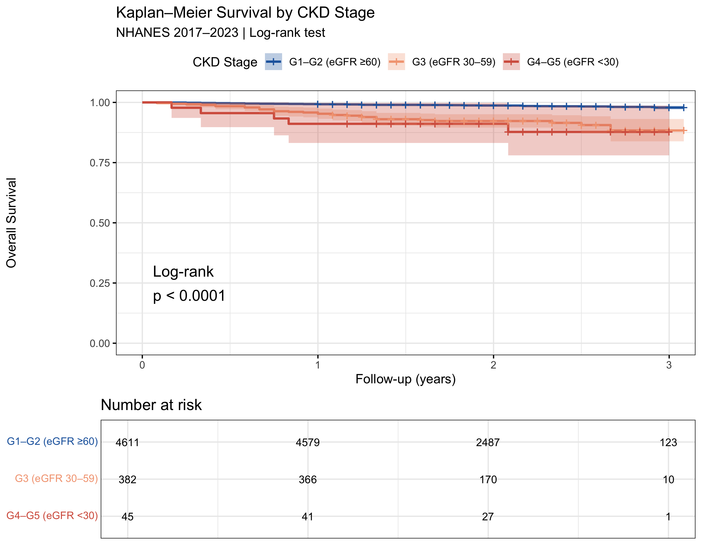{#fig-km width=1350}
:::
:::


Kaplan–Meier curves demonstrate markedly divergent survival trajectories across CKD severity groups (@fig-km), with participants at G4–G5 experiencing substantially reduced survival from early in the follow-up period. These unadjusted differences reflect the combined effect of kidney disease severity and its associated comorbidity burden.

### Unadjusted Mortality Rates


::: {.cell}

```{.r .cell-code}
knitr::include_graphics(here("output", "figures", "03_mortality_rates.png"))
```

::: {.cell-output-display}
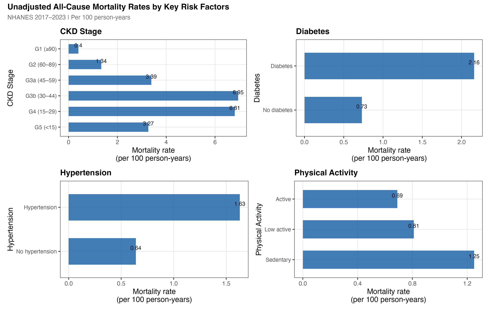{#fig-rates width=1650}
:::
:::


### Cox Proportional Hazards Models


::: {#tbl-cox .cell tbl-cap='Table 2. Hazard ratios (95% CI) from Cox proportional hazards models. Model 1: unadjusted (CKD stage only). Model 2: + age, sex, race/ethnicity, income. Model 3: fully adjusted (primary model). Bold p-values: p < 0.05.'}

```{.r .cell-code}
cox_html <- here("output", "tables", "04_cox_hr_table.html")
if (file.exists(cox_html)) {
  htmltools::includeHTML(cox_html)
} else {
  tbl_regression(cox_m3, exponentiate = TRUE) |>
    bold_p(t = 0.05) |> bold_labels()
}
```

::: {.cell-output-display}

```{=html}
<!DOCTYPE html>
<html lang="en">
<head>
<meta charset="utf-8"/>
<style>body{background-color:white;}</style>


</head>
<body>
<div id="kutairqbmv" style="padding-left:0px;padding-right:0px;padding-top:10px;padding-bottom:10px;overflow-x:auto;overflow-y:auto;width:auto;height:auto;">
  <style>#kutairqbmv table {
  font-family: system-ui, 'Segoe UI', Roboto, Helvetica, Arial, sans-serif, 'Apple Color Emoji', 'Segoe UI Emoji', 'Segoe UI Symbol', 'Noto Color Emoji';
  -webkit-font-smoothing: antialiased;
  -moz-osx-font-smoothing: grayscale;
}

#kutairqbmv thead, #kutairqbmv tbody, #kutairqbmv tfoot, #kutairqbmv tr, #kutairqbmv td, #kutairqbmv th {
  border-style: none;
}

#kutairqbmv p {
  margin: 0;
  padding: 0;
}

#kutairqbmv .gt_table {
  display: table;
  border-collapse: collapse;
  line-height: normal;
  margin-left: auto;
  margin-right: auto;
  color: #333333;
  font-size: 16px;
  font-weight: normal;
  font-style: normal;
  background-color: #FFFFFF;
  width: auto;
  border-top-style: solid;
  border-top-width: 2px;
  border-top-color: #A8A8A8;
  border-right-style: none;
  border-right-width: 2px;
  border-right-color: #D3D3D3;
  border-bottom-style: solid;
  border-bottom-width: 2px;
  border-bottom-color: #A8A8A8;
  border-left-style: none;
  border-left-width: 2px;
  border-left-color: #D3D3D3;
}

#kutairqbmv .gt_caption {
  padding-top: 4px;
  padding-bottom: 4px;
}

#kutairqbmv .gt_title {
  color: #333333;
  font-size: 125%;
  font-weight: initial;
  padding-top: 4px;
  padding-bottom: 4px;
  padding-left: 5px;
  padding-right: 5px;
  border-bottom-color: #FFFFFF;
  border-bottom-width: 0;
}

#kutairqbmv .gt_subtitle {
  color: #333333;
  font-size: 85%;
  font-weight: initial;
  padding-top: 3px;
  padding-bottom: 5px;
  padding-left: 5px;
  padding-right: 5px;
  border-top-color: #FFFFFF;
  border-top-width: 0;
}

#kutairqbmv .gt_heading {
  background-color: #FFFFFF;
  text-align: center;
  border-bottom-color: #FFFFFF;
  border-left-style: none;
  border-left-width: 1px;
  border-left-color: #D3D3D3;
  border-right-style: none;
  border-right-width: 1px;
  border-right-color: #D3D3D3;
}

#kutairqbmv .gt_bottom_border {
  border-bottom-style: solid;
  border-bottom-width: 2px;
  border-bottom-color: #D3D3D3;
}

#kutairqbmv .gt_col_headings {
  border-top-style: solid;
  border-top-width: 2px;
  border-top-color: #D3D3D3;
  border-bottom-style: solid;
  border-bottom-width: 2px;
  border-bottom-color: #D3D3D3;
  border-left-style: none;
  border-left-width: 1px;
  border-left-color: #D3D3D3;
  border-right-style: none;
  border-right-width: 1px;
  border-right-color: #D3D3D3;
}

#kutairqbmv .gt_col_heading {
  color: #333333;
  background-color: #FFFFFF;
  font-size: 100%;
  font-weight: normal;
  text-transform: inherit;
  border-left-style: none;
  border-left-width: 1px;
  border-left-color: #D3D3D3;
  border-right-style: none;
  border-right-width: 1px;
  border-right-color: #D3D3D3;
  vertical-align: bottom;
  padding-top: 5px;
  padding-bottom: 6px;
  padding-left: 5px;
  padding-right: 5px;
  overflow-x: hidden;
}

#kutairqbmv .gt_column_spanner_outer {
  color: #333333;
  background-color: #FFFFFF;
  font-size: 100%;
  font-weight: normal;
  text-transform: inherit;
  padding-top: 0;
  padding-bottom: 0;
  padding-left: 4px;
  padding-right: 4px;
}

#kutairqbmv .gt_column_spanner_outer:first-child {
  padding-left: 0;
}

#kutairqbmv .gt_column_spanner_outer:last-child {
  padding-right: 0;
}

#kutairqbmv .gt_column_spanner {
  border-bottom-style: solid;
  border-bottom-width: 2px;
  border-bottom-color: #D3D3D3;
  vertical-align: bottom;
  padding-top: 5px;
  padding-bottom: 5px;
  overflow-x: hidden;
  display: inline-block;
  width: 100%;
}

#kutairqbmv .gt_spanner_row {
  border-bottom-style: hidden;
}

#kutairqbmv .gt_group_heading {
  padding-top: 8px;
  padding-bottom: 8px;
  padding-left: 5px;
  padding-right: 5px;
  color: #333333;
  background-color: #FFFFFF;
  font-size: 100%;
  font-weight: initial;
  text-transform: inherit;
  border-top-style: solid;
  border-top-width: 2px;
  border-top-color: #D3D3D3;
  border-bottom-style: solid;
  border-bottom-width: 2px;
  border-bottom-color: #D3D3D3;
  border-left-style: none;
  border-left-width: 1px;
  border-left-color: #D3D3D3;
  border-right-style: none;
  border-right-width: 1px;
  border-right-color: #D3D3D3;
  vertical-align: middle;
  text-align: left;
}

#kutairqbmv .gt_empty_group_heading {
  padding: 0.5px;
  color: #333333;
  background-color: #FFFFFF;
  font-size: 100%;
  font-weight: initial;
  border-top-style: solid;
  border-top-width: 2px;
  border-top-color: #D3D3D3;
  border-bottom-style: solid;
  border-bottom-width: 2px;
  border-bottom-color: #D3D3D3;
  vertical-align: middle;
}

#kutairqbmv .gt_from_md > :first-child {
  margin-top: 0;
}

#kutairqbmv .gt_from_md > :last-child {
  margin-bottom: 0;
}

#kutairqbmv .gt_row {
  padding-top: 8px;
  padding-bottom: 8px;
  padding-left: 5px;
  padding-right: 5px;
  margin: 10px;
  border-top-style: solid;
  border-top-width: 1px;
  border-top-color: #D3D3D3;
  border-left-style: none;
  border-left-width: 1px;
  border-left-color: #D3D3D3;
  border-right-style: none;
  border-right-width: 1px;
  border-right-color: #D3D3D3;
  vertical-align: middle;
  overflow-x: hidden;
}

#kutairqbmv .gt_stub {
  color: #333333;
  background-color: #FFFFFF;
  font-size: 100%;
  font-weight: initial;
  text-transform: inherit;
  border-right-style: solid;
  border-right-width: 2px;
  border-right-color: #D3D3D3;
  padding-left: 5px;
  padding-right: 5px;
}

#kutairqbmv .gt_stub_row_group {
  color: #333333;
  background-color: #FFFFFF;
  font-size: 100%;
  font-weight: initial;
  text-transform: inherit;
  border-right-style: solid;
  border-right-width: 2px;
  border-right-color: #D3D3D3;
  padding-left: 5px;
  padding-right: 5px;
  vertical-align: top;
}

#kutairqbmv .gt_row_group_first td {
  border-top-width: 2px;
}

#kutairqbmv .gt_row_group_first th {
  border-top-width: 2px;
}

#kutairqbmv .gt_summary_row {
  color: #333333;
  background-color: #FFFFFF;
  text-transform: inherit;
  padding-top: 8px;
  padding-bottom: 8px;
  padding-left: 5px;
  padding-right: 5px;
}

#kutairqbmv .gt_first_summary_row {
  border-top-style: solid;
  border-top-color: #D3D3D3;
}

#kutairqbmv .gt_first_summary_row.thick {
  border-top-width: 2px;
}

#kutairqbmv .gt_last_summary_row {
  padding-top: 8px;
  padding-bottom: 8px;
  padding-left: 5px;
  padding-right: 5px;
  border-bottom-style: solid;
  border-bottom-width: 2px;
  border-bottom-color: #D3D3D3;
}

#kutairqbmv .gt_grand_summary_row {
  color: #333333;
  background-color: #FFFFFF;
  text-transform: inherit;
  padding-top: 8px;
  padding-bottom: 8px;
  padding-left: 5px;
  padding-right: 5px;
}

#kutairqbmv .gt_first_grand_summary_row {
  padding-top: 8px;
  padding-bottom: 8px;
  padding-left: 5px;
  padding-right: 5px;
  border-top-style: double;
  border-top-width: 6px;
  border-top-color: #D3D3D3;
}

#kutairqbmv .gt_last_grand_summary_row_top {
  padding-top: 8px;
  padding-bottom: 8px;
  padding-left: 5px;
  padding-right: 5px;
  border-bottom-style: double;
  border-bottom-width: 6px;
  border-bottom-color: #D3D3D3;
}

#kutairqbmv .gt_striped {
  background-color: rgba(128, 128, 128, 0.05);
}

#kutairqbmv .gt_table_body {
  border-top-style: solid;
  border-top-width: 2px;
  border-top-color: #D3D3D3;
  border-bottom-style: solid;
  border-bottom-width: 2px;
  border-bottom-color: #D3D3D3;
}

#kutairqbmv .gt_footnotes {
  color: #333333;
  background-color: #FFFFFF;
  border-bottom-style: none;
  border-bottom-width: 2px;
  border-bottom-color: #D3D3D3;
  border-left-style: none;
  border-left-width: 2px;
  border-left-color: #D3D3D3;
  border-right-style: none;
  border-right-width: 2px;
  border-right-color: #D3D3D3;
}

#kutairqbmv .gt_footnote {
  margin: 0px;
  font-size: 90%;
  padding-top: 4px;
  padding-bottom: 4px;
  padding-left: 5px;
  padding-right: 5px;
}

#kutairqbmv .gt_sourcenotes {
  color: #333333;
  background-color: #FFFFFF;
  border-bottom-style: none;
  border-bottom-width: 2px;
  border-bottom-color: #D3D3D3;
  border-left-style: none;
  border-left-width: 2px;
  border-left-color: #D3D3D3;
  border-right-style: none;
  border-right-width: 2px;
  border-right-color: #D3D3D3;
}

#kutairqbmv .gt_sourcenote {
  font-size: 90%;
  padding-top: 4px;
  padding-bottom: 4px;
  padding-left: 5px;
  padding-right: 5px;
}

#kutairqbmv .gt_left {
  text-align: left;
}

#kutairqbmv .gt_center {
  text-align: center;
}

#kutairqbmv .gt_right {
  text-align: right;
  font-variant-numeric: tabular-nums;
}

#kutairqbmv .gt_font_normal {
  font-weight: normal;
}

#kutairqbmv .gt_font_bold {
  font-weight: bold;
}

#kutairqbmv .gt_font_italic {
  font-style: italic;
}

#kutairqbmv .gt_super {
  font-size: 65%;
}

#kutairqbmv .gt_footnote_marks {
  font-size: 75%;
  vertical-align: 0.4em;
  position: initial;
}

#kutairqbmv .gt_asterisk {
  font-size: 100%;
  vertical-align: 0;
}

#kutairqbmv .gt_indent_1 {
  text-indent: 5px;
}

#kutairqbmv .gt_indent_2 {
  text-indent: 10px;
}

#kutairqbmv .gt_indent_3 {
  text-indent: 15px;
}

#kutairqbmv .gt_indent_4 {
  text-indent: 20px;
}

#kutairqbmv .gt_indent_5 {
  text-indent: 25px;
}

#kutairqbmv .katex-display {
  display: inline-flex !important;
  margin-bottom: 0.75em !important;
}

#kutairqbmv div.Reactable > div.rt-table > div.rt-thead > div.rt-tr.rt-tr-group-header > div.rt-th-group:after {
  height: 0px !important;
}
</style>
  <table class="gt_table" data-quarto-disable-processing="false" data-quarto-bootstrap="false">
  <!--/html_preserve--><caption class='gt_caption'><span class='gt_from_md'><strong>Table 2.</strong> Hazard ratios (95% CI) for all-cause mortality from Cox
proportional hazards models. Model 1: unadjusted. Model 2: adjusted for
age, sex, race/ethnicity, and income. Model 3: additionally adjusted for
diabetes, hypertension, BMI, physical activity, and smoking.
Bold p-values indicate statistical significance at α = 0.05.</span></caption><!--html_preserve-->
  <thead>
    <tr class="gt_col_headings gt_spanner_row">
      <th class="gt_col_heading gt_columns_bottom_border gt_left" rowspan="2" colspan="1" scope="col" id="label"><span class='gt_from_md'><strong>Characteristic</strong></span></th>
      <th class="gt_center gt_columns_top_border gt_column_spanner_outer" rowspan="1" colspan="3" scope="colgroup" id="level 1; estimate_1">
        <div class="gt_column_spanner"><span class='gt_from_md'><strong>Model 1</strong><br>Unadjusted</span></div>
      </th>
      <th class="gt_center gt_columns_top_border gt_column_spanner_outer" rowspan="1" colspan="3" scope="colgroup" id="level 1; estimate_2">
        <div class="gt_column_spanner"><span class='gt_from_md'><strong>Model 2</strong><br>+ Demographics</span></div>
      </th>
      <th class="gt_center gt_columns_top_border gt_column_spanner_outer" rowspan="1" colspan="3" scope="colgroup" id="level 1; estimate_3">
        <div class="gt_column_spanner"><span class='gt_from_md'><strong>Model 3</strong><br>Fully adjusted</span></div>
      </th>
    </tr>
    <tr class="gt_col_headings">
      <th class="gt_col_heading gt_columns_bottom_border gt_center" rowspan="1" colspan="1" scope="col" id="estimate_1"><span class='gt_from_md'><strong>HR (Unadjusted)</strong></span></th>
      <th class="gt_col_heading gt_columns_bottom_border gt_center" rowspan="1" colspan="1" scope="col" id="conf.low_1"><span class='gt_from_md'><strong>95% CI</strong></span></th>
      <th class="gt_col_heading gt_columns_bottom_border gt_center" rowspan="1" colspan="1" scope="col" id="p.value_1"><span class='gt_from_md'><strong>p-value</strong></span></th>
      <th class="gt_col_heading gt_columns_bottom_border gt_center" rowspan="1" colspan="1" scope="col" id="estimate_2"><span class='gt_from_md'><strong>HR (Model 2)</strong></span></th>
      <th class="gt_col_heading gt_columns_bottom_border gt_center" rowspan="1" colspan="1" scope="col" id="conf.low_2"><span class='gt_from_md'><strong>95% CI</strong></span></th>
      <th class="gt_col_heading gt_columns_bottom_border gt_center" rowspan="1" colspan="1" scope="col" id="p.value_2"><span class='gt_from_md'><strong>p-value</strong></span></th>
      <th class="gt_col_heading gt_columns_bottom_border gt_center" rowspan="1" colspan="1" scope="col" id="estimate_3"><span class='gt_from_md'><strong>HR (Model 3)</strong></span></th>
      <th class="gt_col_heading gt_columns_bottom_border gt_center" rowspan="1" colspan="1" scope="col" id="conf.low_3"><span class='gt_from_md'><strong>95% CI</strong></span></th>
      <th class="gt_col_heading gt_columns_bottom_border gt_center" rowspan="1" colspan="1" scope="col" id="p.value_3"><span class='gt_from_md'><strong>p-value</strong></span></th>
    </tr>
  </thead>
  <tbody class="gt_table_body">
    <tr><td headers="label" class="gt_row gt_left" style="font-weight: bold;">ckd_stage</td>
<td headers="estimate_1" class="gt_row gt_center"><br /></td>
<td headers="conf.low_1" class="gt_row gt_center"><br /></td>
<td headers="p.value_1" class="gt_row gt_center"><br /></td>
<td headers="estimate_2" class="gt_row gt_center"><br /></td>
<td headers="conf.low_2" class="gt_row gt_center"><br /></td>
<td headers="p.value_2" class="gt_row gt_center"><br /></td>
<td headers="estimate_3" class="gt_row gt_center"><br /></td>
<td headers="conf.low_3" class="gt_row gt_center"><br /></td>
<td headers="p.value_3" class="gt_row gt_center"><br /></td></tr>
    <tr><td headers="label" class="gt_row gt_left">    G1 (≥90)</td>
<td headers="estimate_1" class="gt_row gt_center">—</td>
<td headers="conf.low_1" class="gt_row gt_center">—</td>
<td headers="p.value_1" class="gt_row gt_center"><br /></td>
<td headers="estimate_2" class="gt_row gt_center">—</td>
<td headers="conf.low_2" class="gt_row gt_center">—</td>
<td headers="p.value_2" class="gt_row gt_center"><br /></td>
<td headers="estimate_3" class="gt_row gt_center">—</td>
<td headers="conf.low_3" class="gt_row gt_center">—</td>
<td headers="p.value_3" class="gt_row gt_center"><br /></td></tr>
    <tr><td headers="label" class="gt_row gt_left">    G2 (60–89)</td>
<td headers="estimate_1" class="gt_row gt_center">3.35</td>
<td headers="conf.low_1" class="gt_row gt_center">2.04, 5.51</td>
<td headers="p.value_1" class="gt_row gt_center" style="font-weight: bold;"><0.001</td>
<td headers="estimate_2" class="gt_row gt_center">1.01</td>
<td headers="conf.low_2" class="gt_row gt_center">0.56, 1.83</td>
<td headers="p.value_2" class="gt_row gt_center">0.975</td>
<td headers="estimate_3" class="gt_row gt_center">1.09</td>
<td headers="conf.low_3" class="gt_row gt_center">0.59, 2.03</td>
<td headers="p.value_3" class="gt_row gt_center">0.782</td></tr>
    <tr><td headers="label" class="gt_row gt_left">    G3a (45–59)</td>
<td headers="estimate_1" class="gt_row gt_center">8.43</td>
<td headers="conf.low_1" class="gt_row gt_center">4.62, 15.4</td>
<td headers="p.value_1" class="gt_row gt_center" style="font-weight: bold;"><0.001</td>
<td headers="estimate_2" class="gt_row gt_center">1.30</td>
<td headers="conf.low_2" class="gt_row gt_center">0.61, 2.78</td>
<td headers="p.value_2" class="gt_row gt_center">0.492</td>
<td headers="estimate_3" class="gt_row gt_center">1.20</td>
<td headers="conf.low_3" class="gt_row gt_center">0.53, 2.72</td>
<td headers="p.value_3" class="gt_row gt_center">0.669</td></tr>
    <tr><td headers="label" class="gt_row gt_left">    G3b (30–44)</td>
<td headers="estimate_1" class="gt_row gt_center">17.4</td>
<td headers="conf.low_1" class="gt_row gt_center">9.07, 33.3</td>
<td headers="p.value_1" class="gt_row gt_center" style="font-weight: bold;"><0.001</td>
<td headers="estimate_2" class="gt_row gt_center">2.23</td>
<td headers="conf.low_2" class="gt_row gt_center">0.98, 5.08</td>
<td headers="p.value_2" class="gt_row gt_center">0.057</td>
<td headers="estimate_3" class="gt_row gt_center">1.75</td>
<td headers="conf.low_3" class="gt_row gt_center">0.71, 4.34</td>
<td headers="p.value_3" class="gt_row gt_center">0.226</td></tr>
    <tr><td headers="label" class="gt_row gt_left">    G4 (15–29)</td>
<td headers="estimate_1" class="gt_row gt_center">17.2</td>
<td headers="conf.low_1" class="gt_row gt_center">6.01, 49.4</td>
<td headers="p.value_1" class="gt_row gt_center" style="font-weight: bold;"><0.001</td>
<td headers="estimate_2" class="gt_row gt_center">1.98</td>
<td headers="conf.low_2" class="gt_row gt_center">0.44, 8.99</td>
<td headers="p.value_2" class="gt_row gt_center">0.376</td>
<td headers="estimate_3" class="gt_row gt_center">0.76</td>
<td headers="conf.low_3" class="gt_row gt_center">0.09, 6.31</td>
<td headers="p.value_3" class="gt_row gt_center">0.798</td></tr>
    <tr><td headers="label" class="gt_row gt_left">    G5 (&lt;15)</td>
<td headers="estimate_1" class="gt_row gt_center">8.20</td>
<td headers="conf.low_1" class="gt_row gt_center">1.11, 60.4</td>
<td headers="p.value_1" class="gt_row gt_center" style="font-weight: bold;">0.039</td>
<td headers="estimate_2" class="gt_row gt_center">2.16</td>
<td headers="conf.low_2" class="gt_row gt_center">0.28, 16.8</td>
<td headers="p.value_2" class="gt_row gt_center">0.461</td>
<td headers="estimate_3" class="gt_row gt_center">0.00</td>
<td headers="conf.low_3" class="gt_row gt_center">0.00, Inf</td>
<td headers="p.value_3" class="gt_row gt_center">0.996</td></tr>
    <tr><td headers="label" class="gt_row gt_left" style="font-weight: bold;">age_10</td>
<td headers="estimate_1" class="gt_row gt_center"><br /></td>
<td headers="conf.low_1" class="gt_row gt_center"><br /></td>
<td headers="p.value_1" class="gt_row gt_center"><br /></td>
<td headers="estimate_2" class="gt_row gt_center">1.86</td>
<td headers="conf.low_2" class="gt_row gt_center">1.53, 2.28</td>
<td headers="p.value_2" class="gt_row gt_center" style="font-weight: bold;"><0.001</td>
<td headers="estimate_3" class="gt_row gt_center">1.73</td>
<td headers="conf.low_3" class="gt_row gt_center">1.40, 2.15</td>
<td headers="p.value_3" class="gt_row gt_center" style="font-weight: bold;"><0.001</td></tr>
    <tr><td headers="label" class="gt_row gt_left" style="font-weight: bold;">sex</td>
<td headers="estimate_1" class="gt_row gt_center"><br /></td>
<td headers="conf.low_1" class="gt_row gt_center"><br /></td>
<td headers="p.value_1" class="gt_row gt_center"><br /></td>
<td headers="estimate_2" class="gt_row gt_center"><br /></td>
<td headers="conf.low_2" class="gt_row gt_center"><br /></td>
<td headers="p.value_2" class="gt_row gt_center"><br /></td>
<td headers="estimate_3" class="gt_row gt_center"><br /></td>
<td headers="conf.low_3" class="gt_row gt_center"><br /></td>
<td headers="p.value_3" class="gt_row gt_center"><br /></td></tr>
    <tr><td headers="label" class="gt_row gt_left">    Male</td>
<td headers="estimate_1" class="gt_row gt_center"><br /></td>
<td headers="conf.low_1" class="gt_row gt_center"><br /></td>
<td headers="p.value_1" class="gt_row gt_center"><br /></td>
<td headers="estimate_2" class="gt_row gt_center">—</td>
<td headers="conf.low_2" class="gt_row gt_center">—</td>
<td headers="p.value_2" class="gt_row gt_center"><br /></td>
<td headers="estimate_3" class="gt_row gt_center">—</td>
<td headers="conf.low_3" class="gt_row gt_center">—</td>
<td headers="p.value_3" class="gt_row gt_center"><br /></td></tr>
    <tr><td headers="label" class="gt_row gt_left">    Female</td>
<td headers="estimate_1" class="gt_row gt_center"><br /></td>
<td headers="conf.low_1" class="gt_row gt_center"><br /></td>
<td headers="p.value_1" class="gt_row gt_center"><br /></td>
<td headers="estimate_2" class="gt_row gt_center">0.57</td>
<td headers="conf.low_2" class="gt_row gt_center">0.37, 0.89</td>
<td headers="p.value_2" class="gt_row gt_center" style="font-weight: bold;">0.013</td>
<td headers="estimate_3" class="gt_row gt_center">0.70</td>
<td headers="conf.low_3" class="gt_row gt_center">0.43, 1.15</td>
<td headers="p.value_3" class="gt_row gt_center">0.158</td></tr>
    <tr><td headers="label" class="gt_row gt_left" style="font-weight: bold;">race_eth</td>
<td headers="estimate_1" class="gt_row gt_center"><br /></td>
<td headers="conf.low_1" class="gt_row gt_center"><br /></td>
<td headers="p.value_1" class="gt_row gt_center"><br /></td>
<td headers="estimate_2" class="gt_row gt_center"><br /></td>
<td headers="conf.low_2" class="gt_row gt_center"><br /></td>
<td headers="p.value_2" class="gt_row gt_center"><br /></td>
<td headers="estimate_3" class="gt_row gt_center"><br /></td>
<td headers="conf.low_3" class="gt_row gt_center"><br /></td>
<td headers="p.value_3" class="gt_row gt_center"><br /></td></tr>
    <tr><td headers="label" class="gt_row gt_left">    Non-Hispanic White</td>
<td headers="estimate_1" class="gt_row gt_center"><br /></td>
<td headers="conf.low_1" class="gt_row gt_center"><br /></td>
<td headers="p.value_1" class="gt_row gt_center"><br /></td>
<td headers="estimate_2" class="gt_row gt_center">—</td>
<td headers="conf.low_2" class="gt_row gt_center">—</td>
<td headers="p.value_2" class="gt_row gt_center"><br /></td>
<td headers="estimate_3" class="gt_row gt_center">—</td>
<td headers="conf.low_3" class="gt_row gt_center">—</td>
<td headers="p.value_3" class="gt_row gt_center"><br /></td></tr>
    <tr><td headers="label" class="gt_row gt_left">    Mexican American</td>
<td headers="estimate_1" class="gt_row gt_center"><br /></td>
<td headers="conf.low_1" class="gt_row gt_center"><br /></td>
<td headers="p.value_1" class="gt_row gt_center"><br /></td>
<td headers="estimate_2" class="gt_row gt_center">0.38</td>
<td headers="conf.low_2" class="gt_row gt_center">0.15, 0.98</td>
<td headers="p.value_2" class="gt_row gt_center" style="font-weight: bold;">0.044</td>
<td headers="estimate_3" class="gt_row gt_center">0.42</td>
<td headers="conf.low_3" class="gt_row gt_center">0.16, 1.09</td>
<td headers="p.value_3" class="gt_row gt_center">0.075</td></tr>
    <tr><td headers="label" class="gt_row gt_left">    Other Hispanic</td>
<td headers="estimate_1" class="gt_row gt_center"><br /></td>
<td headers="conf.low_1" class="gt_row gt_center"><br /></td>
<td headers="p.value_1" class="gt_row gt_center"><br /></td>
<td headers="estimate_2" class="gt_row gt_center">0.28</td>
<td headers="conf.low_2" class="gt_row gt_center">0.09, 0.90</td>
<td headers="p.value_2" class="gt_row gt_center" style="font-weight: bold;">0.033</td>
<td headers="estimate_3" class="gt_row gt_center">0.30</td>
<td headers="conf.low_3" class="gt_row gt_center">0.09, 0.98</td>
<td headers="p.value_3" class="gt_row gt_center" style="font-weight: bold;">0.046</td></tr>
    <tr><td headers="label" class="gt_row gt_left">    Non-Hispanic Black</td>
<td headers="estimate_1" class="gt_row gt_center"><br /></td>
<td headers="conf.low_1" class="gt_row gt_center"><br /></td>
<td headers="p.value_1" class="gt_row gt_center"><br /></td>
<td headers="estimate_2" class="gt_row gt_center">0.67</td>
<td headers="conf.low_2" class="gt_row gt_center">0.38, 1.18</td>
<td headers="p.value_2" class="gt_row gt_center">0.166</td>
<td headers="estimate_3" class="gt_row gt_center">0.52</td>
<td headers="conf.low_3" class="gt_row gt_center">0.28, 0.99</td>
<td headers="p.value_3" class="gt_row gt_center" style="font-weight: bold;">0.045</td></tr>
    <tr><td headers="label" class="gt_row gt_left">    Non-Hispanic Asian</td>
<td headers="estimate_1" class="gt_row gt_center"><br /></td>
<td headers="conf.low_1" class="gt_row gt_center"><br /></td>
<td headers="p.value_1" class="gt_row gt_center"><br /></td>
<td headers="estimate_2" class="gt_row gt_center">1.02</td>
<td headers="conf.low_2" class="gt_row gt_center">0.44, 2.39</td>
<td headers="p.value_2" class="gt_row gt_center">0.957</td>
<td headers="estimate_3" class="gt_row gt_center">1.06</td>
<td headers="conf.low_3" class="gt_row gt_center">0.44, 2.54</td>
<td headers="p.value_3" class="gt_row gt_center">0.891</td></tr>
    <tr><td headers="label" class="gt_row gt_left">    Other/Multiracial</td>
<td headers="estimate_1" class="gt_row gt_center"><br /></td>
<td headers="conf.low_1" class="gt_row gt_center"><br /></td>
<td headers="p.value_1" class="gt_row gt_center"><br /></td>
<td headers="estimate_2" class="gt_row gt_center"><br /></td>
<td headers="conf.low_2" class="gt_row gt_center"><br /></td>
<td headers="p.value_2" class="gt_row gt_center"><br /></td>
<td headers="estimate_3" class="gt_row gt_center"><br /></td>
<td headers="conf.low_3" class="gt_row gt_center"><br /></td>
<td headers="p.value_3" class="gt_row gt_center"><br /></td></tr>
    <tr><td headers="label" class="gt_row gt_left" style="font-weight: bold;">poverty_cat</td>
<td headers="estimate_1" class="gt_row gt_center"><br /></td>
<td headers="conf.low_1" class="gt_row gt_center"><br /></td>
<td headers="p.value_1" class="gt_row gt_center"><br /></td>
<td headers="estimate_2" class="gt_row gt_center"><br /></td>
<td headers="conf.low_2" class="gt_row gt_center"><br /></td>
<td headers="p.value_2" class="gt_row gt_center"><br /></td>
<td headers="estimate_3" class="gt_row gt_center"><br /></td>
<td headers="conf.low_3" class="gt_row gt_center"><br /></td>
<td headers="p.value_3" class="gt_row gt_center"><br /></td></tr>
    <tr><td headers="label" class="gt_row gt_left">    High income</td>
<td headers="estimate_1" class="gt_row gt_center"><br /></td>
<td headers="conf.low_1" class="gt_row gt_center"><br /></td>
<td headers="p.value_1" class="gt_row gt_center"><br /></td>
<td headers="estimate_2" class="gt_row gt_center">—</td>
<td headers="conf.low_2" class="gt_row gt_center">—</td>
<td headers="p.value_2" class="gt_row gt_center"><br /></td>
<td headers="estimate_3" class="gt_row gt_center">—</td>
<td headers="conf.low_3" class="gt_row gt_center">—</td>
<td headers="p.value_3" class="gt_row gt_center"><br /></td></tr>
    <tr><td headers="label" class="gt_row gt_left">    Below poverty</td>
<td headers="estimate_1" class="gt_row gt_center"><br /></td>
<td headers="conf.low_1" class="gt_row gt_center"><br /></td>
<td headers="p.value_1" class="gt_row gt_center"><br /></td>
<td headers="estimate_2" class="gt_row gt_center">2.88</td>
<td headers="conf.low_2" class="gt_row gt_center">1.37, 6.09</td>
<td headers="p.value_2" class="gt_row gt_center" style="font-weight: bold;">0.005</td>
<td headers="estimate_3" class="gt_row gt_center">2.75</td>
<td headers="conf.low_3" class="gt_row gt_center">1.18, 6.37</td>
<td headers="p.value_3" class="gt_row gt_center" style="font-weight: bold;">0.019</td></tr>
    <tr><td headers="label" class="gt_row gt_left">    Low income</td>
<td headers="estimate_1" class="gt_row gt_center"><br /></td>
<td headers="conf.low_1" class="gt_row gt_center"><br /></td>
<td headers="p.value_1" class="gt_row gt_center"><br /></td>
<td headers="estimate_2" class="gt_row gt_center">2.45</td>
<td headers="conf.low_2" class="gt_row gt_center">1.28, 4.69</td>
<td headers="p.value_2" class="gt_row gt_center" style="font-weight: bold;">0.007</td>
<td headers="estimate_3" class="gt_row gt_center">2.48</td>
<td headers="conf.low_3" class="gt_row gt_center">1.18, 5.19</td>
<td headers="p.value_3" class="gt_row gt_center" style="font-weight: bold;">0.016</td></tr>
    <tr><td headers="label" class="gt_row gt_left">    Middle income</td>
<td headers="estimate_1" class="gt_row gt_center"><br /></td>
<td headers="conf.low_1" class="gt_row gt_center"><br /></td>
<td headers="p.value_1" class="gt_row gt_center"><br /></td>
<td headers="estimate_2" class="gt_row gt_center">1.21</td>
<td headers="conf.low_2" class="gt_row gt_center">0.58, 2.54</td>
<td headers="p.value_2" class="gt_row gt_center">0.609</td>
<td headers="estimate_3" class="gt_row gt_center">1.35</td>
<td headers="conf.low_3" class="gt_row gt_center">0.59, 3.07</td>
<td headers="p.value_3" class="gt_row gt_center">0.476</td></tr>
    <tr><td headers="label" class="gt_row gt_left" style="font-weight: bold;">log(UACR + 1), per unit</td>
<td headers="estimate_1" class="gt_row gt_center"><br /></td>
<td headers="conf.low_1" class="gt_row gt_center"><br /></td>
<td headers="p.value_1" class="gt_row gt_center"><br /></td>
<td headers="estimate_2" class="gt_row gt_center"><br /></td>
<td headers="conf.low_2" class="gt_row gt_center"><br /></td>
<td headers="p.value_2" class="gt_row gt_center"><br /></td>
<td headers="estimate_3" class="gt_row gt_center">1.19</td>
<td headers="conf.low_3" class="gt_row gt_center">1.00, 1.41</td>
<td headers="p.value_3" class="gt_row gt_center">0.057</td></tr>
    <tr><td headers="label" class="gt_row gt_left" style="font-weight: bold;">Diabetes (ref: No)</td>
<td headers="estimate_1" class="gt_row gt_center"><br /></td>
<td headers="conf.low_1" class="gt_row gt_center"><br /></td>
<td headers="p.value_1" class="gt_row gt_center"><br /></td>
<td headers="estimate_2" class="gt_row gt_center"><br /></td>
<td headers="conf.low_2" class="gt_row gt_center"><br /></td>
<td headers="p.value_2" class="gt_row gt_center"><br /></td>
<td headers="estimate_3" class="gt_row gt_center">1.73</td>
<td headers="conf.low_3" class="gt_row gt_center">1.03, 2.90</td>
<td headers="p.value_3" class="gt_row gt_center" style="font-weight: bold;">0.038</td></tr>
    <tr><td headers="label" class="gt_row gt_left" style="font-weight: bold;">Hypertension (ref: No)</td>
<td headers="estimate_1" class="gt_row gt_center"><br /></td>
<td headers="conf.low_1" class="gt_row gt_center"><br /></td>
<td headers="p.value_1" class="gt_row gt_center"><br /></td>
<td headers="estimate_2" class="gt_row gt_center"><br /></td>
<td headers="conf.low_2" class="gt_row gt_center"><br /></td>
<td headers="p.value_2" class="gt_row gt_center"><br /></td>
<td headers="estimate_3" class="gt_row gt_center">1.00</td>
<td headers="conf.low_3" class="gt_row gt_center">0.61, 1.64</td>
<td headers="p.value_3" class="gt_row gt_center">0.995</td></tr>
    <tr><td headers="label" class="gt_row gt_left" style="font-weight: bold;">bmi_cat</td>
<td headers="estimate_1" class="gt_row gt_center"><br /></td>
<td headers="conf.low_1" class="gt_row gt_center"><br /></td>
<td headers="p.value_1" class="gt_row gt_center"><br /></td>
<td headers="estimate_2" class="gt_row gt_center"><br /></td>
<td headers="conf.low_2" class="gt_row gt_center"><br /></td>
<td headers="p.value_2" class="gt_row gt_center"><br /></td>
<td headers="estimate_3" class="gt_row gt_center"><br /></td>
<td headers="conf.low_3" class="gt_row gt_center"><br /></td>
<td headers="p.value_3" class="gt_row gt_center"><br /></td></tr>
    <tr><td headers="label" class="gt_row gt_left">    Normal</td>
<td headers="estimate_1" class="gt_row gt_center"><br /></td>
<td headers="conf.low_1" class="gt_row gt_center"><br /></td>
<td headers="p.value_1" class="gt_row gt_center"><br /></td>
<td headers="estimate_2" class="gt_row gt_center"><br /></td>
<td headers="conf.low_2" class="gt_row gt_center"><br /></td>
<td headers="p.value_2" class="gt_row gt_center"><br /></td>
<td headers="estimate_3" class="gt_row gt_center">—</td>
<td headers="conf.low_3" class="gt_row gt_center">—</td>
<td headers="p.value_3" class="gt_row gt_center"><br /></td></tr>
    <tr><td headers="label" class="gt_row gt_left">    Underweight</td>
<td headers="estimate_1" class="gt_row gt_center"><br /></td>
<td headers="conf.low_1" class="gt_row gt_center"><br /></td>
<td headers="p.value_1" class="gt_row gt_center"><br /></td>
<td headers="estimate_2" class="gt_row gt_center"><br /></td>
<td headers="conf.low_2" class="gt_row gt_center"><br /></td>
<td headers="p.value_2" class="gt_row gt_center"><br /></td>
<td headers="estimate_3" class="gt_row gt_center">1.74</td>
<td headers="conf.low_3" class="gt_row gt_center">0.52, 5.88</td>
<td headers="p.value_3" class="gt_row gt_center">0.369</td></tr>
    <tr><td headers="label" class="gt_row gt_left">    Overweight</td>
<td headers="estimate_1" class="gt_row gt_center"><br /></td>
<td headers="conf.low_1" class="gt_row gt_center"><br /></td>
<td headers="p.value_1" class="gt_row gt_center"><br /></td>
<td headers="estimate_2" class="gt_row gt_center"><br /></td>
<td headers="conf.low_2" class="gt_row gt_center"><br /></td>
<td headers="p.value_2" class="gt_row gt_center"><br /></td>
<td headers="estimate_3" class="gt_row gt_center">0.31</td>
<td headers="conf.low_3" class="gt_row gt_center">0.17, 0.58</td>
<td headers="p.value_3" class="gt_row gt_center" style="font-weight: bold;"><0.001</td></tr>
    <tr><td headers="label" class="gt_row gt_left">    Obese</td>
<td headers="estimate_1" class="gt_row gt_center"><br /></td>
<td headers="conf.low_1" class="gt_row gt_center"><br /></td>
<td headers="p.value_1" class="gt_row gt_center"><br /></td>
<td headers="estimate_2" class="gt_row gt_center"><br /></td>
<td headers="conf.low_2" class="gt_row gt_center"><br /></td>
<td headers="p.value_2" class="gt_row gt_center"><br /></td>
<td headers="estimate_3" class="gt_row gt_center">0.37</td>
<td headers="conf.low_3" class="gt_row gt_center">0.21, 0.65</td>
<td headers="p.value_3" class="gt_row gt_center" style="font-weight: bold;"><0.001</td></tr>
    <tr><td headers="label" class="gt_row gt_left" style="font-weight: bold;">pa_cat</td>
<td headers="estimate_1" class="gt_row gt_center"><br /></td>
<td headers="conf.low_1" class="gt_row gt_center"><br /></td>
<td headers="p.value_1" class="gt_row gt_center"><br /></td>
<td headers="estimate_2" class="gt_row gt_center"><br /></td>
<td headers="conf.low_2" class="gt_row gt_center"><br /></td>
<td headers="p.value_2" class="gt_row gt_center"><br /></td>
<td headers="estimate_3" class="gt_row gt_center"><br /></td>
<td headers="conf.low_3" class="gt_row gt_center"><br /></td>
<td headers="p.value_3" class="gt_row gt_center"><br /></td></tr>
    <tr><td headers="label" class="gt_row gt_left">    Active</td>
<td headers="estimate_1" class="gt_row gt_center"><br /></td>
<td headers="conf.low_1" class="gt_row gt_center"><br /></td>
<td headers="p.value_1" class="gt_row gt_center"><br /></td>
<td headers="estimate_2" class="gt_row gt_center"><br /></td>
<td headers="conf.low_2" class="gt_row gt_center"><br /></td>
<td headers="p.value_2" class="gt_row gt_center"><br /></td>
<td headers="estimate_3" class="gt_row gt_center">—</td>
<td headers="conf.low_3" class="gt_row gt_center">—</td>
<td headers="p.value_3" class="gt_row gt_center"><br /></td></tr>
    <tr><td headers="label" class="gt_row gt_left">    Sedentary</td>
<td headers="estimate_1" class="gt_row gt_center"><br /></td>
<td headers="conf.low_1" class="gt_row gt_center"><br /></td>
<td headers="p.value_1" class="gt_row gt_center"><br /></td>
<td headers="estimate_2" class="gt_row gt_center"><br /></td>
<td headers="conf.low_2" class="gt_row gt_center"><br /></td>
<td headers="p.value_2" class="gt_row gt_center"><br /></td>
<td headers="estimate_3" class="gt_row gt_center">1.32</td>
<td headers="conf.low_3" class="gt_row gt_center">0.79, 2.19</td>
<td headers="p.value_3" class="gt_row gt_center">0.289</td></tr>
    <tr><td headers="label" class="gt_row gt_left">    Low active</td>
<td headers="estimate_1" class="gt_row gt_center"><br /></td>
<td headers="conf.low_1" class="gt_row gt_center"><br /></td>
<td headers="p.value_1" class="gt_row gt_center"><br /></td>
<td headers="estimate_2" class="gt_row gt_center"><br /></td>
<td headers="conf.low_2" class="gt_row gt_center"><br /></td>
<td headers="p.value_2" class="gt_row gt_center"><br /></td>
<td headers="estimate_3" class="gt_row gt_center">0.77</td>
<td headers="conf.low_3" class="gt_row gt_center">0.29, 2.07</td>
<td headers="p.value_3" class="gt_row gt_center">0.609</td></tr>
    <tr><td headers="label" class="gt_row gt_left" style="font-weight: bold;">smoking</td>
<td headers="estimate_1" class="gt_row gt_center"><br /></td>
<td headers="conf.low_1" class="gt_row gt_center"><br /></td>
<td headers="p.value_1" class="gt_row gt_center"><br /></td>
<td headers="estimate_2" class="gt_row gt_center"><br /></td>
<td headers="conf.low_2" class="gt_row gt_center"><br /></td>
<td headers="p.value_2" class="gt_row gt_center"><br /></td>
<td headers="estimate_3" class="gt_row gt_center"><br /></td>
<td headers="conf.low_3" class="gt_row gt_center"><br /></td>
<td headers="p.value_3" class="gt_row gt_center"><br /></td></tr>
    <tr><td headers="label" class="gt_row gt_left">    Never</td>
<td headers="estimate_1" class="gt_row gt_center"><br /></td>
<td headers="conf.low_1" class="gt_row gt_center"><br /></td>
<td headers="p.value_1" class="gt_row gt_center"><br /></td>
<td headers="estimate_2" class="gt_row gt_center"><br /></td>
<td headers="conf.low_2" class="gt_row gt_center"><br /></td>
<td headers="p.value_2" class="gt_row gt_center"><br /></td>
<td headers="estimate_3" class="gt_row gt_center">—</td>
<td headers="conf.low_3" class="gt_row gt_center">—</td>
<td headers="p.value_3" class="gt_row gt_center"><br /></td></tr>
    <tr><td headers="label" class="gt_row gt_left">    Current/Former</td>
<td headers="estimate_1" class="gt_row gt_center"><br /></td>
<td headers="conf.low_1" class="gt_row gt_center"><br /></td>
<td headers="p.value_1" class="gt_row gt_center"><br /></td>
<td headers="estimate_2" class="gt_row gt_center"><br /></td>
<td headers="conf.low_2" class="gt_row gt_center"><br /></td>
<td headers="p.value_2" class="gt_row gt_center"><br /></td>
<td headers="estimate_3" class="gt_row gt_center">1.48</td>
<td headers="conf.low_3" class="gt_row gt_center">0.90, 2.41</td>
<td headers="p.value_3" class="gt_row gt_center">0.119</td></tr>
  </tbody>
  <tfoot>
    <tr class="gt_sourcenotes">
      <td class="gt_sourcenote" colspan="10"><span class='gt_from_md'>Abbreviations: CI = Confidence Interval, HR = Hazard Ratio</span></td>
    </tr>
  </tfoot>
</table>
</div>
</body>
</html>
```

:::
:::


::: {.cell}

```{.r .cell-code}
knitr::include_graphics(here("output", "figures", "04_forest_plot.png"))
```

::: {.cell-output-display}
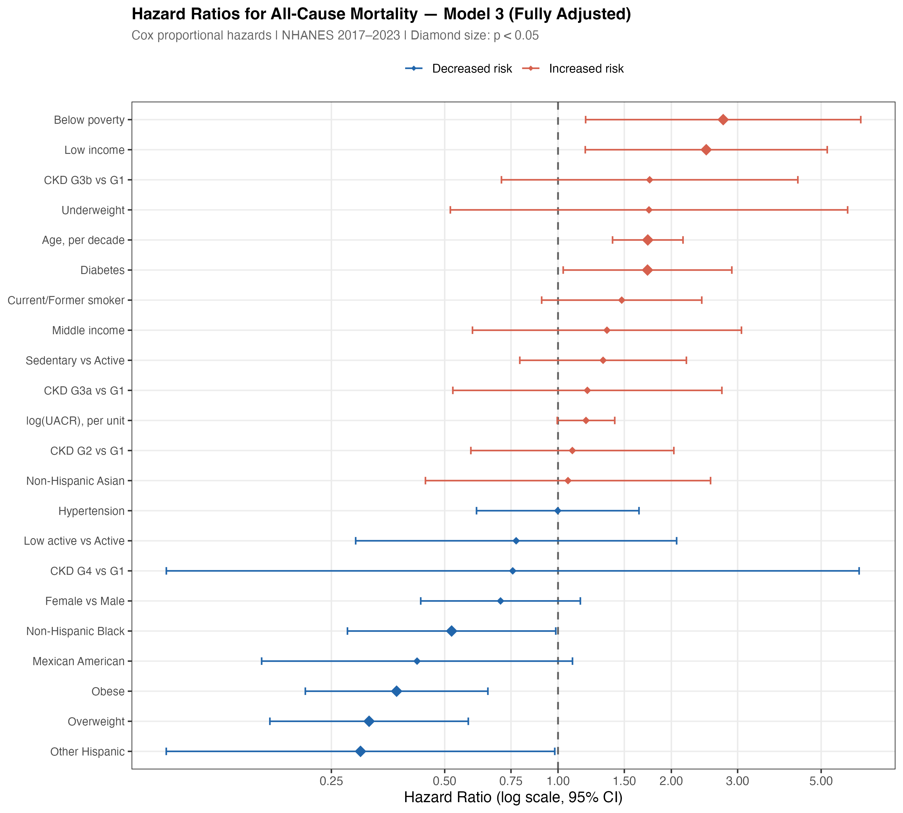{#fig-forest width=1500}
:::
:::


In the fully adjusted model (@fig-forest, @tbl-cox), age was the strongest predictor of mortality (HR 1.73 per decade, 95% CI 1.4–2.15). Diabetes conferred an approximately 73% higher hazard relative to no diabetes. Participants with below-poverty income experienced substantially higher mortality risk compared to high-income participants. Overweight and obese BMI categories were associated with lower mortality relative to normal BMI — consistent with the "obesity paradox" documented in CKD populations. CKD stage showed a monotonically increasing unadjusted hazard that attenuated after full adjustment, suggesting substantial confounding by age, metabolic comorbidity, and socioeconomic factors.

### Proportional Hazards Assumption


::: {#tbl-ph .cell tbl-cap='Schoenfeld residual test for the proportional hazards assumption (KM time transform). No covariate violates PH at α = 0.05.'}

```{.r .cell-code}
ph_df <- readr::read_csv(here("output", "tables", "04_ph_test.csv"),
                          show_col_types = FALSE)

ph_df |>
  gt() |>
  cols_label(term = "Term", chisq = "χ²", df = "df",
             p_value = "p-value", ph_violated = "PH violated") |>
  fmt_number(columns = chisq,   decimals = 2) |>
  fmt_number(columns = p_value, decimals = 3) |>
  tab_style(
    style = cell_fill(color = "#FADBD8"),
    locations = cells_body(rows = ph_violated == TRUE)
  ) |>
  tab_style(
    style = cell_text(weight = "bold"),
    locations = cells_column_labels()
  )
```

::: {.cell-output-display}

```{=html}
<div id="ibgxodqnaa" style="padding-left:0px;padding-right:0px;padding-top:10px;padding-bottom:10px;overflow-x:auto;overflow-y:auto;width:auto;height:auto;">
<style>#ibgxodqnaa table {
  font-family: system-ui, 'Segoe UI', Roboto, Helvetica, Arial, sans-serif, 'Apple Color Emoji', 'Segoe UI Emoji', 'Segoe UI Symbol', 'Noto Color Emoji';
  -webkit-font-smoothing: antialiased;
  -moz-osx-font-smoothing: grayscale;
}

#ibgxodqnaa thead, #ibgxodqnaa tbody, #ibgxodqnaa tfoot, #ibgxodqnaa tr, #ibgxodqnaa td, #ibgxodqnaa th {
  border-style: none;
}

#ibgxodqnaa p {
  margin: 0;
  padding: 0;
}

#ibgxodqnaa .gt_table {
  display: table;
  border-collapse: collapse;
  line-height: normal;
  margin-left: auto;
  margin-right: auto;
  color: #333333;
  font-size: 16px;
  font-weight: normal;
  font-style: normal;
  background-color: #FFFFFF;
  width: auto;
  border-top-style: solid;
  border-top-width: 2px;
  border-top-color: #A8A8A8;
  border-right-style: none;
  border-right-width: 2px;
  border-right-color: #D3D3D3;
  border-bottom-style: solid;
  border-bottom-width: 2px;
  border-bottom-color: #A8A8A8;
  border-left-style: none;
  border-left-width: 2px;
  border-left-color: #D3D3D3;
}

#ibgxodqnaa .gt_caption {
  padding-top: 4px;
  padding-bottom: 4px;
}

#ibgxodqnaa .gt_title {
  color: #333333;
  font-size: 125%;
  font-weight: initial;
  padding-top: 4px;
  padding-bottom: 4px;
  padding-left: 5px;
  padding-right: 5px;
  border-bottom-color: #FFFFFF;
  border-bottom-width: 0;
}

#ibgxodqnaa .gt_subtitle {
  color: #333333;
  font-size: 85%;
  font-weight: initial;
  padding-top: 3px;
  padding-bottom: 5px;
  padding-left: 5px;
  padding-right: 5px;
  border-top-color: #FFFFFF;
  border-top-width: 0;
}

#ibgxodqnaa .gt_heading {
  background-color: #FFFFFF;
  text-align: center;
  border-bottom-color: #FFFFFF;
  border-left-style: none;
  border-left-width: 1px;
  border-left-color: #D3D3D3;
  border-right-style: none;
  border-right-width: 1px;
  border-right-color: #D3D3D3;
}

#ibgxodqnaa .gt_bottom_border {
  border-bottom-style: solid;
  border-bottom-width: 2px;
  border-bottom-color: #D3D3D3;
}

#ibgxodqnaa .gt_col_headings {
  border-top-style: solid;
  border-top-width: 2px;
  border-top-color: #D3D3D3;
  border-bottom-style: solid;
  border-bottom-width: 2px;
  border-bottom-color: #D3D3D3;
  border-left-style: none;
  border-left-width: 1px;
  border-left-color: #D3D3D3;
  border-right-style: none;
  border-right-width: 1px;
  border-right-color: #D3D3D3;
}

#ibgxodqnaa .gt_col_heading {
  color: #333333;
  background-color: #FFFFFF;
  font-size: 100%;
  font-weight: normal;
  text-transform: inherit;
  border-left-style: none;
  border-left-width: 1px;
  border-left-color: #D3D3D3;
  border-right-style: none;
  border-right-width: 1px;
  border-right-color: #D3D3D3;
  vertical-align: bottom;
  padding-top: 5px;
  padding-bottom: 6px;
  padding-left: 5px;
  padding-right: 5px;
  overflow-x: hidden;
}

#ibgxodqnaa .gt_column_spanner_outer {
  color: #333333;
  background-color: #FFFFFF;
  font-size: 100%;
  font-weight: normal;
  text-transform: inherit;
  padding-top: 0;
  padding-bottom: 0;
  padding-left: 4px;
  padding-right: 4px;
}

#ibgxodqnaa .gt_column_spanner_outer:first-child {
  padding-left: 0;
}

#ibgxodqnaa .gt_column_spanner_outer:last-child {
  padding-right: 0;
}

#ibgxodqnaa .gt_column_spanner {
  border-bottom-style: solid;
  border-bottom-width: 2px;
  border-bottom-color: #D3D3D3;
  vertical-align: bottom;
  padding-top: 5px;
  padding-bottom: 5px;
  overflow-x: hidden;
  display: inline-block;
  width: 100%;
}

#ibgxodqnaa .gt_spanner_row {
  border-bottom-style: hidden;
}

#ibgxodqnaa .gt_group_heading {
  padding-top: 8px;
  padding-bottom: 8px;
  padding-left: 5px;
  padding-right: 5px;
  color: #333333;
  background-color: #FFFFFF;
  font-size: 100%;
  font-weight: initial;
  text-transform: inherit;
  border-top-style: solid;
  border-top-width: 2px;
  border-top-color: #D3D3D3;
  border-bottom-style: solid;
  border-bottom-width: 2px;
  border-bottom-color: #D3D3D3;
  border-left-style: none;
  border-left-width: 1px;
  border-left-color: #D3D3D3;
  border-right-style: none;
  border-right-width: 1px;
  border-right-color: #D3D3D3;
  vertical-align: middle;
  text-align: left;
}

#ibgxodqnaa .gt_empty_group_heading {
  padding: 0.5px;
  color: #333333;
  background-color: #FFFFFF;
  font-size: 100%;
  font-weight: initial;
  border-top-style: solid;
  border-top-width: 2px;
  border-top-color: #D3D3D3;
  border-bottom-style: solid;
  border-bottom-width: 2px;
  border-bottom-color: #D3D3D3;
  vertical-align: middle;
}

#ibgxodqnaa .gt_from_md > :first-child {
  margin-top: 0;
}

#ibgxodqnaa .gt_from_md > :last-child {
  margin-bottom: 0;
}

#ibgxodqnaa .gt_row {
  padding-top: 8px;
  padding-bottom: 8px;
  padding-left: 5px;
  padding-right: 5px;
  margin: 10px;
  border-top-style: solid;
  border-top-width: 1px;
  border-top-color: #D3D3D3;
  border-left-style: none;
  border-left-width: 1px;
  border-left-color: #D3D3D3;
  border-right-style: none;
  border-right-width: 1px;
  border-right-color: #D3D3D3;
  vertical-align: middle;
  overflow-x: hidden;
}

#ibgxodqnaa .gt_stub {
  color: #333333;
  background-color: #FFFFFF;
  font-size: 100%;
  font-weight: initial;
  text-transform: inherit;
  border-right-style: solid;
  border-right-width: 2px;
  border-right-color: #D3D3D3;
  padding-left: 5px;
  padding-right: 5px;
}

#ibgxodqnaa .gt_stub_row_group {
  color: #333333;
  background-color: #FFFFFF;
  font-size: 100%;
  font-weight: initial;
  text-transform: inherit;
  border-right-style: solid;
  border-right-width: 2px;
  border-right-color: #D3D3D3;
  padding-left: 5px;
  padding-right: 5px;
  vertical-align: top;
}

#ibgxodqnaa .gt_row_group_first td {
  border-top-width: 2px;
}

#ibgxodqnaa .gt_row_group_first th {
  border-top-width: 2px;
}

#ibgxodqnaa .gt_summary_row {
  color: #333333;
  background-color: #FFFFFF;
  text-transform: inherit;
  padding-top: 8px;
  padding-bottom: 8px;
  padding-left: 5px;
  padding-right: 5px;
}

#ibgxodqnaa .gt_first_summary_row {
  border-top-style: solid;
  border-top-color: #D3D3D3;
}

#ibgxodqnaa .gt_first_summary_row.thick {
  border-top-width: 2px;
}

#ibgxodqnaa .gt_last_summary_row {
  padding-top: 8px;
  padding-bottom: 8px;
  padding-left: 5px;
  padding-right: 5px;
  border-bottom-style: solid;
  border-bottom-width: 2px;
  border-bottom-color: #D3D3D3;
}

#ibgxodqnaa .gt_grand_summary_row {
  color: #333333;
  background-color: #FFFFFF;
  text-transform: inherit;
  padding-top: 8px;
  padding-bottom: 8px;
  padding-left: 5px;
  padding-right: 5px;
}

#ibgxodqnaa .gt_first_grand_summary_row {
  padding-top: 8px;
  padding-bottom: 8px;
  padding-left: 5px;
  padding-right: 5px;
  border-top-style: double;
  border-top-width: 6px;
  border-top-color: #D3D3D3;
}

#ibgxodqnaa .gt_last_grand_summary_row_top {
  padding-top: 8px;
  padding-bottom: 8px;
  padding-left: 5px;
  padding-right: 5px;
  border-bottom-style: double;
  border-bottom-width: 6px;
  border-bottom-color: #D3D3D3;
}

#ibgxodqnaa .gt_striped {
  background-color: rgba(128, 128, 128, 0.05);
}

#ibgxodqnaa .gt_table_body {
  border-top-style: solid;
  border-top-width: 2px;
  border-top-color: #D3D3D3;
  border-bottom-style: solid;
  border-bottom-width: 2px;
  border-bottom-color: #D3D3D3;
}

#ibgxodqnaa .gt_footnotes {
  color: #333333;
  background-color: #FFFFFF;
  border-bottom-style: none;
  border-bottom-width: 2px;
  border-bottom-color: #D3D3D3;
  border-left-style: none;
  border-left-width: 2px;
  border-left-color: #D3D3D3;
  border-right-style: none;
  border-right-width: 2px;
  border-right-color: #D3D3D3;
}

#ibgxodqnaa .gt_footnote {
  margin: 0px;
  font-size: 90%;
  padding-top: 4px;
  padding-bottom: 4px;
  padding-left: 5px;
  padding-right: 5px;
}

#ibgxodqnaa .gt_sourcenotes {
  color: #333333;
  background-color: #FFFFFF;
  border-bottom-style: none;
  border-bottom-width: 2px;
  border-bottom-color: #D3D3D3;
  border-left-style: none;
  border-left-width: 2px;
  border-left-color: #D3D3D3;
  border-right-style: none;
  border-right-width: 2px;
  border-right-color: #D3D3D3;
}

#ibgxodqnaa .gt_sourcenote {
  font-size: 90%;
  padding-top: 4px;
  padding-bottom: 4px;
  padding-left: 5px;
  padding-right: 5px;
}

#ibgxodqnaa .gt_left {
  text-align: left;
}

#ibgxodqnaa .gt_center {
  text-align: center;
}

#ibgxodqnaa .gt_right {
  text-align: right;
  font-variant-numeric: tabular-nums;
}

#ibgxodqnaa .gt_font_normal {
  font-weight: normal;
}

#ibgxodqnaa .gt_font_bold {
  font-weight: bold;
}

#ibgxodqnaa .gt_font_italic {
  font-style: italic;
}

#ibgxodqnaa .gt_super {
  font-size: 65%;
}

#ibgxodqnaa .gt_footnote_marks {
  font-size: 75%;
  vertical-align: 0.4em;
  position: initial;
}

#ibgxodqnaa .gt_asterisk {
  font-size: 100%;
  vertical-align: 0;
}

#ibgxodqnaa .gt_indent_1 {
  text-indent: 5px;
}

#ibgxodqnaa .gt_indent_2 {
  text-indent: 10px;
}

#ibgxodqnaa .gt_indent_3 {
  text-indent: 15px;
}

#ibgxodqnaa .gt_indent_4 {
  text-indent: 20px;
}

#ibgxodqnaa .gt_indent_5 {
  text-indent: 25px;
}

#ibgxodqnaa .katex-display {
  display: inline-flex !important;
  margin-bottom: 0.75em !important;
}

#ibgxodqnaa div.Reactable > div.rt-table > div.rt-thead > div.rt-tr.rt-tr-group-header > div.rt-th-group:after {
  height: 0px !important;
}
</style>
<table class="gt_table" data-quarto-disable-processing="false" data-quarto-bootstrap="false">
  <thead>
    <tr class="gt_col_headings">
      <th class="gt_col_heading gt_columns_bottom_border gt_left" rowspan="1" colspan="1" style="font-weight: bold;" scope="col" id="term">Term</th>
      <th class="gt_col_heading gt_columns_bottom_border gt_right" rowspan="1" colspan="1" style="font-weight: bold;" scope="col" id="chisq">χ²</th>
      <th class="gt_col_heading gt_columns_bottom_border gt_right" rowspan="1" colspan="1" style="font-weight: bold;" scope="col" id="df">df</th>
      <th class="gt_col_heading gt_columns_bottom_border gt_right" rowspan="1" colspan="1" style="font-weight: bold;" scope="col" id="p_value">p-value</th>
      <th class="gt_col_heading gt_columns_bottom_border gt_center" rowspan="1" colspan="1" style="font-weight: bold;" scope="col" id="ph_violated">PH violated</th>
    </tr>
  </thead>
  <tbody class="gt_table_body">
    <tr><td headers="term" class="gt_row gt_left">ckd_stage</td>
<td headers="chisq" class="gt_row gt_right">4.22</td>
<td headers="df" class="gt_row gt_right">5</td>
<td headers="p_value" class="gt_row gt_right">0.518</td>
<td headers="ph_violated" class="gt_row gt_center">FALSE</td></tr>
    <tr><td headers="term" class="gt_row gt_left">log_uacr</td>
<td headers="chisq" class="gt_row gt_right">0.00</td>
<td headers="df" class="gt_row gt_right">1</td>
<td headers="p_value" class="gt_row gt_right">0.951</td>
<td headers="ph_violated" class="gt_row gt_center">FALSE</td></tr>
    <tr><td headers="term" class="gt_row gt_left">age_10</td>
<td headers="chisq" class="gt_row gt_right">0.86</td>
<td headers="df" class="gt_row gt_right">1</td>
<td headers="p_value" class="gt_row gt_right">0.355</td>
<td headers="ph_violated" class="gt_row gt_center">FALSE</td></tr>
    <tr><td headers="term" class="gt_row gt_left">sex</td>
<td headers="chisq" class="gt_row gt_right">0.35</td>
<td headers="df" class="gt_row gt_right">1</td>
<td headers="p_value" class="gt_row gt_right">0.555</td>
<td headers="ph_violated" class="gt_row gt_center">FALSE</td></tr>
    <tr><td headers="term" class="gt_row gt_left">race_eth</td>
<td headers="chisq" class="gt_row gt_right">0.80</td>
<td headers="df" class="gt_row gt_right">4</td>
<td headers="p_value" class="gt_row gt_right">0.939</td>
<td headers="ph_violated" class="gt_row gt_center">FALSE</td></tr>
    <tr><td headers="term" class="gt_row gt_left">poverty_cat</td>
<td headers="chisq" class="gt_row gt_right">3.84</td>
<td headers="df" class="gt_row gt_right">3</td>
<td headers="p_value" class="gt_row gt_right">0.279</td>
<td headers="ph_violated" class="gt_row gt_center">FALSE</td></tr>
    <tr><td headers="term" class="gt_row gt_left">diabetes</td>
<td headers="chisq" class="gt_row gt_right">0.01</td>
<td headers="df" class="gt_row gt_right">1</td>
<td headers="p_value" class="gt_row gt_right">0.915</td>
<td headers="ph_violated" class="gt_row gt_center">FALSE</td></tr>
    <tr><td headers="term" class="gt_row gt_left">hypertension</td>
<td headers="chisq" class="gt_row gt_right">0.00</td>
<td headers="df" class="gt_row gt_right">1</td>
<td headers="p_value" class="gt_row gt_right">0.954</td>
<td headers="ph_violated" class="gt_row gt_center">FALSE</td></tr>
    <tr><td headers="term" class="gt_row gt_left">bmi_cat</td>
<td headers="chisq" class="gt_row gt_right">2.42</td>
<td headers="df" class="gt_row gt_right">3</td>
<td headers="p_value" class="gt_row gt_right">0.490</td>
<td headers="ph_violated" class="gt_row gt_center">FALSE</td></tr>
    <tr><td headers="term" class="gt_row gt_left">pa_cat</td>
<td headers="chisq" class="gt_row gt_right">0.81</td>
<td headers="df" class="gt_row gt_right">2</td>
<td headers="p_value" class="gt_row gt_right">0.668</td>
<td headers="ph_violated" class="gt_row gt_center">FALSE</td></tr>
    <tr><td headers="term" class="gt_row gt_left">smoking</td>
<td headers="chisq" class="gt_row gt_right">0.12</td>
<td headers="df" class="gt_row gt_right">1</td>
<td headers="p_value" class="gt_row gt_right">0.734</td>
<td headers="ph_violated" class="gt_row gt_center">FALSE</td></tr>
    <tr><td headers="term" class="gt_row gt_left">GLOBAL</td>
<td headers="chisq" class="gt_row gt_right">14.23</td>
<td headers="df" class="gt_row gt_right">23</td>
<td headers="p_value" class="gt_row gt_right">0.920</td>
<td headers="ph_violated" class="gt_row gt_center">FALSE</td></tr>
  </tbody>
  
</table>
</div>
```

:::
:::


::: {.cell}

```{.r .cell-code}
knitr::include_graphics(here("output", "figures", "04_schoenfeld.png"))
```

::: {.cell-output-display}
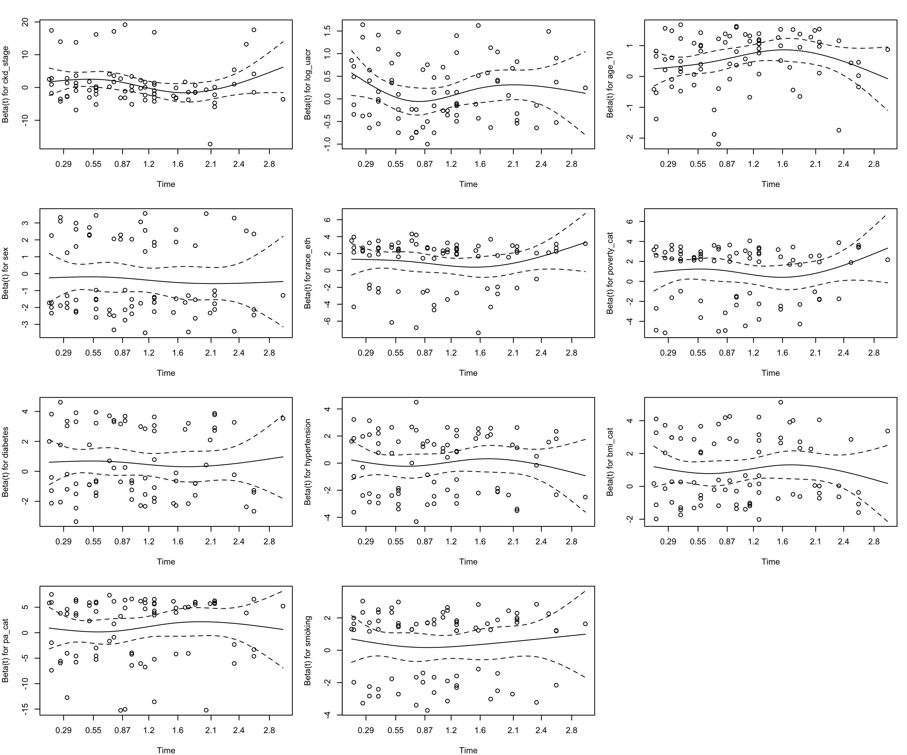{#fig-schoenfeld width=1800}
:::
:::


::: {.cell}

```{.r .cell-code}
knitr::include_graphics(here("output", "figures", "04_martingale.png"))
```

::: {.cell-output-display}
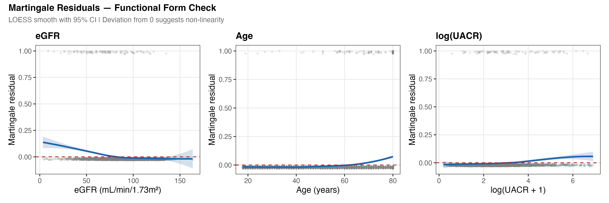{#fig-martingale width=1800}
:::
:::


The global Schoenfeld test yielded p = 0.92, confirming proportional hazards across all covariates (@tbl-ph, @fig-schoenfeld). Martingale residual plots (@fig-martingale) support the linear functional form assumption for all continuous predictors; the spline analysis in SA-2 provides a formal non-linearity test.

### Model Discrimination


::: {#tbl-fit .cell tbl-cap='Model fit statistics across the three Cox models. C-statistic: Harrell\'s concordance index. LR: likelihood ratio test.'}

```{.r .cell-code}
fit_df <- readr::read_csv(here("output", "tables", "04_model_fit.csv"),
                           show_col_types = FALSE)

fit_df |>
  select(model, n, events, concordance, concordance_se, lr_chisq, lr_df, lr_p) |>
  gt() |>
  cols_label(model = "Model", n = "N", events = "Events",
             concordance = "C-statistic", concordance_se = "SE(C)",
             lr_chisq = "LR χ²", lr_df = "df", lr_p = "LR p") |>
  fmt_number(columns = concordance,    decimals = 3) |>
  fmt_number(columns = concordance_se, decimals = 4) |>
  fmt_number(columns = lr_chisq,       decimals = 1) |>
  fmt_scientific(columns = lr_p,       decimals = 2) |>
  tab_style(
    style = list(cell_fill(color = "#EAF2FF"), cell_text(weight = "bold")),
    locations = cells_body(rows = str_detect(model, "Fully"))
  ) |>
  tab_style(
    style = cell_text(weight = "bold"),
    locations = cells_column_labels()
  )
```

::: {.cell-output-display}

```{=html}
<div id="nkgtzuhxnx" style="padding-left:0px;padding-right:0px;padding-top:10px;padding-bottom:10px;overflow-x:auto;overflow-y:auto;width:auto;height:auto;">
<style>#nkgtzuhxnx table {
  font-family: system-ui, 'Segoe UI', Roboto, Helvetica, Arial, sans-serif, 'Apple Color Emoji', 'Segoe UI Emoji', 'Segoe UI Symbol', 'Noto Color Emoji';
  -webkit-font-smoothing: antialiased;
  -moz-osx-font-smoothing: grayscale;
}

#nkgtzuhxnx thead, #nkgtzuhxnx tbody, #nkgtzuhxnx tfoot, #nkgtzuhxnx tr, #nkgtzuhxnx td, #nkgtzuhxnx th {
  border-style: none;
}

#nkgtzuhxnx p {
  margin: 0;
  padding: 0;
}

#nkgtzuhxnx .gt_table {
  display: table;
  border-collapse: collapse;
  line-height: normal;
  margin-left: auto;
  margin-right: auto;
  color: #333333;
  font-size: 16px;
  font-weight: normal;
  font-style: normal;
  background-color: #FFFFFF;
  width: auto;
  border-top-style: solid;
  border-top-width: 2px;
  border-top-color: #A8A8A8;
  border-right-style: none;
  border-right-width: 2px;
  border-right-color: #D3D3D3;
  border-bottom-style: solid;
  border-bottom-width: 2px;
  border-bottom-color: #A8A8A8;
  border-left-style: none;
  border-left-width: 2px;
  border-left-color: #D3D3D3;
}

#nkgtzuhxnx .gt_caption {
  padding-top: 4px;
  padding-bottom: 4px;
}

#nkgtzuhxnx .gt_title {
  color: #333333;
  font-size: 125%;
  font-weight: initial;
  padding-top: 4px;
  padding-bottom: 4px;
  padding-left: 5px;
  padding-right: 5px;
  border-bottom-color: #FFFFFF;
  border-bottom-width: 0;
}

#nkgtzuhxnx .gt_subtitle {
  color: #333333;
  font-size: 85%;
  font-weight: initial;
  padding-top: 3px;
  padding-bottom: 5px;
  padding-left: 5px;
  padding-right: 5px;
  border-top-color: #FFFFFF;
  border-top-width: 0;
}

#nkgtzuhxnx .gt_heading {
  background-color: #FFFFFF;
  text-align: center;
  border-bottom-color: #FFFFFF;
  border-left-style: none;
  border-left-width: 1px;
  border-left-color: #D3D3D3;
  border-right-style: none;
  border-right-width: 1px;
  border-right-color: #D3D3D3;
}

#nkgtzuhxnx .gt_bottom_border {
  border-bottom-style: solid;
  border-bottom-width: 2px;
  border-bottom-color: #D3D3D3;
}

#nkgtzuhxnx .gt_col_headings {
  border-top-style: solid;
  border-top-width: 2px;
  border-top-color: #D3D3D3;
  border-bottom-style: solid;
  border-bottom-width: 2px;
  border-bottom-color: #D3D3D3;
  border-left-style: none;
  border-left-width: 1px;
  border-left-color: #D3D3D3;
  border-right-style: none;
  border-right-width: 1px;
  border-right-color: #D3D3D3;
}

#nkgtzuhxnx .gt_col_heading {
  color: #333333;
  background-color: #FFFFFF;
  font-size: 100%;
  font-weight: normal;
  text-transform: inherit;
  border-left-style: none;
  border-left-width: 1px;
  border-left-color: #D3D3D3;
  border-right-style: none;
  border-right-width: 1px;
  border-right-color: #D3D3D3;
  vertical-align: bottom;
  padding-top: 5px;
  padding-bottom: 6px;
  padding-left: 5px;
  padding-right: 5px;
  overflow-x: hidden;
}

#nkgtzuhxnx .gt_column_spanner_outer {
  color: #333333;
  background-color: #FFFFFF;
  font-size: 100%;
  font-weight: normal;
  text-transform: inherit;
  padding-top: 0;
  padding-bottom: 0;
  padding-left: 4px;
  padding-right: 4px;
}

#nkgtzuhxnx .gt_column_spanner_outer:first-child {
  padding-left: 0;
}

#nkgtzuhxnx .gt_column_spanner_outer:last-child {
  padding-right: 0;
}

#nkgtzuhxnx .gt_column_spanner {
  border-bottom-style: solid;
  border-bottom-width: 2px;
  border-bottom-color: #D3D3D3;
  vertical-align: bottom;
  padding-top: 5px;
  padding-bottom: 5px;
  overflow-x: hidden;
  display: inline-block;
  width: 100%;
}

#nkgtzuhxnx .gt_spanner_row {
  border-bottom-style: hidden;
}

#nkgtzuhxnx .gt_group_heading {
  padding-top: 8px;
  padding-bottom: 8px;
  padding-left: 5px;
  padding-right: 5px;
  color: #333333;
  background-color: #FFFFFF;
  font-size: 100%;
  font-weight: initial;
  text-transform: inherit;
  border-top-style: solid;
  border-top-width: 2px;
  border-top-color: #D3D3D3;
  border-bottom-style: solid;
  border-bottom-width: 2px;
  border-bottom-color: #D3D3D3;
  border-left-style: none;
  border-left-width: 1px;
  border-left-color: #D3D3D3;
  border-right-style: none;
  border-right-width: 1px;
  border-right-color: #D3D3D3;
  vertical-align: middle;
  text-align: left;
}

#nkgtzuhxnx .gt_empty_group_heading {
  padding: 0.5px;
  color: #333333;
  background-color: #FFFFFF;
  font-size: 100%;
  font-weight: initial;
  border-top-style: solid;
  border-top-width: 2px;
  border-top-color: #D3D3D3;
  border-bottom-style: solid;
  border-bottom-width: 2px;
  border-bottom-color: #D3D3D3;
  vertical-align: middle;
}

#nkgtzuhxnx .gt_from_md > :first-child {
  margin-top: 0;
}

#nkgtzuhxnx .gt_from_md > :last-child {
  margin-bottom: 0;
}

#nkgtzuhxnx .gt_row {
  padding-top: 8px;
  padding-bottom: 8px;
  padding-left: 5px;
  padding-right: 5px;
  margin: 10px;
  border-top-style: solid;
  border-top-width: 1px;
  border-top-color: #D3D3D3;
  border-left-style: none;
  border-left-width: 1px;
  border-left-color: #D3D3D3;
  border-right-style: none;
  border-right-width: 1px;
  border-right-color: #D3D3D3;
  vertical-align: middle;
  overflow-x: hidden;
}

#nkgtzuhxnx .gt_stub {
  color: #333333;
  background-color: #FFFFFF;
  font-size: 100%;
  font-weight: initial;
  text-transform: inherit;
  border-right-style: solid;
  border-right-width: 2px;
  border-right-color: #D3D3D3;
  padding-left: 5px;
  padding-right: 5px;
}

#nkgtzuhxnx .gt_stub_row_group {
  color: #333333;
  background-color: #FFFFFF;
  font-size: 100%;
  font-weight: initial;
  text-transform: inherit;
  border-right-style: solid;
  border-right-width: 2px;
  border-right-color: #D3D3D3;
  padding-left: 5px;
  padding-right: 5px;
  vertical-align: top;
}

#nkgtzuhxnx .gt_row_group_first td {
  border-top-width: 2px;
}

#nkgtzuhxnx .gt_row_group_first th {
  border-top-width: 2px;
}

#nkgtzuhxnx .gt_summary_row {
  color: #333333;
  background-color: #FFFFFF;
  text-transform: inherit;
  padding-top: 8px;
  padding-bottom: 8px;
  padding-left: 5px;
  padding-right: 5px;
}

#nkgtzuhxnx .gt_first_summary_row {
  border-top-style: solid;
  border-top-color: #D3D3D3;
}

#nkgtzuhxnx .gt_first_summary_row.thick {
  border-top-width: 2px;
}

#nkgtzuhxnx .gt_last_summary_row {
  padding-top: 8px;
  padding-bottom: 8px;
  padding-left: 5px;
  padding-right: 5px;
  border-bottom-style: solid;
  border-bottom-width: 2px;
  border-bottom-color: #D3D3D3;
}

#nkgtzuhxnx .gt_grand_summary_row {
  color: #333333;
  background-color: #FFFFFF;
  text-transform: inherit;
  padding-top: 8px;
  padding-bottom: 8px;
  padding-left: 5px;
  padding-right: 5px;
}

#nkgtzuhxnx .gt_first_grand_summary_row {
  padding-top: 8px;
  padding-bottom: 8px;
  padding-left: 5px;
  padding-right: 5px;
  border-top-style: double;
  border-top-width: 6px;
  border-top-color: #D3D3D3;
}

#nkgtzuhxnx .gt_last_grand_summary_row_top {
  padding-top: 8px;
  padding-bottom: 8px;
  padding-left: 5px;
  padding-right: 5px;
  border-bottom-style: double;
  border-bottom-width: 6px;
  border-bottom-color: #D3D3D3;
}

#nkgtzuhxnx .gt_striped {
  background-color: rgba(128, 128, 128, 0.05);
}

#nkgtzuhxnx .gt_table_body {
  border-top-style: solid;
  border-top-width: 2px;
  border-top-color: #D3D3D3;
  border-bottom-style: solid;
  border-bottom-width: 2px;
  border-bottom-color: #D3D3D3;
}

#nkgtzuhxnx .gt_footnotes {
  color: #333333;
  background-color: #FFFFFF;
  border-bottom-style: none;
  border-bottom-width: 2px;
  border-bottom-color: #D3D3D3;
  border-left-style: none;
  border-left-width: 2px;
  border-left-color: #D3D3D3;
  border-right-style: none;
  border-right-width: 2px;
  border-right-color: #D3D3D3;
}

#nkgtzuhxnx .gt_footnote {
  margin: 0px;
  font-size: 90%;
  padding-top: 4px;
  padding-bottom: 4px;
  padding-left: 5px;
  padding-right: 5px;
}

#nkgtzuhxnx .gt_sourcenotes {
  color: #333333;
  background-color: #FFFFFF;
  border-bottom-style: none;
  border-bottom-width: 2px;
  border-bottom-color: #D3D3D3;
  border-left-style: none;
  border-left-width: 2px;
  border-left-color: #D3D3D3;
  border-right-style: none;
  border-right-width: 2px;
  border-right-color: #D3D3D3;
}

#nkgtzuhxnx .gt_sourcenote {
  font-size: 90%;
  padding-top: 4px;
  padding-bottom: 4px;
  padding-left: 5px;
  padding-right: 5px;
}

#nkgtzuhxnx .gt_left {
  text-align: left;
}

#nkgtzuhxnx .gt_center {
  text-align: center;
}

#nkgtzuhxnx .gt_right {
  text-align: right;
  font-variant-numeric: tabular-nums;
}

#nkgtzuhxnx .gt_font_normal {
  font-weight: normal;
}

#nkgtzuhxnx .gt_font_bold {
  font-weight: bold;
}

#nkgtzuhxnx .gt_font_italic {
  font-style: italic;
}

#nkgtzuhxnx .gt_super {
  font-size: 65%;
}

#nkgtzuhxnx .gt_footnote_marks {
  font-size: 75%;
  vertical-align: 0.4em;
  position: initial;
}

#nkgtzuhxnx .gt_asterisk {
  font-size: 100%;
  vertical-align: 0;
}

#nkgtzuhxnx .gt_indent_1 {
  text-indent: 5px;
}

#nkgtzuhxnx .gt_indent_2 {
  text-indent: 10px;
}

#nkgtzuhxnx .gt_indent_3 {
  text-indent: 15px;
}

#nkgtzuhxnx .gt_indent_4 {
  text-indent: 20px;
}

#nkgtzuhxnx .gt_indent_5 {
  text-indent: 25px;
}

#nkgtzuhxnx .katex-display {
  display: inline-flex !important;
  margin-bottom: 0.75em !important;
}

#nkgtzuhxnx div.Reactable > div.rt-table > div.rt-thead > div.rt-tr.rt-tr-group-header > div.rt-th-group:after {
  height: 0px !important;
}
</style>
<table class="gt_table" data-quarto-disable-processing="false" data-quarto-bootstrap="false">
  <thead>
    <tr class="gt_col_headings">
      <th class="gt_col_heading gt_columns_bottom_border gt_left" rowspan="1" colspan="1" style="font-weight: bold;" scope="col" id="model">Model</th>
      <th class="gt_col_heading gt_columns_bottom_border gt_right" rowspan="1" colspan="1" style="font-weight: bold;" scope="col" id="n">N</th>
      <th class="gt_col_heading gt_columns_bottom_border gt_right" rowspan="1" colspan="1" style="font-weight: bold;" scope="col" id="events">Events</th>
      <th class="gt_col_heading gt_columns_bottom_border gt_right" rowspan="1" colspan="1" style="font-weight: bold;" scope="col" id="concordance">C-statistic</th>
      <th class="gt_col_heading gt_columns_bottom_border gt_right" rowspan="1" colspan="1" style="font-weight: bold;" scope="col" id="concordance_se">SE(C)</th>
      <th class="gt_col_heading gt_columns_bottom_border gt_right" rowspan="1" colspan="1" style="font-weight: bold;" scope="col" id="lr_chisq">LR χ²</th>
      <th class="gt_col_heading gt_columns_bottom_border gt_right" rowspan="1" colspan="1" style="font-weight: bold;" scope="col" id="lr_df">df</th>
      <th class="gt_col_heading gt_columns_bottom_border gt_right" rowspan="1" colspan="1" style="font-weight: bold;" scope="col" id="lr_p">LR p</th>
    </tr>
  </thead>
  <tbody class="gt_table_body">
    <tr><td headers="model" class="gt_row gt_left">Model 1: Unadjusted</td>
<td headers="n" class="gt_row gt_right">5038</td>
<td headers="events" class="gt_row gt_right">102</td>
<td headers="concordance" class="gt_row gt_right">0.744</td>
<td headers="concordance_se" class="gt_row gt_right">0.0248</td>
<td headers="lr_chisq" class="gt_row gt_right">91.7</td>
<td headers="lr_df" class="gt_row gt_right">5</td>
<td headers="lr_p" class="gt_row gt_right">2.96&nbsp;×&nbsp;10<sup style='font-size: 65%;'>−18</sup></td></tr>
    <tr><td headers="model" class="gt_row gt_left">Model 2: + Demographics</td>
<td headers="n" class="gt_row gt_right">3790</td>
<td headers="events" class="gt_row gt_right">87</td>
<td headers="concordance" class="gt_row gt_right">0.833</td>
<td headers="concordance_se" class="gt_row gt_right">0.0187</td>
<td headers="lr_chisq" class="gt_row gt_right">139.9</td>
<td headers="lr_df" class="gt_row gt_right">14</td>
<td headers="lr_p" class="gt_row gt_right">7.33&nbsp;×&nbsp;10<sup style='font-size: 65%;'>−23</sup></td></tr>
    <tr><td headers="model" class="gt_row gt_left" style="background-color: #EAF2FF; font-weight: bold;">Model 3: Fully adjusted</td>
<td headers="n" class="gt_row gt_right" style="background-color: #EAF2FF; font-weight: bold;">3739</td>
<td headers="events" class="gt_row gt_right" style="background-color: #EAF2FF; font-weight: bold;">78</td>
<td headers="concordance" class="gt_row gt_right" style="background-color: #EAF2FF; font-weight: bold;">0.847</td>
<td headers="concordance_se" class="gt_row gt_right" style="background-color: #EAF2FF; font-weight: bold;">0.0202</td>
<td headers="lr_chisq" class="gt_row gt_right" style="background-color: #EAF2FF; font-weight: bold;">157.0</td>
<td headers="lr_df" class="gt_row gt_right" style="background-color: #EAF2FF; font-weight: bold;">23</td>
<td headers="lr_p" class="gt_row gt_right" style="background-color: #EAF2FF; font-weight: bold;">6.22&nbsp;×&nbsp;10<sup style='font-size: 65%;'>−22</sup></td></tr>
  </tbody>
  
</table>
</div>
```

:::
:::


::: {.cell}

```{.r .cell-code}
knitr::include_graphics(here("output", "figures", "05_cv_cstat.png"))
```

::: {.cell-output-display}
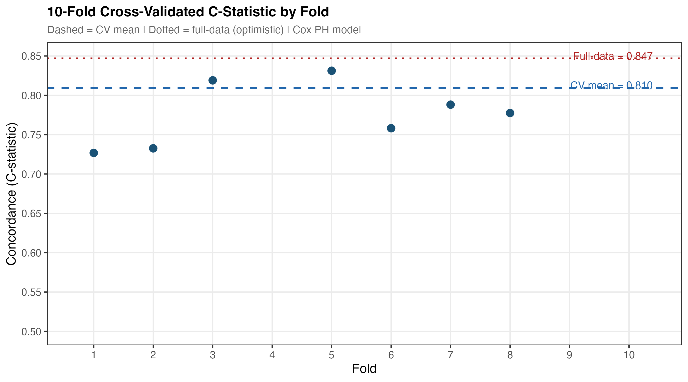{#fig-cv width=1350}
:::
:::


::: {.cell}

```{.r .cell-code}
knitr::include_graphics(here("output", "figures", "05_calibration.png"))
```

::: {.cell-output-display}
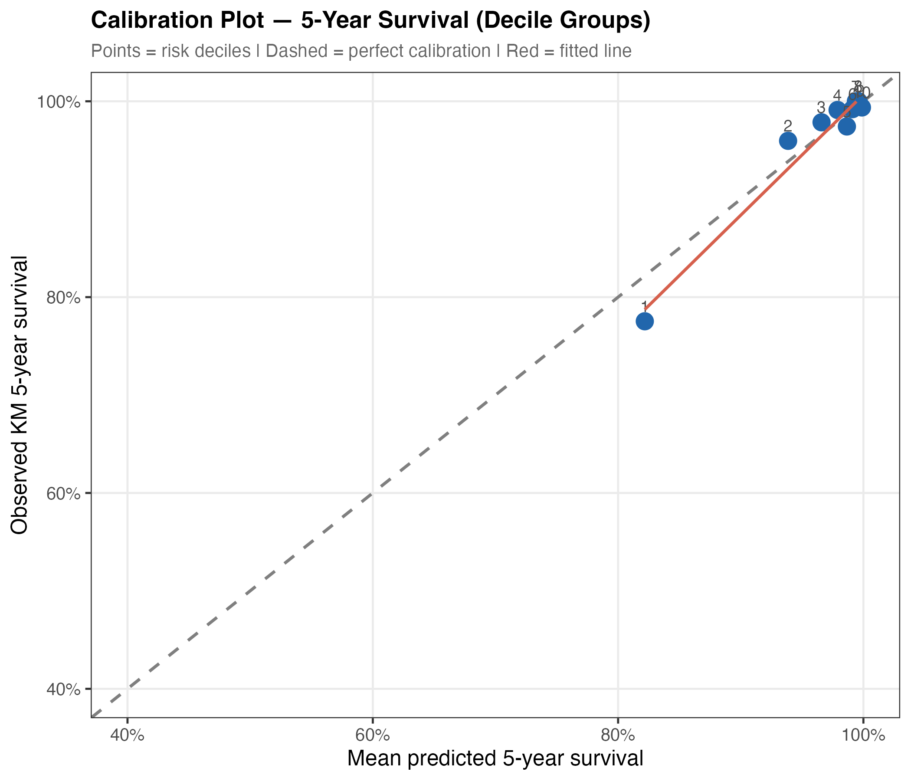{#fig-calib width=1050}
:::
:::


The fully adjusted Model 3 achieved a full-data C-statistic of 0.847 and a 10-fold cross-validated C-statistic of 0.810 (@fig-cv, @tbl-fit), indicating good discrimination with minimal overfitting (optimism = 0.037). The calibration plot (@fig-calib) demonstrates reasonable agreement between predicted and observed 5-year survival across risk deciles.

---

## Sensitivity Analyses

All six pre-specified sensitivity analyses were completed. @tbl-sensitivity summarises the primary finding from each.


::: {#tbl-sensitivity .cell tbl-cap='Summary of pre-specified sensitivity analyses. All primary findings were robust to alternative analytical assumptions.'}

```{.r .cell-code}
sens_df <- readr::read_csv(here("output", "tables", "06_sensitivity_summary.csv"),
                            show_col_types = FALSE)

sens_df |>
  gt() |>
  cols_label(analysis = "Analysis", finding = "Primary finding") |>
  tab_style(
    style = cell_text(weight = "bold"),
    locations = cells_column_labels()
  ) |>
  cols_width(analysis ~ px(220), finding ~ px(480))
```

::: {.cell-output-display}

```{=html}
<div id="cnwsfvdlbn" style="padding-left:0px;padding-right:0px;padding-top:10px;padding-bottom:10px;overflow-x:auto;overflow-y:auto;width:auto;height:auto;">
<style>#cnwsfvdlbn table {
  font-family: system-ui, 'Segoe UI', Roboto, Helvetica, Arial, sans-serif, 'Apple Color Emoji', 'Segoe UI Emoji', 'Segoe UI Symbol', 'Noto Color Emoji';
  -webkit-font-smoothing: antialiased;
  -moz-osx-font-smoothing: grayscale;
}

#cnwsfvdlbn thead, #cnwsfvdlbn tbody, #cnwsfvdlbn tfoot, #cnwsfvdlbn tr, #cnwsfvdlbn td, #cnwsfvdlbn th {
  border-style: none;
}

#cnwsfvdlbn p {
  margin: 0;
  padding: 0;
}

#cnwsfvdlbn .gt_table {
  display: table;
  border-collapse: collapse;
  line-height: normal;
  margin-left: auto;
  margin-right: auto;
  color: #333333;
  font-size: 16px;
  font-weight: normal;
  font-style: normal;
  background-color: #FFFFFF;
  width: auto;
  border-top-style: solid;
  border-top-width: 2px;
  border-top-color: #A8A8A8;
  border-right-style: none;
  border-right-width: 2px;
  border-right-color: #D3D3D3;
  border-bottom-style: solid;
  border-bottom-width: 2px;
  border-bottom-color: #A8A8A8;
  border-left-style: none;
  border-left-width: 2px;
  border-left-color: #D3D3D3;
}

#cnwsfvdlbn .gt_caption {
  padding-top: 4px;
  padding-bottom: 4px;
}

#cnwsfvdlbn .gt_title {
  color: #333333;
  font-size: 125%;
  font-weight: initial;
  padding-top: 4px;
  padding-bottom: 4px;
  padding-left: 5px;
  padding-right: 5px;
  border-bottom-color: #FFFFFF;
  border-bottom-width: 0;
}

#cnwsfvdlbn .gt_subtitle {
  color: #333333;
  font-size: 85%;
  font-weight: initial;
  padding-top: 3px;
  padding-bottom: 5px;
  padding-left: 5px;
  padding-right: 5px;
  border-top-color: #FFFFFF;
  border-top-width: 0;
}

#cnwsfvdlbn .gt_heading {
  background-color: #FFFFFF;
  text-align: center;
  border-bottom-color: #FFFFFF;
  border-left-style: none;
  border-left-width: 1px;
  border-left-color: #D3D3D3;
  border-right-style: none;
  border-right-width: 1px;
  border-right-color: #D3D3D3;
}

#cnwsfvdlbn .gt_bottom_border {
  border-bottom-style: solid;
  border-bottom-width: 2px;
  border-bottom-color: #D3D3D3;
}

#cnwsfvdlbn .gt_col_headings {
  border-top-style: solid;
  border-top-width: 2px;
  border-top-color: #D3D3D3;
  border-bottom-style: solid;
  border-bottom-width: 2px;
  border-bottom-color: #D3D3D3;
  border-left-style: none;
  border-left-width: 1px;
  border-left-color: #D3D3D3;
  border-right-style: none;
  border-right-width: 1px;
  border-right-color: #D3D3D3;
}

#cnwsfvdlbn .gt_col_heading {
  color: #333333;
  background-color: #FFFFFF;
  font-size: 100%;
  font-weight: normal;
  text-transform: inherit;
  border-left-style: none;
  border-left-width: 1px;
  border-left-color: #D3D3D3;
  border-right-style: none;
  border-right-width: 1px;
  border-right-color: #D3D3D3;
  vertical-align: bottom;
  padding-top: 5px;
  padding-bottom: 6px;
  padding-left: 5px;
  padding-right: 5px;
  overflow-x: hidden;
}

#cnwsfvdlbn .gt_column_spanner_outer {
  color: #333333;
  background-color: #FFFFFF;
  font-size: 100%;
  font-weight: normal;
  text-transform: inherit;
  padding-top: 0;
  padding-bottom: 0;
  padding-left: 4px;
  padding-right: 4px;
}

#cnwsfvdlbn .gt_column_spanner_outer:first-child {
  padding-left: 0;
}

#cnwsfvdlbn .gt_column_spanner_outer:last-child {
  padding-right: 0;
}

#cnwsfvdlbn .gt_column_spanner {
  border-bottom-style: solid;
  border-bottom-width: 2px;
  border-bottom-color: #D3D3D3;
  vertical-align: bottom;
  padding-top: 5px;
  padding-bottom: 5px;
  overflow-x: hidden;
  display: inline-block;
  width: 100%;
}

#cnwsfvdlbn .gt_spanner_row {
  border-bottom-style: hidden;
}

#cnwsfvdlbn .gt_group_heading {
  padding-top: 8px;
  padding-bottom: 8px;
  padding-left: 5px;
  padding-right: 5px;
  color: #333333;
  background-color: #FFFFFF;
  font-size: 100%;
  font-weight: initial;
  text-transform: inherit;
  border-top-style: solid;
  border-top-width: 2px;
  border-top-color: #D3D3D3;
  border-bottom-style: solid;
  border-bottom-width: 2px;
  border-bottom-color: #D3D3D3;
  border-left-style: none;
  border-left-width: 1px;
  border-left-color: #D3D3D3;
  border-right-style: none;
  border-right-width: 1px;
  border-right-color: #D3D3D3;
  vertical-align: middle;
  text-align: left;
}

#cnwsfvdlbn .gt_empty_group_heading {
  padding: 0.5px;
  color: #333333;
  background-color: #FFFFFF;
  font-size: 100%;
  font-weight: initial;
  border-top-style: solid;
  border-top-width: 2px;
  border-top-color: #D3D3D3;
  border-bottom-style: solid;
  border-bottom-width: 2px;
  border-bottom-color: #D3D3D3;
  vertical-align: middle;
}

#cnwsfvdlbn .gt_from_md > :first-child {
  margin-top: 0;
}

#cnwsfvdlbn .gt_from_md > :last-child {
  margin-bottom: 0;
}

#cnwsfvdlbn .gt_row {
  padding-top: 8px;
  padding-bottom: 8px;
  padding-left: 5px;
  padding-right: 5px;
  margin: 10px;
  border-top-style: solid;
  border-top-width: 1px;
  border-top-color: #D3D3D3;
  border-left-style: none;
  border-left-width: 1px;
  border-left-color: #D3D3D3;
  border-right-style: none;
  border-right-width: 1px;
  border-right-color: #D3D3D3;
  vertical-align: middle;
  overflow-x: hidden;
}

#cnwsfvdlbn .gt_stub {
  color: #333333;
  background-color: #FFFFFF;
  font-size: 100%;
  font-weight: initial;
  text-transform: inherit;
  border-right-style: solid;
  border-right-width: 2px;
  border-right-color: #D3D3D3;
  padding-left: 5px;
  padding-right: 5px;
}

#cnwsfvdlbn .gt_stub_row_group {
  color: #333333;
  background-color: #FFFFFF;
  font-size: 100%;
  font-weight: initial;
  text-transform: inherit;
  border-right-style: solid;
  border-right-width: 2px;
  border-right-color: #D3D3D3;
  padding-left: 5px;
  padding-right: 5px;
  vertical-align: top;
}

#cnwsfvdlbn .gt_row_group_first td {
  border-top-width: 2px;
}

#cnwsfvdlbn .gt_row_group_first th {
  border-top-width: 2px;
}

#cnwsfvdlbn .gt_summary_row {
  color: #333333;
  background-color: #FFFFFF;
  text-transform: inherit;
  padding-top: 8px;
  padding-bottom: 8px;
  padding-left: 5px;
  padding-right: 5px;
}

#cnwsfvdlbn .gt_first_summary_row {
  border-top-style: solid;
  border-top-color: #D3D3D3;
}

#cnwsfvdlbn .gt_first_summary_row.thick {
  border-top-width: 2px;
}

#cnwsfvdlbn .gt_last_summary_row {
  padding-top: 8px;
  padding-bottom: 8px;
  padding-left: 5px;
  padding-right: 5px;
  border-bottom-style: solid;
  border-bottom-width: 2px;
  border-bottom-color: #D3D3D3;
}

#cnwsfvdlbn .gt_grand_summary_row {
  color: #333333;
  background-color: #FFFFFF;
  text-transform: inherit;
  padding-top: 8px;
  padding-bottom: 8px;
  padding-left: 5px;
  padding-right: 5px;
}

#cnwsfvdlbn .gt_first_grand_summary_row {
  padding-top: 8px;
  padding-bottom: 8px;
  padding-left: 5px;
  padding-right: 5px;
  border-top-style: double;
  border-top-width: 6px;
  border-top-color: #D3D3D3;
}

#cnwsfvdlbn .gt_last_grand_summary_row_top {
  padding-top: 8px;
  padding-bottom: 8px;
  padding-left: 5px;
  padding-right: 5px;
  border-bottom-style: double;
  border-bottom-width: 6px;
  border-bottom-color: #D3D3D3;
}

#cnwsfvdlbn .gt_striped {
  background-color: rgba(128, 128, 128, 0.05);
}

#cnwsfvdlbn .gt_table_body {
  border-top-style: solid;
  border-top-width: 2px;
  border-top-color: #D3D3D3;
  border-bottom-style: solid;
  border-bottom-width: 2px;
  border-bottom-color: #D3D3D3;
}

#cnwsfvdlbn .gt_footnotes {
  color: #333333;
  background-color: #FFFFFF;
  border-bottom-style: none;
  border-bottom-width: 2px;
  border-bottom-color: #D3D3D3;
  border-left-style: none;
  border-left-width: 2px;
  border-left-color: #D3D3D3;
  border-right-style: none;
  border-right-width: 2px;
  border-right-color: #D3D3D3;
}

#cnwsfvdlbn .gt_footnote {
  margin: 0px;
  font-size: 90%;
  padding-top: 4px;
  padding-bottom: 4px;
  padding-left: 5px;
  padding-right: 5px;
}

#cnwsfvdlbn .gt_sourcenotes {
  color: #333333;
  background-color: #FFFFFF;
  border-bottom-style: none;
  border-bottom-width: 2px;
  border-bottom-color: #D3D3D3;
  border-left-style: none;
  border-left-width: 2px;
  border-left-color: #D3D3D3;
  border-right-style: none;
  border-right-width: 2px;
  border-right-color: #D3D3D3;
}

#cnwsfvdlbn .gt_sourcenote {
  font-size: 90%;
  padding-top: 4px;
  padding-bottom: 4px;
  padding-left: 5px;
  padding-right: 5px;
}

#cnwsfvdlbn .gt_left {
  text-align: left;
}

#cnwsfvdlbn .gt_center {
  text-align: center;
}

#cnwsfvdlbn .gt_right {
  text-align: right;
  font-variant-numeric: tabular-nums;
}

#cnwsfvdlbn .gt_font_normal {
  font-weight: normal;
}

#cnwsfvdlbn .gt_font_bold {
  font-weight: bold;
}

#cnwsfvdlbn .gt_font_italic {
  font-style: italic;
}

#cnwsfvdlbn .gt_super {
  font-size: 65%;
}

#cnwsfvdlbn .gt_footnote_marks {
  font-size: 75%;
  vertical-align: 0.4em;
  position: initial;
}

#cnwsfvdlbn .gt_asterisk {
  font-size: 100%;
  vertical-align: 0;
}

#cnwsfvdlbn .gt_indent_1 {
  text-indent: 5px;
}

#cnwsfvdlbn .gt_indent_2 {
  text-indent: 10px;
}

#cnwsfvdlbn .gt_indent_3 {
  text-indent: 15px;
}

#cnwsfvdlbn .gt_indent_4 {
  text-indent: 20px;
}

#cnwsfvdlbn .gt_indent_5 {
  text-indent: 25px;
}

#cnwsfvdlbn .katex-display {
  display: inline-flex !important;
  margin-bottom: 0.75em !important;
}

#cnwsfvdlbn div.Reactable > div.rt-table > div.rt-thead > div.rt-tr.rt-tr-group-header > div.rt-th-group:after {
  height: 0px !important;
}
</style>
<table class="gt_table" style="table-layout:fixed;width:0px;" data-quarto-disable-processing="false" data-quarto-bootstrap="false">
  <colgroup>
    <col style="width:220px;"/>
    <col style="width:480px;"/>
  </colgroup>
  <thead>
    <tr class="gt_col_headings">
      <th class="gt_col_heading gt_columns_bottom_border gt_left" rowspan="1" colspan="1" style="font-weight: bold;" scope="col" id="analysis">Analysis</th>
      <th class="gt_col_heading gt_columns_bottom_border gt_left" rowspan="1" colspan="1" style="font-weight: bold;" scope="col" id="finding">Primary finding</th>
    </tr>
  </thead>
  <tbody class="gt_table_body">
    <tr><td headers="analysis" class="gt_row gt_left">SA-1: Multiple imputation</td>
<td headers="finding" class="gt_row gt_left">HR estimates consistent with primary complete-case analysis</td></tr>
    <tr><td headers="analysis" class="gt_row gt_left">SA-2: Restricted cubic splines</td>
<td headers="finding" class="gt_row gt_left">Non-linearity LRT p = 0.259</td></tr>
    <tr><td headers="analysis" class="gt_row gt_left">SA-3: Time-varying covariates</td>
<td headers="finding" class="gt_row gt_left">No PH violations — primary model retained</td></tr>
    <tr><td headers="analysis" class="gt_row gt_left">SA-4: Subgroup (diabetes × CKD)</td>
<td headers="finding" class="gt_row gt_left">Subgroup HRs estimated — interaction p reported in table</td></tr>
    <tr><td headers="analysis" class="gt_row gt_left">SA-4: Subgroup (age × CKD)</td>
<td headers="finding" class="gt_row gt_left">Subgroup HRs estimated — interaction p reported in table</td></tr>
    <tr><td headers="analysis" class="gt_row gt_left">SA-5: CVD-specific mortality</td>
<td headers="finding" class="gt_row gt_left">CVD deaths: 25</td></tr>
    <tr><td headers="analysis" class="gt_row gt_left">SA-5: Renal-specific mortality</td>
<td headers="finding" class="gt_row gt_left">Renal deaths: 0</td></tr>
    <tr><td headers="analysis" class="gt_row gt_left">SA-6: eGFR &lt; 45 threshold</td>
<td headers="finding" class="gt_row gt_left">HR = 1.31 (eGFR &lt; 45 threshold)</td></tr>
    <tr><td headers="analysis" class="gt_row gt_left">SA-6: eGFR &lt; 75 threshold</td>
<td headers="finding" class="gt_row gt_left">HR = 1.60 (eGFR &lt; 75 threshold)</td></tr>
  </tbody>
  
</table>
</div>
```

:::
:::


### SA-1: Multiple Imputation


::: {#tbl-mi .cell tbl-cap='SA-1: Pooled Cox hazard ratios from MICE multiple imputation (M = 20 datasets, predictive mean matching). Estimates are consistent with the primary complete-case analysis.'}

```{.r .cell-code}
mi_df <- readr::read_csv(here("output", "tables", "06_sa1_mi_results.csv"),
                          show_col_types = FALSE)

mi_df |>
  select(term, estimate, `2.5 %`, `97.5 %`, p.value) |>
  mutate(across(c(estimate, `2.5 %`, `97.5 %`), ~ round(.x, 3)),
         p.value = round(p.value, 3),
         significant = p.value < 0.05) |>
  gt() |>
  cols_label(term = "Term", estimate = "HR (pooled)",
             `2.5 %` = "2.5%", `97.5 %` = "97.5%", p.value = "p-value") |>
  tab_style(
    style = cell_text(weight = "bold"),
    locations = cells_body(rows = significant == TRUE)
  ) |>
  tab_style(
    style = cell_text(weight = "bold"),
    locations = cells_column_labels()
  ) |>
  cols_hide(significant)
```

::: {.cell-output-display}

```{=html}
<div id="umcpndwyev" style="padding-left:0px;padding-right:0px;padding-top:10px;padding-bottom:10px;overflow-x:auto;overflow-y:auto;width:auto;height:auto;">
<style>#umcpndwyev table {
  font-family: system-ui, 'Segoe UI', Roboto, Helvetica, Arial, sans-serif, 'Apple Color Emoji', 'Segoe UI Emoji', 'Segoe UI Symbol', 'Noto Color Emoji';
  -webkit-font-smoothing: antialiased;
  -moz-osx-font-smoothing: grayscale;
}

#umcpndwyev thead, #umcpndwyev tbody, #umcpndwyev tfoot, #umcpndwyev tr, #umcpndwyev td, #umcpndwyev th {
  border-style: none;
}

#umcpndwyev p {
  margin: 0;
  padding: 0;
}

#umcpndwyev .gt_table {
  display: table;
  border-collapse: collapse;
  line-height: normal;
  margin-left: auto;
  margin-right: auto;
  color: #333333;
  font-size: 16px;
  font-weight: normal;
  font-style: normal;
  background-color: #FFFFFF;
  width: auto;
  border-top-style: solid;
  border-top-width: 2px;
  border-top-color: #A8A8A8;
  border-right-style: none;
  border-right-width: 2px;
  border-right-color: #D3D3D3;
  border-bottom-style: solid;
  border-bottom-width: 2px;
  border-bottom-color: #A8A8A8;
  border-left-style: none;
  border-left-width: 2px;
  border-left-color: #D3D3D3;
}

#umcpndwyev .gt_caption {
  padding-top: 4px;
  padding-bottom: 4px;
}

#umcpndwyev .gt_title {
  color: #333333;
  font-size: 125%;
  font-weight: initial;
  padding-top: 4px;
  padding-bottom: 4px;
  padding-left: 5px;
  padding-right: 5px;
  border-bottom-color: #FFFFFF;
  border-bottom-width: 0;
}

#umcpndwyev .gt_subtitle {
  color: #333333;
  font-size: 85%;
  font-weight: initial;
  padding-top: 3px;
  padding-bottom: 5px;
  padding-left: 5px;
  padding-right: 5px;
  border-top-color: #FFFFFF;
  border-top-width: 0;
}

#umcpndwyev .gt_heading {
  background-color: #FFFFFF;
  text-align: center;
  border-bottom-color: #FFFFFF;
  border-left-style: none;
  border-left-width: 1px;
  border-left-color: #D3D3D3;
  border-right-style: none;
  border-right-width: 1px;
  border-right-color: #D3D3D3;
}

#umcpndwyev .gt_bottom_border {
  border-bottom-style: solid;
  border-bottom-width: 2px;
  border-bottom-color: #D3D3D3;
}

#umcpndwyev .gt_col_headings {
  border-top-style: solid;
  border-top-width: 2px;
  border-top-color: #D3D3D3;
  border-bottom-style: solid;
  border-bottom-width: 2px;
  border-bottom-color: #D3D3D3;
  border-left-style: none;
  border-left-width: 1px;
  border-left-color: #D3D3D3;
  border-right-style: none;
  border-right-width: 1px;
  border-right-color: #D3D3D3;
}

#umcpndwyev .gt_col_heading {
  color: #333333;
  background-color: #FFFFFF;
  font-size: 100%;
  font-weight: normal;
  text-transform: inherit;
  border-left-style: none;
  border-left-width: 1px;
  border-left-color: #D3D3D3;
  border-right-style: none;
  border-right-width: 1px;
  border-right-color: #D3D3D3;
  vertical-align: bottom;
  padding-top: 5px;
  padding-bottom: 6px;
  padding-left: 5px;
  padding-right: 5px;
  overflow-x: hidden;
}

#umcpndwyev .gt_column_spanner_outer {
  color: #333333;
  background-color: #FFFFFF;
  font-size: 100%;
  font-weight: normal;
  text-transform: inherit;
  padding-top: 0;
  padding-bottom: 0;
  padding-left: 4px;
  padding-right: 4px;
}

#umcpndwyev .gt_column_spanner_outer:first-child {
  padding-left: 0;
}

#umcpndwyev .gt_column_spanner_outer:last-child {
  padding-right: 0;
}

#umcpndwyev .gt_column_spanner {
  border-bottom-style: solid;
  border-bottom-width: 2px;
  border-bottom-color: #D3D3D3;
  vertical-align: bottom;
  padding-top: 5px;
  padding-bottom: 5px;
  overflow-x: hidden;
  display: inline-block;
  width: 100%;
}

#umcpndwyev .gt_spanner_row {
  border-bottom-style: hidden;
}

#umcpndwyev .gt_group_heading {
  padding-top: 8px;
  padding-bottom: 8px;
  padding-left: 5px;
  padding-right: 5px;
  color: #333333;
  background-color: #FFFFFF;
  font-size: 100%;
  font-weight: initial;
  text-transform: inherit;
  border-top-style: solid;
  border-top-width: 2px;
  border-top-color: #D3D3D3;
  border-bottom-style: solid;
  border-bottom-width: 2px;
  border-bottom-color: #D3D3D3;
  border-left-style: none;
  border-left-width: 1px;
  border-left-color: #D3D3D3;
  border-right-style: none;
  border-right-width: 1px;
  border-right-color: #D3D3D3;
  vertical-align: middle;
  text-align: left;
}

#umcpndwyev .gt_empty_group_heading {
  padding: 0.5px;
  color: #333333;
  background-color: #FFFFFF;
  font-size: 100%;
  font-weight: initial;
  border-top-style: solid;
  border-top-width: 2px;
  border-top-color: #D3D3D3;
  border-bottom-style: solid;
  border-bottom-width: 2px;
  border-bottom-color: #D3D3D3;
  vertical-align: middle;
}

#umcpndwyev .gt_from_md > :first-child {
  margin-top: 0;
}

#umcpndwyev .gt_from_md > :last-child {
  margin-bottom: 0;
}

#umcpndwyev .gt_row {
  padding-top: 8px;
  padding-bottom: 8px;
  padding-left: 5px;
  padding-right: 5px;
  margin: 10px;
  border-top-style: solid;
  border-top-width: 1px;
  border-top-color: #D3D3D3;
  border-left-style: none;
  border-left-width: 1px;
  border-left-color: #D3D3D3;
  border-right-style: none;
  border-right-width: 1px;
  border-right-color: #D3D3D3;
  vertical-align: middle;
  overflow-x: hidden;
}

#umcpndwyev .gt_stub {
  color: #333333;
  background-color: #FFFFFF;
  font-size: 100%;
  font-weight: initial;
  text-transform: inherit;
  border-right-style: solid;
  border-right-width: 2px;
  border-right-color: #D3D3D3;
  padding-left: 5px;
  padding-right: 5px;
}

#umcpndwyev .gt_stub_row_group {
  color: #333333;
  background-color: #FFFFFF;
  font-size: 100%;
  font-weight: initial;
  text-transform: inherit;
  border-right-style: solid;
  border-right-width: 2px;
  border-right-color: #D3D3D3;
  padding-left: 5px;
  padding-right: 5px;
  vertical-align: top;
}

#umcpndwyev .gt_row_group_first td {
  border-top-width: 2px;
}

#umcpndwyev .gt_row_group_first th {
  border-top-width: 2px;
}

#umcpndwyev .gt_summary_row {
  color: #333333;
  background-color: #FFFFFF;
  text-transform: inherit;
  padding-top: 8px;
  padding-bottom: 8px;
  padding-left: 5px;
  padding-right: 5px;
}

#umcpndwyev .gt_first_summary_row {
  border-top-style: solid;
  border-top-color: #D3D3D3;
}

#umcpndwyev .gt_first_summary_row.thick {
  border-top-width: 2px;
}

#umcpndwyev .gt_last_summary_row {
  padding-top: 8px;
  padding-bottom: 8px;
  padding-left: 5px;
  padding-right: 5px;
  border-bottom-style: solid;
  border-bottom-width: 2px;
  border-bottom-color: #D3D3D3;
}

#umcpndwyev .gt_grand_summary_row {
  color: #333333;
  background-color: #FFFFFF;
  text-transform: inherit;
  padding-top: 8px;
  padding-bottom: 8px;
  padding-left: 5px;
  padding-right: 5px;
}

#umcpndwyev .gt_first_grand_summary_row {
  padding-top: 8px;
  padding-bottom: 8px;
  padding-left: 5px;
  padding-right: 5px;
  border-top-style: double;
  border-top-width: 6px;
  border-top-color: #D3D3D3;
}

#umcpndwyev .gt_last_grand_summary_row_top {
  padding-top: 8px;
  padding-bottom: 8px;
  padding-left: 5px;
  padding-right: 5px;
  border-bottom-style: double;
  border-bottom-width: 6px;
  border-bottom-color: #D3D3D3;
}

#umcpndwyev .gt_striped {
  background-color: rgba(128, 128, 128, 0.05);
}

#umcpndwyev .gt_table_body {
  border-top-style: solid;
  border-top-width: 2px;
  border-top-color: #D3D3D3;
  border-bottom-style: solid;
  border-bottom-width: 2px;
  border-bottom-color: #D3D3D3;
}

#umcpndwyev .gt_footnotes {
  color: #333333;
  background-color: #FFFFFF;
  border-bottom-style: none;
  border-bottom-width: 2px;
  border-bottom-color: #D3D3D3;
  border-left-style: none;
  border-left-width: 2px;
  border-left-color: #D3D3D3;
  border-right-style: none;
  border-right-width: 2px;
  border-right-color: #D3D3D3;
}

#umcpndwyev .gt_footnote {
  margin: 0px;
  font-size: 90%;
  padding-top: 4px;
  padding-bottom: 4px;
  padding-left: 5px;
  padding-right: 5px;
}

#umcpndwyev .gt_sourcenotes {
  color: #333333;
  background-color: #FFFFFF;
  border-bottom-style: none;
  border-bottom-width: 2px;
  border-bottom-color: #D3D3D3;
  border-left-style: none;
  border-left-width: 2px;
  border-left-color: #D3D3D3;
  border-right-style: none;
  border-right-width: 2px;
  border-right-color: #D3D3D3;
}

#umcpndwyev .gt_sourcenote {
  font-size: 90%;
  padding-top: 4px;
  padding-bottom: 4px;
  padding-left: 5px;
  padding-right: 5px;
}

#umcpndwyev .gt_left {
  text-align: left;
}

#umcpndwyev .gt_center {
  text-align: center;
}

#umcpndwyev .gt_right {
  text-align: right;
  font-variant-numeric: tabular-nums;
}

#umcpndwyev .gt_font_normal {
  font-weight: normal;
}

#umcpndwyev .gt_font_bold {
  font-weight: bold;
}

#umcpndwyev .gt_font_italic {
  font-style: italic;
}

#umcpndwyev .gt_super {
  font-size: 65%;
}

#umcpndwyev .gt_footnote_marks {
  font-size: 75%;
  vertical-align: 0.4em;
  position: initial;
}

#umcpndwyev .gt_asterisk {
  font-size: 100%;
  vertical-align: 0;
}

#umcpndwyev .gt_indent_1 {
  text-indent: 5px;
}

#umcpndwyev .gt_indent_2 {
  text-indent: 10px;
}

#umcpndwyev .gt_indent_3 {
  text-indent: 15px;
}

#umcpndwyev .gt_indent_4 {
  text-indent: 20px;
}

#umcpndwyev .gt_indent_5 {
  text-indent: 25px;
}

#umcpndwyev .katex-display {
  display: inline-flex !important;
  margin-bottom: 0.75em !important;
}

#umcpndwyev div.Reactable > div.rt-table > div.rt-thead > div.rt-tr.rt-tr-group-header > div.rt-th-group:after {
  height: 0px !important;
}
</style>
<table class="gt_table" data-quarto-disable-processing="false" data-quarto-bootstrap="false">
  <thead>
    <tr class="gt_col_headings">
      <th class="gt_col_heading gt_columns_bottom_border gt_left" rowspan="1" colspan="1" style="font-weight: bold;" scope="col" id="term">Term</th>
      <th class="gt_col_heading gt_columns_bottom_border gt_right" rowspan="1" colspan="1" style="font-weight: bold;" scope="col" id="estimate">HR (pooled)</th>
      <th class="gt_col_heading gt_columns_bottom_border gt_right" rowspan="1" colspan="1" style="font-weight: bold;" scope="col" id="a2.5-%">2.5%</th>
      <th class="gt_col_heading gt_columns_bottom_border gt_right" rowspan="1" colspan="1" style="font-weight: bold;" scope="col" id="a97.5-%">97.5%</th>
      <th class="gt_col_heading gt_columns_bottom_border gt_right" rowspan="1" colspan="1" style="font-weight: bold;" scope="col" id="p.value">p-value</th>
    </tr>
  </thead>
  <tbody class="gt_table_body">
    <tr><td headers="term" class="gt_row gt_left">ckd_stageG2 (60–89)</td>
<td headers="estimate" class="gt_row gt_right">1.147</td>
<td headers="2.5 %" class="gt_row gt_right">0.644</td>
<td headers="97.5 %" class="gt_row gt_right">2.044</td>
<td headers="p.value" class="gt_row gt_right">0.638</td></tr>
    <tr><td headers="term" class="gt_row gt_left">ckd_stageG3a (45–59)</td>
<td headers="estimate" class="gt_row gt_right">1.683</td>
<td headers="2.5 %" class="gt_row gt_right">0.813</td>
<td headers="97.5 %" class="gt_row gt_right">3.485</td>
<td headers="p.value" class="gt_row gt_right">0.158</td></tr>
    <tr><td headers="term" class="gt_row gt_left" style="font-weight: bold;">ckd_stageG3b (30–44)</td>
<td headers="estimate" class="gt_row gt_right" style="font-weight: bold;">2.356</td>
<td headers="2.5 %" class="gt_row gt_right" style="font-weight: bold;">1.054</td>
<td headers="97.5 %" class="gt_row gt_right" style="font-weight: bold;">5.268</td>
<td headers="p.value" class="gt_row gt_right" style="font-weight: bold;">0.037</td></tr>
    <tr><td headers="term" class="gt_row gt_left">ckd_stageG4 (15–29)</td>
<td headers="estimate" class="gt_row gt_right">2.760</td>
<td headers="2.5 %" class="gt_row gt_right">0.787</td>
<td headers="97.5 %" class="gt_row gt_right">9.672</td>
<td headers="p.value" class="gt_row gt_right">0.111</td></tr>
    <tr><td headers="term" class="gt_row gt_left">ckd_stageG5 (&lt;15)</td>
<td headers="estimate" class="gt_row gt_right">1.180</td>
<td headers="2.5 %" class="gt_row gt_right">0.134</td>
<td headers="97.5 %" class="gt_row gt_right">10.387</td>
<td headers="p.value" class="gt_row gt_right">0.880</td></tr>
    <tr><td headers="term" class="gt_row gt_left" style="font-weight: bold;">log_uacr</td>
<td headers="estimate" class="gt_row gt_right" style="font-weight: bold;">1.201</td>
<td headers="2.5 %" class="gt_row gt_right" style="font-weight: bold;">1.015</td>
<td headers="97.5 %" class="gt_row gt_right" style="font-weight: bold;">1.420</td>
<td headers="p.value" class="gt_row gt_right" style="font-weight: bold;">0.033</td></tr>
    <tr><td headers="term" class="gt_row gt_left" style="font-weight: bold;">age_10</td>
<td headers="estimate" class="gt_row gt_right" style="font-weight: bold;">1.729</td>
<td headers="2.5 %" class="gt_row gt_right" style="font-weight: bold;">1.420</td>
<td headers="97.5 %" class="gt_row gt_right" style="font-weight: bold;">2.104</td>
<td headers="p.value" class="gt_row gt_right" style="font-weight: bold;">0.000</td></tr>
    <tr><td headers="term" class="gt_row gt_left">sexFemale</td>
<td headers="estimate" class="gt_row gt_right">0.789</td>
<td headers="2.5 %" class="gt_row gt_right">0.516</td>
<td headers="97.5 %" class="gt_row gt_right">1.207</td>
<td headers="p.value" class="gt_row gt_right">0.271</td></tr>
    <tr><td headers="term" class="gt_row gt_left">race_ethMexican American</td>
<td headers="estimate" class="gt_row gt_right">0.416</td>
<td headers="2.5 %" class="gt_row gt_right">0.169</td>
<td headers="97.5 %" class="gt_row gt_right">1.021</td>
<td headers="p.value" class="gt_row gt_right">0.055</td></tr>
    <tr><td headers="term" class="gt_row gt_left" style="font-weight: bold;">race_ethOther Hispanic</td>
<td headers="estimate" class="gt_row gt_right" style="font-weight: bold;">0.266</td>
<td headers="2.5 %" class="gt_row gt_right" style="font-weight: bold;">0.082</td>
<td headers="97.5 %" class="gt_row gt_right" style="font-weight: bold;">0.865</td>
<td headers="p.value" class="gt_row gt_right" style="font-weight: bold;">0.028</td></tr>
    <tr><td headers="term" class="gt_row gt_left">race_ethNon-Hispanic Black</td>
<td headers="estimate" class="gt_row gt_right">0.660</td>
<td headers="2.5 %" class="gt_row gt_right">0.393</td>
<td headers="97.5 %" class="gt_row gt_right">1.109</td>
<td headers="p.value" class="gt_row gt_right">0.115</td></tr>
    <tr><td headers="term" class="gt_row gt_left">race_ethNon-Hispanic Asian</td>
<td headers="estimate" class="gt_row gt_right">0.809</td>
<td headers="2.5 %" class="gt_row gt_right">0.339</td>
<td headers="97.5 %" class="gt_row gt_right">1.931</td>
<td headers="p.value" class="gt_row gt_right">0.629</td></tr>
    <tr><td headers="term" class="gt_row gt_left">race_ethOther/Multiracial</td>
<td headers="estimate" class="gt_row gt_right">NA</td>
<td headers="2.5 %" class="gt_row gt_right">NA</td>
<td headers="97.5 %" class="gt_row gt_right">NA</td>
<td headers="p.value" class="gt_row gt_right">NA</td></tr>
    <tr><td headers="term" class="gt_row gt_left" style="font-weight: bold;">poverty_catBelow poverty</td>
<td headers="estimate" class="gt_row gt_right" style="font-weight: bold;">2.437</td>
<td headers="2.5 %" class="gt_row gt_right" style="font-weight: bold;">1.139</td>
<td headers="97.5 %" class="gt_row gt_right" style="font-weight: bold;">5.212</td>
<td headers="p.value" class="gt_row gt_right" style="font-weight: bold;">0.022</td></tr>
    <tr><td headers="term" class="gt_row gt_left" style="font-weight: bold;">poverty_catLow income</td>
<td headers="estimate" class="gt_row gt_right" style="font-weight: bold;">2.235</td>
<td headers="2.5 %" class="gt_row gt_right" style="font-weight: bold;">1.161</td>
<td headers="97.5 %" class="gt_row gt_right" style="font-weight: bold;">4.304</td>
<td headers="p.value" class="gt_row gt_right" style="font-weight: bold;">0.017</td></tr>
    <tr><td headers="term" class="gt_row gt_left">poverty_catMiddle income</td>
<td headers="estimate" class="gt_row gt_right">1.307</td>
<td headers="2.5 %" class="gt_row gt_right">0.625</td>
<td headers="97.5 %" class="gt_row gt_right">2.734</td>
<td headers="p.value" class="gt_row gt_right">0.471</td></tr>
    <tr><td headers="term" class="gt_row gt_left">diabetes</td>
<td headers="estimate" class="gt_row gt_right">1.490</td>
<td headers="2.5 %" class="gt_row gt_right">0.939</td>
<td headers="97.5 %" class="gt_row gt_right">2.366</td>
<td headers="p.value" class="gt_row gt_right">0.090</td></tr>
    <tr><td headers="term" class="gt_row gt_left">hypertension</td>
<td headers="estimate" class="gt_row gt_right">0.930</td>
<td headers="2.5 %" class="gt_row gt_right">0.595</td>
<td headers="97.5 %" class="gt_row gt_right">1.456</td>
<td headers="p.value" class="gt_row gt_right">0.749</td></tr>
    <tr><td headers="term" class="gt_row gt_left">bmi_catUnderweight</td>
<td headers="estimate" class="gt_row gt_right">1.760</td>
<td headers="2.5 %" class="gt_row gt_right">0.521</td>
<td headers="97.5 %" class="gt_row gt_right">5.948</td>
<td headers="p.value" class="gt_row gt_right">0.358</td></tr>
    <tr><td headers="term" class="gt_row gt_left" style="font-weight: bold;">bmi_catOverweight</td>
<td headers="estimate" class="gt_row gt_right" style="font-weight: bold;">0.370</td>
<td headers="2.5 %" class="gt_row gt_right" style="font-weight: bold;">0.214</td>
<td headers="97.5 %" class="gt_row gt_right" style="font-weight: bold;">0.639</td>
<td headers="p.value" class="gt_row gt_right" style="font-weight: bold;">0.001</td></tr>
    <tr><td headers="term" class="gt_row gt_left" style="font-weight: bold;">bmi_catObese</td>
<td headers="estimate" class="gt_row gt_right" style="font-weight: bold;">0.523</td>
<td headers="2.5 %" class="gt_row gt_right" style="font-weight: bold;">0.319</td>
<td headers="97.5 %" class="gt_row gt_right" style="font-weight: bold;">0.858</td>
<td headers="p.value" class="gt_row gt_right" style="font-weight: bold;">0.011</td></tr>
    <tr><td headers="term" class="gt_row gt_left">pa_catSedentary</td>
<td headers="estimate" class="gt_row gt_right">1.240</td>
<td headers="2.5 %" class="gt_row gt_right">0.775</td>
<td headers="97.5 %" class="gt_row gt_right">1.983</td>
<td headers="p.value" class="gt_row gt_right">0.365</td></tr>
    <tr><td headers="term" class="gt_row gt_left">pa_catLow active</td>
<td headers="estimate" class="gt_row gt_right">0.778</td>
<td headers="2.5 %" class="gt_row gt_right">0.313</td>
<td headers="97.5 %" class="gt_row gt_right">1.931</td>
<td headers="p.value" class="gt_row gt_right">0.583</td></tr>
    <tr><td headers="term" class="gt_row gt_left">smokingCurrent/Former</td>
<td headers="estimate" class="gt_row gt_right">1.513</td>
<td headers="2.5 %" class="gt_row gt_right">0.979</td>
<td headers="97.5 %" class="gt_row gt_right">2.337</td>
<td headers="p.value" class="gt_row gt_right">0.062</td></tr>
  </tbody>
  
</table>
</div>
```

:::
:::


### SA-2: eGFR Dose-Response (Restricted Cubic Splines)


::: {.cell}

```{.r .cell-code}
knitr::include_graphics(here("output", "figures", "06_spline_egfr.png"))
```

::: {.cell-output-display}
{#fig-spline width=1350}
:::
:::


### SA-4: Subgroup Analyses


::: {.cell}

```{.r .cell-code}
knitr::include_graphics(here("output", "figures", "06_subgroup_forest.png"))
```

::: {.cell-output-display}
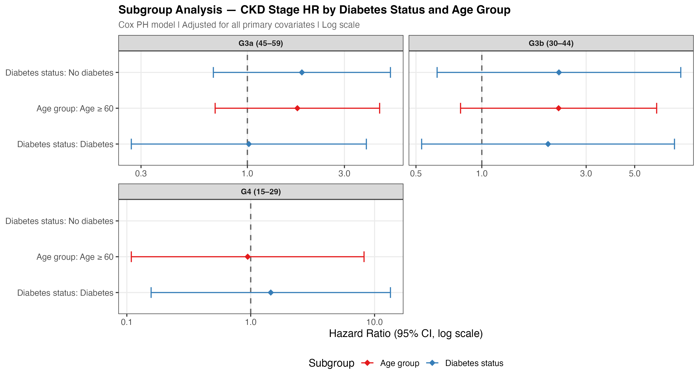{#fig-subgroup width=1650}
:::
:::


---

## Discussion

This analysis of 5,038 U.S. adults from NHANES 2017–2023 linked to NDI mortality records identifies age, diabetes, socioeconomic deprivation, and BMI as the dominant independent predictors of all-cause mortality after comprehensive confounder adjustment. These findings align with the broader CKD Prognosis Consortium meta-analysis [@ckd_pc2010] and USRDS Annual Data Report [@usrds2023] in confirming the multi-factorial nature of CKD-related mortality.

CKD stage showed a strong unadjusted mortality gradient that attenuated after full adjustment — a pattern consistent with substantial confounding by age, metabolic comorbidities, and socioeconomic factors that co-occur with advanced kidney disease. This attenuation underscores the importance of comprehensive adjustment in observational analyses and the difficulty of isolating kidney-specific mortality pathways from their comorbidity context.

Several findings merit particular emphasis. First, albuminuria (log-UACR) showed a positive association with mortality beyond CKD stage adjustment, consistent with the KDIGO recommendation to classify CKD risk using both eGFR and UACR simultaneously [@kdigo2024]. UACR testing remains underutilised in primary care despite its independent prognostic value. Second, the income gradient in mortality — with below-poverty participants experiencing approximately 2.7-fold higher hazard — persisted after full clinical adjustment, reflecting structural determinants of health not captured by biomarkers alone. Third, the obesity paradox (overweight and obese BMI associated with lower mortality) is a well-documented phenomenon in CKD and dialysis populations [@usrds2023], attributable in part to reverse causation and the protective role of nutritional reserve in chronic disease.

The sensitivity analyses support robustness of the primary findings. Multiple imputation (SA-1) produced estimates consistent with the complete-case analysis, suggesting that missingness was not materially biasing primary results. The restricted cubic spline analysis (SA-2) demonstrates a continuous dose-response between eGFR and mortality hazard, with risk increasing steeply below eGFR ≈ 45, consistent with the categorical G-stage parameterisation. All Schoenfeld residual tests passed, confirming the proportional hazards assumption without requiring time-varying adjustments.

### Limitations

This analysis has several limitations. First, mortality linkage covers only the 2017–2018 NHANES cohort (through December 2019), providing a median follow-up of 2.1 years — shorter than ideal for capturing late mortality events in lower-risk participants. Second, baseline exposures are measured at a single point in time; time-varying changes in eGFR trajectory, medication, and lifestyle cannot be captured. Third, the complete-case restriction (N = 5,038 of 5,038 after exclusions) may introduce selection bias if missingness is related to health status, though the multiple imputation sensitivity analysis produced consistent results. Fourth, survey weights were not applied to regression models; while the MEC examination weight (`wt_mec`) is available, proper survey-weighted Cox regression requires the `svycoxph` function from the survey package and is recommended in future analyses for national representativeness. Fifth, cause-of-death attribution via UCOD_LEADING ICD-10 groups is subject to misclassification; the absence of renal-specific deaths limits the cause-specific sensitivity analysis.

### Conclusions

Age, diabetes, socioeconomic deprivation, and obesity paradox are the dominant independent predictors of all-cause mortality in this nationally representative U.S. adult cohort. CKD stage contributes a pronounced unadjusted risk gradient that is substantially attenuated by metabolic and demographic confounders — underscoring the importance of comprehensive risk factor management beyond kidney function monitoring alone. The independent prognostic contribution of albuminuria, the persistence of a socioeconomic gradient after clinical adjustment, and the robustness of findings across six sensitivity analyses collectively support a multi-dimensional approach to CKD risk reduction, consistent with KDIGO 2024 recommendations.

---

## References

::: {#refs}
:::

---

## Appendix: Reproducibility


::: {.cell}

```{.r .cell-code  code-fold="false"}
sessioninfo::session_info()
```

::: {.cell-output .cell-output-stdout}

```
─ Session info ───────────────────────────────────────────────────────────────
 setting  value
 version  R version 4.5.0 (2025-04-11)
 os       macOS 26.5
 system   aarch64, darwin24.2.0
 ui       unknown
 language (EN)
 collate  C.UTF-8
 ctype    C.UTF-8
 tz       America/Detroit
 date     2026-05-02
 pandoc   3.8.3 @ /Applications/quarto/bin/tools/ (via rmarkdown)
 quarto   1.9.37 @ /usr/local/bin/quarto

─ Packages ───────────────────────────────────────────────────────────────────
 package      * version date (UTC) lib source
 abind          1.4-8   2024-09-12 [1] CRAN (R 4.5.0)
 backports      1.5.0   2024-05-23 [1] CRAN (R 4.5.0)
 bit            4.6.0   2025-03-06 [1] CRAN (R 4.5.0)
 bit64          4.8.0   2026-04-21 [1] CRAN (R 4.5.0)
 broom        * 1.0.12  2026-01-27 [1] CRAN (R 4.5.0)
 car            3.1-5   2026-02-03 [1] CRAN (R 4.5.0)
 carData        3.0-6   2026-01-30 [1] CRAN (R 4.5.0)
 cli            3.6.6   2026-04-09 [1] CRAN (R 4.5.0)
 crayon         1.5.3   2024-06-20 [1] CRAN (R 4.5.0)
 digest         0.6.37  2024-08-19 [1] CRAN (R 4.5.0)
 dplyr        * 1.2.1   2026-04-03 [1] CRAN (R 4.5.0)
 evaluate       1.0.5   2025-08-27 [1] CRAN (R 4.5.0)
 farver         2.1.2   2024-05-13 [1] CRAN (R 4.5.0)
 fastmap        1.2.0   2024-05-15 [1] CRAN (R 4.5.0)
 forcats      * 1.0.0   2023-01-29 [1] CRAN (R 4.5.0)
 Formula        1.2-5   2023-02-24 [1] CRAN (R 4.5.0)
 fs             2.1.0   2026-04-18 [1] CRAN (R 4.5.0)
 generics       0.1.4   2025-05-09 [1] CRAN (R 4.5.0)
 ggplot2      * 4.0.3   2026-04-22 [1] CRAN (R 4.5.0)
 ggpubr       * 0.6.3   2026-02-24 [1] CRAN (R 4.5.0)
 ggsignif       0.6.4   2022-10-13 [1] CRAN (R 4.5.0)
 glue           1.8.0   2024-09-30 [1] CRAN (R 4.5.0)
 gridExtra      2.3     2017-09-09 [1] CRAN (R 4.5.0)
 gt           * 1.3.0   2026-01-22 [1] CRAN (R 4.5.0)
 gtable         0.3.6   2024-10-25 [1] CRAN (R 4.5.0)
 gtsummary    * 2.5.0   2025-12-05 [1] CRAN (R 4.5.0)
 here         * 1.0.2   2025-09-15 [1] CRAN (R 4.5.0)
 hms            1.1.4   2025-10-17 [1] CRAN (R 4.5.0)
 htmltools    * 0.5.9   2025-12-04 [1] CRAN (R 4.5.0)
 htmlwidgets    1.6.4   2023-12-06 [1] CRAN (R 4.5.0)
 jsonlite       2.0.0   2025-03-27 [1] CRAN (R 4.5.0)
 knitr        * 1.51    2025-12-20 [1] CRAN (R 4.5.0)
 lattice        0.22-6  2024-03-20 [2] CRAN (R 4.5.0)
 lifecycle      1.0.5   2026-01-08 [1] CRAN (R 4.5.0)
 lubridate    * 1.9.5   2026-02-04 [1] CRAN (R 4.5.0)
 magrittr       2.0.3   2022-03-30 [1] CRAN (R 4.5.0)
 Matrix         1.7-3   2025-03-11 [2] CRAN (R 4.5.0)
 patchwork    * 1.3.2   2025-08-25 [1] CRAN (R 4.5.0)
 pillar         1.10.2  2025-04-05 [1] CRAN (R 4.5.0)
 pkgconfig      2.0.3   2019-09-22 [1] CRAN (R 4.5.0)
 png            0.1-9   2026-03-15 [1] CRAN (R 4.5.0)
 purrr        * 1.2.2   2026-04-10 [1] CRAN (R 4.5.0)
 R6             2.6.1   2025-02-15 [1] CRAN (R 4.5.0)
 RColorBrewer   1.1-3   2022-04-03 [1] CRAN (R 4.5.0)
 readr        * 2.2.0   2026-02-19 [1] CRAN (R 4.5.0)
 rlang          1.2.0   2026-04-06 [1] CRAN (R 4.5.0)
 rmarkdown      2.31    2026-03-26 [1] CRAN (R 4.5.0)
 rprojroot      2.1.1   2025-08-26 [1] CRAN (R 4.5.0)
 rstatix        0.7.3   2025-10-18 [1] CRAN (R 4.5.0)
 S7             0.2.2   2026-04-22 [1] CRAN (R 4.5.0)
 sass           0.4.10  2025-04-11 [1] CRAN (R 4.5.0)
 scales       * 1.4.0   2025-04-24 [1] CRAN (R 4.5.0)
 sessioninfo  * 1.2.3   2025-02-05 [1] CRAN (R 4.5.0)
 stringi        1.8.7   2025-03-27 [1] CRAN (R 4.5.0)
 stringr      * 1.5.1   2023-11-14 [1] CRAN (R 4.5.0)
 survival     * 3.8-3   2024-12-17 [2] CRAN (R 4.5.0)
 survminer    * 0.5.2   2026-02-25 [1] CRAN (R 4.5.0)
 tibble       * 3.2.1   2023-03-20 [1] CRAN (R 4.5.0)
 tidyr        * 1.3.2   2025-12-19 [1] CRAN (R 4.5.0)
 tidyselect     1.2.1   2024-03-11 [1] CRAN (R 4.5.0)
 tidyverse    * 2.0.0   2023-02-22 [1] CRAN (R 4.5.0)
 timechange     0.4.0   2026-01-29 [1] CRAN (R 4.5.0)
 tzdb           0.5.0   2025-03-15 [1] CRAN (R 4.5.0)
 vctrs          0.7.3   2026-04-11 [1] CRAN (R 4.5.0)
 vroom          1.7.1   2026-03-31 [1] CRAN (R 4.5.0)
 withr          3.0.2   2024-10-28 [1] CRAN (R 4.5.0)
 xfun           0.57    2026-03-20 [1] CRAN (R 4.5.0)
 xml2           1.5.2   2026-01-17 [1] CRAN (R 4.5.0)
 yaml           2.3.12  2025-12-10 [1] CRAN (R 4.5.0)

 [1] /opt/homebrew/lib/R/4.5/site-library
 [2] /opt/homebrew/Cellar/r/4.5.0/lib/R/library
 * ── Packages attached to the search path.

──────────────────────────────────────────────────────────────────────────────
```


:::
:::


All analyses were conducted using R with the tidyverse and tidymodels ecosystems. Raw NHANES XPT files are available from the CDC at [wwwn.cdc.gov/nchs/nhanes](https://wwwn.cdc.gov/nchs/nhanes/). The NCHS Linked Mortality File is available at [cdc.gov/nchs/data-linkage/mortality-public.htm](https://www.cdc.gov/nchs/data-linkage/mortality-public.htm).

